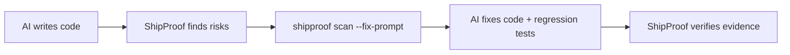

<p align="center">
  
</p>

<h1 align="center">ShipProof</h1>

<p align="center"><strong>A local-first production evidence gate for AI-assisted software.</strong></p>

<p align="center"><a href="README.md">English</a> · <a href="README.th.md">ภาษาไทย</a></p>

Security · Correctness · Scale · Performance · Release evidence

[](https://github.com/kingggg5/shipproof/actions/workflows/ci.yml)
[](https://github.com/kingggg5/shipproof/actions/workflows/security.yml)
[](CHANGELOG.md)
[](package.json)
[](pyproject.toml)
[](LICENSE)

ShipProof is an independently developed production gate for repositories written by people, coding agents, or both. It scans source without executing repository code, evaluates measured CPU/RAM/latency budgets, models reviewed capacity assumptions, and emits evidence through terminal output, JSON, SARIF, pre-commit, GitHub Actions, or an optional read-only MCP adapter.

ShipProof is not a certification, penetration test, formal proof, or substitute for product-specific threat modeling and runtime tests. It makes assumptions visible, reports the strength of available evidence, and preserves human authority for consequential actions and releases.

**Project resources:** [Website](https://shipproof-site.sjet2744.chatgpt.site/shipproof/) · [Commands](docs/commands.md) · [Contributing](CONTRIBUTING.md) · [Support](SUPPORT.md) · [Governance](GOVERNANCE.md) · [Security](SECURITY.md) · [Community validation](docs/community-validation.md) · [Research methodology](docs/research.md) · [Roadmap](docs/roadmap.md) · [Citation](CITATION.cff)

<p align="center">
  
</p>

## Understand it in 30 seconds

The checked-in [demo API](examples/demo-api/README.md) contains five real, intentionally vulnerable code paths: missing admin authorization, interpolated SQL, unbounded pagination, a missing outbound timeout, and production debug mode.

```bash
shipproof scan examples/demo-api/fixtures/before --fail-on high
# BLOCK · 5 findings

python -m unittest discover -s examples/demo-api/fixtures/after/tests -v
shipproof scan examples/demo-api/fixtures/after --fail-on high
# PASS_WITH_EVIDENCE · 0 findings
```

The test suite verifies the exact before/after contract. Additional [Node.js, Python, secure, and performance fixtures](fixtures/README.md) guard against missed findings and obvious false positives.

## Quickstart

Run directly in any repository without creating a configuration file first:

```bash
npx github:kingggg5/shipproof check
```

The git form works without any registry credentials. Once the package is published to the public npm registry, the shorter `npx @kingggg5/shipproof check` will also work; GitHub Packages requires authentication even for public packages, so it is not used for the one-liner.

Or install globally:

```bash
npm install --global github:kingggg5/shipproof
shipproof doctor .
shipproof init . --target both
shipproof check .
```

`init` adds repository-scoped skills to `.agents/skills` for Codex and `.claude/skills` for Claude Code. It skips existing skill directories unless you explicitly pass `--force`.

Node.js 20+ runs the front-door CLI. Python 3.10+ is needed for `scan`, `check`, all `gate` and `labs` commands, and the MCP tools. The core has no runtime npm or Python package dependencies.

## Scope and project status

ShipProof applies the same review contract regardless of who wrote the code. Its executable scanner currently contains **635 deterministic rules** for locally observable security, correctness, scale, performance, configuration, and supply-chain risks. The default path is read-only, offline, and dependency-free beyond Node.js and the Python standard library.

| Property | Current contract |
| :--- | :--- |
| Current release | `v0.10.0` reviewed release |
| Runtime | Node.js 20+; Python 3.10+ for scanner-backed commands |
| Executable rules | 635 (`SP001`–`SP665`, with deliberate reserved gaps) |
| Evidence levels | `L0` pattern, `L1` structural/artifact, `L2` interprocedural taint (`--cross-file`; Python + JavaScript/TypeScript) |
| Research inventory | 7,800 catalogued candidates plus 1,000 reserved promotion slots; none are findings until promoted |
| Exit codes | `0` pass, `1` policy gate failure, `2` invalid or unavailable evidence |
| Default data flow | Local filesystem and subprocesses only; no telemetry or source upload |

Rule design is informed by primary references such as [MITRE CWE](https://cwe.mitre.org/), [OWASP ASVS](https://owasp.org/www-project-application-security-verification-standard/), [OWASP API Security](https://owasp.org/API-Security/), [NIST SSDF](https://csrc.nist.gov/pubs/sp/800/218/final), owning framework documentation, and real vulnerability records. A source identifies a risk class; it does not automatically justify a detector. Promotion requires local observability, a bounded implementation, positive/negative/adversarial fixtures, mappings, remediation, and a documented false-positive boundary.

## Trust model

| ShipProof guarantees | ShipProof does not claim |
| :--- | :--- |
| Deterministic output for the same supported inputs and version | Absence of vulnerabilities or production incidents |
| Stable rule IDs, schemas, fingerprints, and `0/1/2` exit semantics | Cross-file reachability or runtime exploitability from regex alone |
| Redacted evidence and no repository-code execution in the default scanner | Compliance certification for CWE, OWASP, NIST, or another standard |
| Explicit unknown/unavailable evidence rather than a fabricated pass | A universal capacity target, SLO, or architecture |
| Review-first severity for heuristics that need context | Replacement of CodeQL, dependency/SBOM tools, fuzzing, or human review |

## Evidence output

ShipProof formats findings as actionable review cards with source context, confidence levels, why the risk matters, and recommended fixes:

```text
  [BLOCK] ShipProof: BLOCK
  Scanned 24 files | 1 blocking issue | 0 suppressed
  HIGH: 1

  [HIGH] Sensitive route lacks visible authorization (SP108)
     src/routes/admin.py:42  |  confidence: LIKELY

     Evidence:
       40   
       41   @app.post("/admin/users/{user_id}/ban")
       42 > def ban_user(user_id: str):
       43       return db.ban(user_id)

     Why: An admin or internal route has no visible authorization dependency.
     Fix: Require an explicit authorization dependency or verify application-wide control.
     Ref: CWE-862 | OWASP ASVS V4

  ----------------------------------------------------------------------

  -> Run `shipproof scan --fix-prompt` to generate AI-ready fix instructions
  -> Run `shipproof explain SP108` for attack scenarios and testing guidance
```

## Verification workflow

ShipProof turns development into a verified feedback loop: AI writes code, ShipProof finds risks, AI fixes with explicit constraints, and ShipProof re-verifies.

<p align="center">
  
</p>

If verification blocks the change, the evidence goes back into the fix-and-test step. A pass means the configured gate has evidence for the reviewed scope—not that the software is universally vulnerability-free.

<details>
<summary>Accessible workflow source</summary>



</details>

```bash
shipproof scan --fix-prompt        # structured handoff for Codex/Claude Code/Cursor/Copilot
shipproof explain SP108            # rationale, attack scenario, false positives, test plan
shipproof labs impact src/app.py   # experimental blast radius before editing
```

Full prompt samples, invariant analysis, token cost budgeting, worktree isolation, status badges, and `--trace` output live in [docs/features.md](docs/features.md).

## Detection rules

**635 deterministic executable rules** (`SP001`–`SP665`, with deliberate reserved gaps) across security, correctness, scale, performance, configuration, and supply-chain risks. Findings carry an evidence `proof_level`: `L0` pattern match, `L1` structural/AST/artifact evidence, and `L2` interprocedural taint flows (`--cross-file`; Python plus JavaScript/TypeScript route-to-sink chains since v0.8).

The complete catalog, severity, category, and detection method per rule, plus the ecosystem/framework mapping that decides where each structural check runs, lives in **[docs/rules.md](docs/rules.md)**.

## False Positive Control

ShipProof prioritizes high precision over noisy alerts:

- **Inline suppression:** Add `# shipproof-ignore SP101` or `// shipproof-ignore SP101` directly on the line or on the line immediately preceding it. The marker is honored only inside a comment (or at the start of a documentation line), never inside string data, and may list several rules at once (for example `# shipproof-ignore SP101 SP102`). Both the regex and the Python AST engines honor these markers.
- **Confidence filtering:** Run with `--min-confidence high` to surface only confirmed, high-confidence issues.
- **Reviewed baselines:** Record existing technical debt into `.shipproof-baseline.json` using `shipproof scan --baseline-out .shipproof-baseline.json`.

## Add the GitHub Action

Add a deterministic gate to pull requests:

```yaml
name: ShipProof
on: [pull_request]
permissions:
  contents: read
jobs:
  production-gate:
    runs-on: ubuntu-latest
    steps:
      - uses: actions/checkout@v4
      - uses: kingggg5/shipproof@v0.10.0
        with:
          fail-on: high
```

The action writes a structured Markdown status card to the GitHub Step Summary. The example uses the `v0.10.0` release tag; pin the action to a reviewed full commit SHA when an immutable supply-chain reference is required.

For pull requests that touch a large repository, scan only what changed relative to the base branch:

```yaml
      - uses: actions/checkout@v4
        with:
          fetch-depth: 0
      - uses: kingggg5/shipproof@v0.10.0
        with:
          fail-on: high
          changed-since: origin/main
```

The scanner resolves the git diff (added, copied, modified, and renamed files, plus untracked files) and reports the ref under `changed_since` in JSON output. Findings outside the diff are not reported for that run; keep a scheduled full scan as the safety net.

The default report format is `sarif`, which the action writes into the workspace. To surface findings as inline Code Scanning alerts, upload that artifact with GitHub's official action after the gate step:

```yaml
      - uses: kingggg5/shipproof@v0.10.0
        with:
          fail-on: high
          format: sarif
          output: shipproof.sarif
      - uses: github/codeql-action/upload-sarif@v3
        if: always()
        with:
          sarif_file: shipproof.sarif
```

Uploading requires `permissions: security-events: write` (keep `contents: read`) on the job or workflow.

## One Policy, One Command

Commit a bounded [`.shipproof.yml`](.shipproof.yml), then run every declared repository gate:

```yaml
version: 1
scan:
  path: .
  exclude:
    - vendor/**
security:
  fail_on: high
performance:
  baseline: perf/baseline.json
  current: perf/current.json
  budget: perf/budget.json
capacity:
  config: capacity.json
```

```bash
shipproof check .
```

The dependency-free YAML subset rejects executable tags, anchors, duplicate keys, unknown fields, path traversal, and arbitrary commands. The full shape is documented by the [policy schema](schemas/shipproof-policy.schema.json).

## Two skills, one workflow

| Skill | Use it for |
| :--- | :--- |
| `$engineer-production-systems` | Bounded implementation with explicit security, CPU/RAM/latency, and failure budgets |
| `$audit-production-readiness` | Independent release gates: Security, Correctness, Data & Privacy, Scale, Operability, Supply Chain |

The full workflow diagram, systems coverage ladder, host compatibility table, and the production playbook are in [docs/features.md](docs/features.md) and [docs/production-playbook.md](docs/production-playbook.md).

## Command Reference

```text
shipproof check [path] [--config <file>]     Run every gate (works without config)
shipproof scan [path] [options]              Scan repository (--format terminal|markdown|json|sarif|github)
shipproof explain <rule-id>                  Explain a rule in detail (e.g. explain SP108)
shipproof doctor [path] [--json]             Inspect local runtime and integration health
shipproof init [path] [--scope <scope>]      Add project/global skills and a project policy
shipproof config validate [path]             Validate policy without running gates
shipproof gate budget [options]              Enforce CPU/RAM/latency regression budgets
shipproof gate evidence [path] [options]     Run allowlisted TypeScript, Go, or Rust analyzers
shipproof labs impact <file>[:line]          Experimental blast-radius analysis
shipproof labs invariants [path]             Experimental invariant analysis
shipproof labs cost [path] [options]         Experimental token/cost estimate
shipproof labs capacity [options]            Experimental capacity model and k6 export
shipproof mcp                                Start the read-only stdio MCP server
shipproof help                               Show command help
shipproof version                            Print current version
```

See [docs/commands.md](docs/commands.md) for full argument options and exit codes.

## Install from a Clone

```bash
git clone https://github.com/kingggg5/shipproof.git
cd shipproof
npm install --global .
```

Then invoke the skill while building:

```text
Use $engineer-production-systems to implement this feature with explicit security,
CPU, RAM, latency, and failure budgets.
```

Before release:

```text
Use $audit-production-readiness to audit this repository for production.
```

Claude Code can also load the repository directly as a plugin during development:

```bash
claude --plugin-dir .
```

Plugin-installed Claude skills use the namespaced commands `/shipproof:engineer-production-systems` and `/shipproof:audit-production-readiness`.

## Budgets, capacity, MCP, and layering

- **Resource budgets:** gate measured p95 latency/CPU/RAM/throughput regressions with `shipproof gate budget`; runnable samples in [examples/performance](examples/performance).
- **Capacity planning:** turn reviewed workload assumptions into a transparent model or a deterministic k6 scaffold with `shipproof labs capacity`.
- **MCP mode:** `shipproof mcp` exposes five read-only tools to any MCP client with canonical paths, bounded runtime, and redacted evidence.
- **Language-native evidence:** `shipproof gate evidence . --adapter typescript|go|rust` runs approved local analyzers without downloading dependencies, records the probed analyzer version, and bounds/redacts diagnostics. Repository-controlled TypeScript and Rust paths require explicit consent.
- **Layering:** pair ShipProof with mature SAST, SCA, secret-history, and supply-chain tools already present in your environment; it routes to them and never silently installs anything.

All detailed walkthroughs are in [docs/features.md](docs/features.md).

## Research & evaluation status

The scanner ships 635 executable rules. Behind them sits a research backlog of 7,800 catalogued candidates. The current promotion triage identifies 934 targets with a possible local signature, 435 that need dataflow evidence beyond today's engines, and 1,595 design, process, or hardware classes that a regex-based gate cannot catch; the remaining catalog entries retain discovery status until their evidence boundary is reviewed. The bounded P2 batch-A record reviews 25 direct candidates across nine requested ecosystems: 3 reached research-only `fixture_ready`, 22 were rejected as duplicates or wrong evidence routes, and none was silently promoted without representative shadow metrics. See [the batch record](research/promotion-batch-a.json) and [the broader plan](research/promotion-plan.json).

Fixture battery (median of 3 runs, `--cross-file`, labels in [benchmarks/head-to-head-labels.json](benchmarks/head-to-head-labels.json)):

| Corpus | Precision | Recall | F1 |
| :--- | :--- | :--- | :--- |
| vulnerable-node-api | 1.0 | 1.0 | 1.0 |
| vulnerable-python-api | 1.0 | 1.0 | 1.0 |
| node-taint-crossfile | 1.0 | 1.0 | 1.0 |
| adversarial-node | 1.0 | 1.0 | 1.0 |
| secure-node-api / node-secure-crossfile |: |: | 0 findings |

The version-2 label contract distinguishes expected finding locations from context-only source/helper files in a vulnerable chain. Those context files remain listed and hashed but do not count as false negatives for a sink-reporting detector. The adversarial corpus holds look-alikes inside comments and string literals that must stay silent, next to disguised chains (two-hop aliasing, destructured parameters, cookie-to-DOM, three-file taint) that must fire.

The opt-in real-world evaluator pins express, flask, and requests as clean baselines plus juice-shop, DVWA, and NodeGoat as intentionally vulnerable apps. The reviewed 2026-08-24 manifest run scanned 1,805 files and observed 310 application-scope findings (2 / 9 / 3 / 184 / 84 / 28 in that order). Every alert remains explicitly `unreviewed`; these inventory counts are not a real-world precision claim.

Operating profile: no repository or contributor limits, fully offline against local files only, and interprocedural taint for JavaScript/TypeScript and Python in the open core. Bounded added-line git-history scanning is available with `--history`; live credential validation, SBOM/licensing, and AppSec management remain outside the core and should be paired with dedicated tools ([layering guidance](docs/features.md)). Measurement methodology and current results: [docs/benchmarks.md](docs/benchmarks.md).

## Research methodology and provenance

ShipProof is independently implemented. References are used to define questions, terminology, and expected safety boundaries; external detector code and license-restricted rule sets are not copied. The [research notebook](docs/research.md) records the page consulted, the question asked, the decision retained, and the claims deliberately not inferred.

The evidence hierarchy for a rule proposal is:

1. Owning standards, platform/framework documentation, and language specifications.
2. CWE/CVE/KEV records and vendor advisories for demonstrated failure classes.
3. Reproducible project fixtures, measurements, and compatibility contracts.
4. Community reports only as discovery signals that must be confirmed by a primary source.
5. Model-generated ideas only as untrusted hypotheses.

A research candidate becomes an executable `SPxxx` rule only after deduplication, an observable local invariant, a bounded implementation, CWE/control mapping, remediation, false-positive analysis, and positive/negative/adversarial tests. Severity expresses the potential impact of the matched condition; proof level expresses the strength of local evidence. Neither is a probability of exploitation.

| Research artifact | Scope | Runtime effect |
| :--- | :--- | :--- |
| [Expert candidate catalog](docs/rule-expansion-1000.md) | 1,000 model-assisted, source-mapped hypotheses | None |
| [2021–2026 annual catalog](docs/rule-expansion-2021-2026.md) | 1,800 time-bounded CVE/CWE/community signals | None |
| [Language catalog](docs/rule-expansion-languages-5000.md) | 5,000 deduplicated ecosystem/CWE research slots | None |
| [Executable rule table](docs/rules.md#detection-rules-reference) | 635 reviewed detectors | Emits versioned findings |

The machine-derived [rule assurance inventory](docs/rule-assurance.md) verifies all 635 executable rules through explicit positive/negative/adversarial contracts. The checked-in debt baseline is empty and fail-closed: any new partial or uncontracted executable rule fails CI instead of silently joining legacy debt.

See the [production playbook](docs/production-playbook.md), [development plan](docs/next-development-plan.md), and [delivery roadmap](docs/roadmap.md) for operational boundaries and acceptance gates. Cite a release using [CITATION.cff](CITATION.cff). ShipProof deliberately avoids a single readiness score because one veto-level failure must not be averaged away by many clean checks.

## Project governance

ShipProof uses a maintainer-led, evidence-first decision model. Backward compatibility, rule promotion, releases, security response, and changes to the default trust boundary follow [GOVERNANCE.md](GOVERNANCE.md). Contributions must follow [CONTRIBUTING.md](CONTRIBUTING.md) and the [Code of Conduct](CODE_OF_CONDUCT.md). Public feature and defect discussions belong in GitHub Issues; exploitable vulnerabilities belong in the private reporting channel described in [SECURITY.md](SECURITY.md).

## Development

```bash
npm ci --ignore-scripts
python -m pip install -r requirements-dev.txt
npm run check
python skills/audit-production-readiness/scripts/scan_repo.py . --fail-on high
```

The core runtime uses only Node and the Python standard library; Ruff is development-only. The optional MCP adapter uses the MCP SDK and Zod as explicitly installed peers. CI tests Node 20/22/24 and Python 3.10/3.11/3.12/3.13/3.14, verifies an exact package allowlist, smoke-tests the packed artifact, and runs CodeQL for Python and JavaScript/TypeScript.

The scoped npm manifest and manual OIDC workflow are ready for a future public npm release. Until the owner establishes the package, protected environment, and trusted-publisher relationship, use the GitHub npm install shown above; this project does not claim an unpublished registry release. See [docs/releasing.md](docs/releasing.md).

## License, citation, and security

ShipProof is available under the [MIT License](LICENSE). Academic and research users can cite the project with [CITATION.cff](CITATION.cff). Report vulnerabilities privately according to [SECURITY.md](SECURITY.md).
