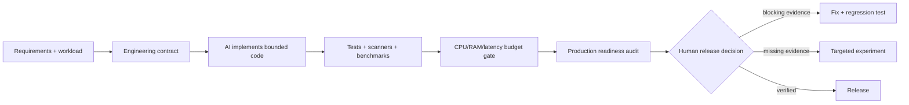

# ShipProof

**A local-first production evidence gate for AI-assisted software.**

[English](README.md) · [ภาษาไทย](README.th.md)

Security · Correctness · Scale · Performance · Release evidence

[](https://github.com/kingggg5/shipproof/actions/workflows/ci.yml)
[](https://github.com/kingggg5/shipproof/actions/workflows/security.yml)
[](CHANGELOG.md)
[](package.json)
[](pyproject.toml)
[](LICENSE)

ShipProof is an independently developed production gate for repositories written by people, coding agents, or both. It scans source without executing repository code, evaluates measured CPU/RAM/latency budgets, models reviewed capacity assumptions, and emits evidence through terminal output, JSON, SARIF, pre-commit, GitHub Actions, or an optional read-only MCP adapter.

ShipProof is not a certification, penetration test, formal proof, or substitute for product-specific threat modeling and runtime tests. It makes assumptions visible, reports the strength of available evidence, and preserves human authority for consequential actions and releases.

**Project resources:** [Commands](docs/commands.md) · [Contributing](CONTRIBUTING.md) · [Governance](GOVERNANCE.md) · [Security](SECURITY.md) · [Research methodology](docs/research.md) · [Roadmap](docs/roadmap.md) · [Citation](CITATION.cff)

<p align="center">
  
</p>

## Understand it in 30 seconds

The checked-in [demo API](examples/demo-api/README.md) contains five real, intentionally vulnerable code paths: missing admin authorization, interpolated SQL, unbounded pagination, a missing outbound timeout, and production debug mode.

```bash
shipproof scan examples/demo-api/fixtures/before --fail-on high
# BLOCK · 5 findings

python -m unittest discover -s examples/demo-api/fixtures/after/tests -v
shipproof scan examples/demo-api/fixtures/after --fail-on high
# PASS_WITH_EVIDENCE · 0 findings
```

The test suite verifies the exact before/after contract. Additional [Node.js, Python, secure, and performance fixtures](fixtures/README.md) guard against missed findings and obvious false positives.

## Quickstart

Run directly in any repository without creating a configuration file first:

```bash
npx github:kingggg5/shipproof check
```

The git form works without any registry credentials. Once the package is published to the public npm registry, the shorter `npx @kingggg5/shipproof check` will also work; GitHub Packages requires authentication even for public packages, so it is not used for the one-liner.

Or install globally:

```bash
npm install --global github:kingggg5/shipproof
shipproof doctor .
shipproof init . --target both
shipproof check .
```

`init` adds repository-scoped skills to `.agents/skills` for Codex and `.claude/skills` for Claude Code. It skips existing skill directories unless you explicitly pass `--force`.

Node.js 20+ runs the front-door CLI. Python 3.10+ is needed for `scan`, `check`, all `gate` and `labs` commands, and the MCP tools. The core has no runtime npm or Python package dependencies.

## Scope and project status

ShipProof applies the same review contract regardless of who wrote the code. Its executable scanner currently contains **571 deterministic rules** for locally observable security, correctness, scale, performance, configuration, and supply-chain risks. The default path is read-only, offline, and dependency-free beyond Node.js and the Python standard library.

| Property | Current contract |
| :--- | :--- |
| Current release | `v0.7.0` public beta |
| Runtime | Node.js 20+; Python 3.10+ for scanner-backed commands |
| Executable rules | 575 (`SP001`–`SP665`, with deliberate reserved gaps) |
| Evidence levels | `L0` pattern, `L1` structural/artifact, `L2` intraprocedural Python taint |
| Research backlog | 8,800 research-only candidates; none are findings until promoted |
| Exit codes | `0` pass, `1` policy gate failure, `2` invalid or unavailable evidence |
| Default data flow | Local filesystem and subprocesses only; no telemetry or source upload |

Rule design is informed by primary references such as [MITRE CWE](https://cwe.mitre.org/), [OWASP ASVS](https://owasp.org/www-project-application-security-verification-standard/), [OWASP API Security](https://owasp.org/API-Security/), [NIST SSDF](https://csrc.nist.gov/pubs/sp/800/218/final), owning framework documentation, and real vulnerability records. A source identifies a risk class; it does not automatically justify a detector. Promotion requires local observability, a bounded implementation, positive/negative/adversarial fixtures, mappings, remediation, and a documented false-positive boundary.

## Trust model

| ShipProof guarantees | ShipProof does not claim |
| :--- | :--- |
| Deterministic output for the same supported inputs and version | Absence of vulnerabilities or production incidents |
| Stable rule IDs, schemas, fingerprints, and `0/1/2` exit semantics | Cross-file reachability or runtime exploitability from regex alone |
| Redacted evidence and no repository-code execution in the default scanner | Compliance certification for CWE, OWASP, NIST, or another standard |
| Explicit unknown/unavailable evidence rather than a fabricated pass | A universal capacity target, SLO, or architecture |
| Review-first severity for heuristics that need context | Replacement of CodeQL, dependency/SBOM tools, fuzzing, or human review |

## Evidence output

ShipProof formats findings as actionable review cards with source context, confidence levels, why the risk matters, and recommended fixes:

```text
  [BLOCK] ShipProof: BLOCK
  Scanned 24 files | 1 blocking issue | 0 suppressed
  HIGH: 1

  [HIGH] Sensitive route lacks visible authorization (SP108)
     src/routes/admin.py:42  |  confidence: LIKELY

     Evidence:
       40   
       41   @app.post("/admin/users/{user_id}/ban")
       42 > def ban_user(user_id: str):
       43       return db.ban(user_id)

     Why: An admin or internal route has no visible authorization dependency.
     Fix: Require an explicit authorization dependency or verify application-wide control.
     Ref: CWE-862 | OWASP ASVS V4

  ----------------------------------------------------------------------

  -> Run `shipproof scan --fix-prompt` to generate AI-ready fix instructions
  -> Run `shipproof explain SP108` for attack scenarios and testing guidance
```

## Verification workflow

ShipProof turns development into a verified feedback loop: AI writes code, ShipProof finds risks, AI fixes with explicit constraints, and ShipProof re-verifies.

<p align="center">
  
</p>


### Generate Prompts for AI Handoff

```bash
shipproof scan --fix-prompt
shipproof scan --fix-prompt --context-level overview
```

Outputs structured instructions with code context, constraints, and test requirements ready for **Codex**, **Claude Code**, **Cursor**, **Gemini**, **Grok**, or **Copilot**:

```text
Fix SP108 in src/routes/admin.py (line 42).

Problem:
An admin route has no visible authorization dependency.

Required fix:
Add Depends(require_admin) to route dependencies.

Engineering Dimensions:
- [x] Object-Level Authorization & IDOR Protection
- [x] Tenant Boundary Isolation
- [x] Least Privilege & Default-Deny Policy
- [x] Token Lifecycle & Invalidation

Implicit Requirements:
- Enforce authorization before executing any business logic or state modification.
- Return 403 Forbidden for authenticated non-authorized users, 401 for unauthenticated.
- Preserve legitimate user access paths while closing escalation routes.

Failure Scenarios to Guard Against:
- Regular authenticated user submits payload to target endpoint and modifies elevated resource.
- Missing tenant scoping allows user in Organization A to access records belonging to Organization B.

Constraints:
- Do not change the public API contract
- Add a regression test that verifies the fix
- Reference: CWE-862, OWASP ASVS V4
```

### Experimental Change Impact Analysis

Inspect caller dependencies, state tables touched, and impact-selected test suites before editing code:

```bash
shipproof labs impact src/routes/admin.py
```

### Experimental System Invariant Analysis

Verify system-level architectural and security invariants (such as auth boundaries, tenant isolation, and transaction safety):

```bash
shipproof labs invariants .
```

### AI Agent Cost & Token Budgeting

Model AI token consumption, prompt caching savings, and dollar costs across Claude 3.5/3.7, GPT-4o, Gemini 2.0, and DeepSeek R1:

```bash
shipproof labs cost . --model claude-3-5-sonnet --iterations 3
shipproof labs cost . --model deepseek-r1 --cadence per-pr --budget-usd 0.50
```

### Git Worktree Isolation

Use Git's standard worktree commands, then run the ShipProof gate inside the isolated tree:

```bash
git worktree add .work/fix-auth -b fix-auth
shipproof check .work/fix-auth
git worktree remove .work/fix-auth
```

### Production Gate Status Badge

Use the status badge from the CI workflow that actually runs the gate. The retired `shipproof badge` command cannot produce a verifiable attestation from static Markdown.

```markdown
[](https://github.com/OWNER/REPOSITORY/actions/workflows/security.yml)
```

### Interactive Rule Explanations

Inspect why a rule exists, the threat scenario, common false positives, and how to write a regression test:

```bash
shipproof explain SP108
shipproof explain SP108 --context-level summary
```

Use `summary` for compact triage, `overview` for rationale and false-positive review, and `full` for attack scenarios and the complete engineering contract. `full` is the default, so existing integrations keep their current output.

For a locally inspectable gate decision, add `--trace` to JSON, Markdown, or terminal scans:

```bash
shipproof scan . --format json --trace --fail-on high
```

The opt-in trace contains deterministic counts for selected files, filters, baseline suppression, and gate evaluation. It contains no source or evidence text, paths, secrets, timestamps, timings, user identifiers, telemetry, or network calls.

## Ecosystem-aware detection

ShipProof uses file suffixes, manifests, and bounded structural context to select applicable checks. Framework detection narrows where a rule runs; it is not proof that a framework is configured or deployed exactly as the repository suggests.

| Ecosystem / Framework | Detection Source | Target Production Checks |
| :--- | :--- | :--- |
| **Next.js, Nuxt, SvelteKit, Remix, Astro** | `package.json` (`next`, `nuxt`, `@sveltejs/kit`, `@remix-run/*`, `astro`) | Secrets in `NEXT_PUBLIC_` (`SP403`), CSP header evaluation (`SP408`), Serverless DB connection leaks (`SP313`), Middleware static asset matcher (`SP413`), Server Action authorization (`SP420`) |
| **React, Vue, Angular, SolidJS** | `package.json` (`react`, `vue`, `@angular/core`, `solid-js`) | Exposed service role keys (`SP503`), Credential logging in client bundles (`SP204`), Unsanitized SVG uploads (`SP112`), Raw HTML injection (`SP116`), Angular sanitizer bypass (`SP125`), Vue `v-html` (`SP415`), Array index keys (`SP414`) |
| **Express, Fastify, NestJS, Koa, Hono, Elysia** | `package.json` (`express`, `fastify`, `@nestjs/core`, `koa`, `hono`, `elysia`) | Missing security headers/helmet (`SP401`), Rate-limited auth routes (`SP402`), CSRF on cookie sessions (`SP407`), Open redirects (`SP121`), SSRF via request URLs (`SP124`), Raw error object leaks (`SP406`), Body parser limits (`SP412`), Unhandled stream pipes (`SP336`), In-memory session leaks (`SP337`), Synchronous crypto in event loop (`SP339`), `process.exit` in handlers (`SP343`), Insecure Stripe webhooks (`SP502`), Unmetered AI routes (`SP501`) |
| **Prisma, Drizzle, TypeORM, Mongoose, Supabase** | `package.json` (`@prisma/client`, `drizzle-orm`, `typeorm`, `mongoose`, `@supabase/*`) | Raw SQL interpolation (`SP103`), Non-singleton DB clients in serverless (`SP313`), Supabase RLS bypass (`SP503`), Unbounded queries (`SP302`), Missing connection pool limits (`SP328`), Per-row commit locks (`SP326`) |
| **FastAPI, Starlette, Litestar, Sanic** | `pyproject.toml`, `requirements.txt` | Unprotected admin routes (`SP108`), Missing `response_model` (`SP409`), Wildcard CORS credentials (`SP419`), N+1 queries in loops (`SP307`), Unbounded pagination (`SP305`), Missing HTTP timeouts (`SP304`), Dropped asyncio task refs (`SP335`), ThreadPool per request (`SP344`) |
| **Django & Flask** | `pyproject.toml`, `requirements.txt` | Hardcoded `SECRET_KEY` (`SP404`), Wildcard `ALLOWED_HOSTS` (`SP405`), Debug enabled (`SP201`, `SP411`), Flask hardcoded `secret_key` (`SP410`), String-interpolated SQL (`SP103`), SSTI via `render_template_string` (`SP137`) |
| **Go (Gin, Echo, Fiber, Chi)** | `go.mod` | Missing server timeouts (`SP131`), Ignored errors (`SP136`), Response body leak (`SP315`), Goroutine context leaks (`SP309`), Unbuffered channel deadlocks (`SP332`), WaitGroup race conditions (`SP333`), Insecure secret fallbacks (`SP004`), Outbound request timeouts (`SP304`), Unbounded concurrency (`SP306`) |
| **Rust (Actix-web, Axum, Rocket)** | `Cargo.toml` | Committed keys/credentials (`SP001`, `SP002`, `SP003`), TLS verification bypass (`SP104`), SSRF to metadata (`SP109`), Credential logging (`SP204`) |
| **PHP (Laravel, Symfony)** | `composer.json` | Dynamic code evaluation (`SP101`), SQL injection interpolation (`SP103`, `SP128`), Path traversal (`SP110`), Loose equality credential comparison (`SP127`), Reflected XSS (`SP129`), Open redirect (`SP130`), Object injection (`SP113`) |
| **Ruby (Rails, Sinatra)** | `Gemfile` | Secret key leakage (`SP003`), Unsafe deserialization with Marshal/YAML (`SP106`), Debug mode enabled (`SP201`), CSRF forgery disabled (`SP417`), Dynamic code execution (`SP101`), Missing payment idempotency (`SP504`) |
| **Java / Kotlin (Spring Boot, Quarkus, Micronaut)** | `pom.xml`, `build.gradle`, `build.gradle.kts` | Committed keys/credentials (`SP001`, `SP002`, `SP003`), Insecure CORS with credentials (`SP107`), Path traversal (`SP110`), Spring Boot actuator public exposure (`SP416`), Binary ObjectInputStream deserialization (`SP168`) |
| **C# / .NET (ASP.NET Core, Web API)** | `*.csproj`, `packages.config` | Sync-over-async thread starvation (`SP132`), `debug="true"` configuration (`SP133`), Unconditional `UseDeveloperExceptionPage` (`SP418`), Insecure deserialization (`SP106`) |
| **C / C++** | `CMakeLists.txt`, `Makefile` | Unbounded legacy string manipulation `strcpy`/`gets` (`SP135`), Insecure temporary file permissions (`SP139`, `SP169`) |
| **Containers, Kubernetes & CI/CD** | `Dockerfile`, Compose, Kubernetes YAML, `.github/workflows` | Root/container privilege (`SP205`, `SP637`–`SP640`), mutable dependencies (`SP202`, `SP203`), workflow trust boundaries (`SP209`, `SP210`, `SP658`–`SP660`), Kubernetes RBAC/admission posture (`SP656`, `SP657`, `SP661`) |

## Detection Rules Reference

Every finding carries an evidence `proof_level`: `L0` means a pattern match, `L1` means structural evidence (Python AST, whole-file structural analysis, or an inspected file artifact such as a SQLite header), and `L2` is reserved for the shipped intraprocedural Python taint engine. ShipProof does not claim cross-file reachability or runtime proof. Only the 571 entries in this table are executable rules; research catalogs are planning inputs and cannot emit findings.

| Rule ID | Severity | Category | Rule Title & Target Problem | Detection Method |
| :--- | :--- | :--- | :--- | :--- |
| **`SP001`** | CRITICAL | Security | Private key committed | Regex |
| **`SP002`** | CRITICAL | Security | AWS access key committed | Regex |
| **`SP003`** | HIGH | Security | Credential-like value committed | Regex |
| **`SP004`** | HIGH | Security | Insecure secret fallback default | Regex |
| **`SP005`** | CRITICAL | Security | GCP service account private key committed | Regex |
| **`SP006`** | CRITICAL | Security | GitHub access token committed | Regex |
| **`SP007`** | CRITICAL | Security | AWS session token or secret key committed | Regex |
| **`SP008`** | CRITICAL | Security | Slack bot token or webhook committed | Regex |
| **`SP009`** | CRITICAL | Security | Stripe live secret key committed | Regex |
| **`SP010`** | CRITICAL | Security | OpenAI or Anthropic API key committed | Regex |
| **`SP011`** | CRITICAL | Security | SendGrid or Twilio API key committed | Regex |
| **`SP012`** | CRITICAL | Security | Mailgun or Postmark API token committed | Regex |
| **`SP013`** | CRITICAL | Security | Discord bot token or webhook committed | Regex |
| **`SP014`** | CRITICAL | Security | Square or PayPal credentials committed | Regex |
| **`SP015`** | CRITICAL | Security | HuggingFace or Replicate token committed | Regex |
| **`SP016`** | HIGH | Security | Hardcoded Bearer JWT token | Regex |
| **`SP017`** | CRITICAL | Security | Package registry publish token committed | Regex |
| **`SP018`** | CRITICAL | Security | Kubernetes service account token committed | Regex |
| **`SP019`** | HIGH | Security | Database connection string with password | Regex |
| **`SP020`** | HIGH | Security | Redis connection URI with password | Regex |
| **`SP021`** | HIGH | Security | MongoDB connection string with password | Regex |
| **`SP022`** | CRITICAL | Security | Cloudflare API token committed | Regex |
| **`SP023`** | HIGH | Security | Datadog or New Relic key committed | Regex |
| **`SP024`** | HIGH | Security | Sentry auth token or secret DSN committed | Regex |
| **`SP025`** | CRITICAL | Security | Hardcoded encryption passphrase or static salt | Regex |
| **`SP026`** | CRITICAL | Security | Anthropic API key committed | Regex |
| **`SP027`** | CRITICAL | Security | Hugging Face user access token committed | Regex |
| **`SP028`** | CRITICAL | Security | Pinecone API key committed | Regex |
| **`SP029`** | CRITICAL | Security | Cohere API key committed | Regex |
| **`SP030`** | CRITICAL | Security | Datadog API or application key committed | Regex |
| **`SP031`** | CRITICAL | Security | New Relic license or ingest key committed | Regex |
| **`SP032`** | HIGH | Security | Sentry DSN authentication token committed | Regex |
| **`SP033`** | CRITICAL | Security | Postman API key committed | Regex |
| **`SP034`** | CRITICAL | Security | Shopify access token or private app secret committed | Regex |
| **`SP035`** | CRITICAL | Security | Square OAuth or access token committed | Regex |
| **`SP036`** | CRITICAL | Security | Algolia admin API key committed | Regex |
| **`SP037`** | CRITICAL | Security | Vault root or client token committed | Regex |
| **`SP038`** | CRITICAL | Security | Pulumi access token committed | Regex |
| **`SP039`** | CRITICAL | Security | Grafana service account or API token committed | Regex |
| **`SP040`** | CRITICAL | Security | Discord bot token committed | Regex |
| **`SP041`** | CRITICAL | Security | Telegram bot API token committed | Regex |
| **`SP042`** | HIGH | Security | Slack incoming webhook URL committed | Regex |
| **`SP043`** | CRITICAL | Security | Linear personal access token committed | Regex |
| **`SP044`** | CRITICAL | Security | Notion internal integration token committed | Regex |
| **`SP045`** | CRITICAL | Security | Airtable personal access token committed | Regex |
| **`SP046`** | CRITICAL | Security | Resend API key committed | Regex |
| **`SP047`** | CRITICAL | Security | Twilio Account SID and Auth Token committed together | Regex |
| **`SP048`** | CRITICAL | Security | Firebase service account JSON committed | Regex |
| **`SP049`** | CRITICAL | Security | Age encryption identity secret key committed | Regex |
| **`SP050`** | CRITICAL | Security | PyPI upload token committed | Regex |
| **`SP101`** | HIGH | Security | Dynamic code execution | Python AST |
| **`SP102`** | HIGH | Security | Shell execution enabled | Python AST |
| **`SP103`** | HIGH | Security | SQL built with interpolation | Python AST |
| **`SP104`** | HIGH | Security | TLS verification disabled | Regex |
| **`SP105`** | CRITICAL | Security | JWT signature verification disabled | Regex |
| **`SP106`** | HIGH | Security | Unsafe deserialization | Regex |
| **`SP107`** | HIGH | Security | Credentialed wildcard CORS | Regex |
| **`SP108`** | HIGH | Security | Sensitive route lacks visible authorization | Regex |
| **`SP109`** | HIGH | Security | SSRF to internal network or metadata | Regex |
| **`SP110`** | HIGH | Security | Path traversal in file path | Regex |
| **`SP111`** | HIGH | Security | Zip-Slip unsafe archive extraction | Regex |
| **`SP112`** | MEDIUM | Security | Unsanitized SVG upload accepted | Regex |
| **`SP113`** | CRITICAL | Security | PHP object injection via unserialize | Regex |
| **`SP114`** | MEDIUM | Security | Catastrophic ReDoS nested quantifier | Regex |
| **`SP115`** | MEDIUM | Security | XXE-capable lxml parser without entity hardening | Regex |
| **`SP116`** | HIGH | Security | React dangerouslySetInnerHTML with dynamic value | Regex |
| **`SP117`** | HIGH | Security | Dynamic code via new Function | Regex |
| **`SP118`** | MEDIUM | Security | Implicit eval via timer string | Regex |
| **`SP119`** | HIGH | Security | Filesystem path joined from request input | Regex |
| **`SP120`** | CRITICAL | Security | Unsafe JS deserialization via node-serialize | Regex |
| **`SP121`** | MEDIUM | Security | Open redirect from request value | Regex |
| **`SP122`** | HIGH | Security | Security value from insecure randomness | Regex |
| **`SP123`** | HIGH | Security | Hardcoded initialization vector | Regex |
| **`SP124`** | HIGH | Security | SSRF via user-controlled request URL | Regex |
| **`SP125`** | HIGH | Security | Angular sanitizer bypass | Regex |
| **`SP126`** | MEDIUM | Security | Auth token stored in web storage | Regex |
| **`SP127`** | HIGH | Security | PHP loose comparison on credential | Regex |
| **`SP128`** | HIGH | Security | PHP SQL with interpolated variables | Regex |
| **`SP129`** | HIGH | Security | PHP reflected XSS via echoed superglobal | Regex |
| **`SP130`** | MEDIUM | Security | PHP open redirect via Location header | Regex |
| **`SP131`** | MEDIUM | Reliability | Go HTTP server without timeouts | Regex |
| **`SP132`** | MEDIUM | Reliability | .NET sync-over-async blocking | Regex |
| **`SP133`** | MEDIUM | Security | ASP.NET debug compilation enabled | Regex |
| **`SP134`** | HIGH | Security | Assertion used as authorization | Regex |
| **`SP135`** | HIGH | Security | Unbounded C string function | Regex |
| **`SP136`** | MEDIUM | Reliability | Go error explicitly discarded | Regex |
| **`SP137`** | HIGH | Security | Server-side template injection | Python AST |
| **`SP138`** | HIGH | Security | Timing-attack vulnerable comparison | Regex |
| **`SP139`** | HIGH | Security | Insecure temporary file creation | Regex |
| **`SP140`** | HIGH | Security | Insecure cryptographic hash algorithm (MD5/SHA1) | Regex |
| **`SP141`** | HIGH | Security | Weak PRNG seeded with timestamp | Regex |
| **`SP142`** | HIGH | Security | AES cipher in ECB mode | Regex |
| **`SP143`** | HIGH | Security | Static salt in password hashing | Regex |
| **`SP144`** | CRITICAL | Security | JWT verification bypassed | Regex |
| **`SP145`** | HIGH | Security | Dynamic SQL execution via exec_sql | Regex |
| **`SP146`** | HIGH | Security | Direct execution via document.write | Regex |
| **`SP147`** | HIGH | Security | Unsanitized innerHTML assignment | Regex |
| **`SP148`** | HIGH | Security | JavaScript scheme URI in navigation link | Regex |
| **`SP149`** | HIGH | Security | XML entity resolution enabled in standard parser | Regex |
| **`SP150`** | HIGH | Security | XSLT processing with extensions enabled | Regex |
| **`SP151`** | HIGH | Security | Python subprocess execution with shell execution | Regex |
| **`SP152`** | HIGH | Security | Node child_process.exec with template string | Regex |
| **`SP153`** | CRITICAL | Security | Insecure Ruby deserialization | Regex |
| **`SP154`** | CRITICAL | Security | Java insecure ObjectInputStream deserialization | Regex |
| **`SP155`** | CRITICAL | Security | PHP dynamic evaluation via preg_replace /e | Regex |
| **`SP156`** | HIGH | Security | LDAP query constructed with string concatenation | Regex |
| **`SP157`** | HIGH | Security | XPath query constructed with string concatenation | Regex |
| **`SP158`** | HIGH | Security | Hardcoded HTTP Basic Authorization header | Regex |
| **`SP159`** | MEDIUM | Security | Cookie generated without Secure or HttpOnly flags | Regex |
| **`SP160`** | MEDIUM | Security | Session token passed in URL query parameters | Regex |
| **`SP161`** | HIGH | Security | Mass assignment via unfiltered model update | Regex |
| **`SP162`** | HIGH | Security | Hardcoded localhost or private IP in webhook target | Regex |
| **`SP163`** | HIGH | Security | Bypassed SSL context with unverified context | Regex |
| **`SP164`** | HIGH | Security | Flask debug toolbar enabled in route setup | Regex |
| **`SP165`** | HIGH | Security | Django raw query with string interpolation | Regex |
| **`SP166`** | LOW | Security | Server framework fingerprinting header enabled | Regex |
| **`SP167`** | MEDIUM | Security | GraphQL unauthenticated introspection enabled | Regex |
| **`SP168`** | HIGH | Security | Sensitive credential passed in GET parameter | Regex |
| **`SP169`** | MEDIUM | Security | Insecure file permissions set on created file | Regex |
| **`SP170`** | MEDIUM | Security | Cleartext unencrypted protocol for external traffic | Regex |
| **`SP171`** | HIGH | Security | GraphQL unbounded query depth or complexity | Regex |
| **`SP172`** | CRITICAL | Security | MongoDB $where clause with string concatenation | Regex |
| **`SP173`** | HIGH | Security | LDAP query built by string concatenation | Regex |
| **`SP174`** | HIGH | Security | XPath query built by string concatenation | Regex |
| **`SP175`** | HIGH | Security | HTTP header injection via unvalidated CRLF characters | Regex |
| **`SP176`** | HIGH | Security | Prototype pollution via unsafe object merge | Regex |
| **`SP177`** | HIGH | Security | Insecure window.postMessage with wildcard targetOrigin | Regex |
| **`SP178`** | MEDIUM | Security | External script tag missing Subresource Integrity (SRI) | Regex |
| **`SP179`** | CRITICAL | Security | Dynamic class instantiation from user input | Regex |
| **`SP180`** | MEDIUM | Security | Frame inclusion allowed globally without frame-ancestors CSP | Regex |
| **`SP181`** | CRITICAL | Security | Django raw SQL query with f-string interpolation | Regex |
| **`SP182`** | CRITICAL | Security | Spring Expression Language (SpEL) expression injection | Regex |
| **`SP183`** | CRITICAL | Security | Ruby ERB template rendering user string directly | Regex |
| **`SP184`** | CRITICAL | Security | PHP extract on untrusted input enabling variable overwrite | Regex |
| **`SP185`** | CRITICAL | Security | PHP dangerous assert with string expression | Regex |
| **`SP186`** | CRITICAL | Security | Insecure .NET BinaryFormatter deserialization | Regex |
| **`SP187`** | HIGH | Security | ASP.NET Request Validation explicitly disabled | Regex |
| **`SP188`** | HIGH | Security | Go html/template unescaped HTML type conversion | Regex |
| **`SP189`** | HIGH | Security | WebSocket server accepting arbitrary origin without check | Regex |
| **`SP190`** | HIGH | Security | CORS policy reflecting null origin | Regex |
| **`SP191`** | HIGH | Security | Insecure cookie SameSite None without Secure flag | Regex |
| **`SP192`** | HIGH | Security | OAuth 2.0 PKCE code_challenge verification omitted | Regex |
| **`SP193`** | HIGH | Security | OpenID Connect authentication nonce verification skipped | Regex |
| **`SP194`** | CRITICAL | Security | SAML response assertion signature verification disabled | Regex |
| **`SP195`** | HIGH | Security | Insecure gRPC channel created without transport security | Regex |
| **`SP196`** | MEDIUM | Security | Redis connection without TLS encryption | Regex |
| **`SP197`** | HIGH | Security | Elasticsearch query constructed with raw JSON string interpolation | Regex |
| **`SP198`** | HIGH | Security | Mongoose mass assignment from raw request body | Regex |
| **`SP199`** | HIGH | Security | Sequelize mass update with unconstrained request body | Regex |
| **`SP200`** | HIGH | Security | TypeORM repository save with unsanitized request body | Regex |
| **`SP201`** | HIGH | Security | Debug mode enabled | Regex |
| **`SP202`** | MEDIUM | Supply-chain | Floating container base image | Regex |
| **`SP203`** | HIGH | Supply-chain | Unpinned GitHub Action | Regex |
| **`SP204`** | MEDIUM | Security | Sensitive data or credential logging | Regex |
| **`SP205`** | MEDIUM | Supply-chain | Dockerfile running container as root | Regex |
| **`SP206`** | HIGH | Supply-chain | Dockerfile package install via curl piped to shell | Regex |
| **`SP207`** | HIGH | Security | Dockerfile copying sensitive environment files | Regex |
| **`SP208`** | LOW | Security | Dockerfile exposing privileged ports | Regex |
| **`SP209`** | HIGH | Supply-chain | GitHub Actions pull_request_target checkout of PR head | Regex |
| **`SP210`** | HIGH | Security | GitHub Actions workflow script injection | Regex |
| **`SP211`** | MEDIUM | Security | GitHub Actions workflow missing explicit permissions | Regex |
| **`SP212`** | HIGH | Security | CI/CD step printing environment variables to console | Regex |
| **`SP213`** | HIGH | Supply-chain | npm script with unsafe-perm or ignore-scripts | Regex |
| **`SP214`** | MEDIUM | Supply-chain | Pip install without pinned versions | Regex |
| **`SP215`** | HIGH | Security | Terraform AWS S3 bucket with public ACL | Regex |
| **`SP216`** | HIGH | Security | Terraform security group with unrestricted ingress | Regex |
| **`SP217`** | HIGH | Security | Kubernetes pod configured with privileged mode | Regex |
| **`SP218`** | MEDIUM | Reliability | Kubernetes container missing resource limits | Regex |
| **`SP219`** | HIGH | Security | Kubernetes service exposing unauthenticated NodePort | Regex |
| **`SP220`** | HIGH | Security | Sensitive environment file tracked in git | Regex |
| **`SP221`** | MEDIUM | Supply-chain | Unpinned git dependency in package manifest | Regex |
| **`SP222`** | CRITICAL | Security | Docker Compose mounting Docker socket | Regex |
| **`SP223`** | HIGH | Security | Nginx configuration with deprecated SSL/TLS protocols | Regex |
| **`SP224`** | MEDIUM | Security | Nginx configuration missing security headers | Regex |
| **`SP225`** | MEDIUM | Security | Logging HTTP request headers with credentials | Regex |
| **`SP226`** | MEDIUM | Security | Dockerfile container missing non-root USER directive | Regex |
| **`SP227`** | MEDIUM | Reliability | Dockerfile container missing HEALTHCHECK instruction | Regex |
| **`SP228`** | HIGH | Correctness | Dockerfile using unpinned latest base image tag | Regex |
| **`SP229`** | CRITICAL | Security | Dockerfile executing untrusted curl piped to shell | Regex |
| **`SP230`** | CRITICAL | Security | Docker daemon socket exposed in container compose | Regex |
| **`SP231`** | MEDIUM | Security | Dockerfile blanket host copy without .dockerignore | Regex |
| **`SP232`** | CRITICAL | Security | Docker compose container running in privileged mode | Regex |
| **`SP233`** | HIGH | Security | Docker compose container sharing host network namespace | Regex |
| **`SP234`** | HIGH | Security | Docker compose container sharing host PID namespace | Regex |
| **`SP235`** | CRITICAL | Security | Docker compose mounting host root filesystem | Regex |
| **`SP236`** | CRITICAL | Security | Kubernetes privileged container execution enabled | Regex |
| **`SP237`** | HIGH | Security | Kubernetes allowPrivilegeEscalation permitted | Regex |
| **`SP238`** | HIGH | Reliability | Kubernetes container missing CPU or memory limit | Regex |
| **`SP239`** | HIGH | Reliability | Kubernetes container missing resource requests | Regex |
| **`SP240`** | MEDIUM | Security | Kubernetes container root filesystem writable | Regex |
| **`SP241`** | HIGH | Security | Kubernetes container configured to run as root | Regex |
| **`SP242`** | HIGH | Security | Kubernetes Pod running on hostNetwork | Regex |
| **`SP243`** | HIGH | Security | Kubernetes Pod running with hostPID or hostIPC | Regex |
| **`SP244`** | CRITICAL | Security | Kubernetes Pod mounting docker.sock hostPath volume | Regex |
| **`SP245`** | MEDIUM | Security | Kubernetes ServiceAccount automatic token mounting enabled | Regex |
| **`SP246`** | HIGH | Security | Kubernetes Ingress missing TLS configuration | Regex |
| **`SP247`** | MEDIUM | Security | Kubernetes namespace missing default deny NetworkPolicy | Regex |
| **`SP248`** | HIGH | Security | Terraform S3 bucket missing server-side encryption | Regex |
| **`SP249`** | CRITICAL | Security | Terraform S3 bucket configured with public ACL | Regex |
| **`SP250`** | HIGH | Security | Terraform S3 bucket missing public access block | Regex |
| **`SP251`** | HIGH | Security | Terraform EBS volume created without encryption | Regex |
| **`SP252`** | HIGH | Security | Terraform RDS instance missing storage encryption | Regex |
| **`SP253`** | CRITICAL | Security | Terraform RDS database instance publicly accessible | Regex |
| **`SP254`** | CRITICAL | Security | Terraform Security Group open SSH ingress from 0.0.0.0/0 | Regex |
| **`SP255`** | CRITICAL | Security | Terraform Security Group open RDP ingress from 0.0.0.0/0 | Regex |
| **`SP256`** | CRITICAL | Security | Terraform IAM policy granting full administrator wildcard | Regex |
| **`SP257`** | HIGH | Security | Terraform CloudFront distribution viewer_protocol_policy allow-all | Regex |
| **`SP258`** | MEDIUM | Reliability | Terraform DynamoDB table point-in-time recovery disabled | Regex |
| **`SP259`** | HIGH | Security | Terraform EKS cluster public endpoint access unrestricted | Regex |
| **`SP260`** | CRITICAL | Security | GitHub Actions inline script injection from untrusted event context | Regex |
| **`SP261`** | CRITICAL | Security | GitHub Actions pull_request_target checking out untrusted pull request code | Regex |
| **`SP262`** | MEDIUM | Correctness | GitHub Actions third-party action referenced without immutable commit SHA | Regex |
| **`SP263`** | CRITICAL | Security | GitHub Actions echo statement printing secret token | Regex |
| **`SP264`** | HIGH | Security | GitHub Actions workflow granting broad write-all permissions | Regex |
| **`SP265`** | HIGH | Security | GitHub Actions public repository using self-hosted runner | Regex |
| **`SP266`** | CRITICAL | Security | Helm values file containing hardcoded plaintext database password | Regex |
| **`SP267`** | HIGH | Security | Nginx configuration enabling obsolete SSLv3 or TLSv1 protocols | Regex |
| **`SP268`** | MEDIUM | Security | Nginx configuration missing X-Content-Type-Options nosniff header | Regex |
| **`SP269`** | MEDIUM | Security | Systemd unit service running as root without User directive | Regex |
| **`SP270`** | MEDIUM | Reliability | Systemd unit service configured with unrestricted Restart=always | Regex |
| **`SP301`** | HIGH | Scale | Redis KEYS in application path | Regex |
| **`SP302`** | MEDIUM | Scale | Unbounded SQL result | Regex |
| **`SP303`** | HIGH | Correctness | Blocking sleep in async code | Regex |
| **`SP304`** | HIGH | Correctness | Outbound request without timeout | Regex |
| **`SP305`** | MEDIUM | Scale | Unbounded pagination input | Regex |
| **`SP306`** | MEDIUM | Scale | Unbounded concurrency in collection | Regex |
| **`SP307`** | HIGH | Scale | N+1 database query in loop | Regex |
| **`SP308`** | MEDIUM | Scale | Unbounded in-memory global cache | Regex |
| **`SP309`** | MEDIUM | Reliability | Goroutine spawned without context | Regex |
| **`SP310`** | HIGH | Reliability | Busy-wait spin loop without backoff | Regex |
| **`SP311`** | MEDIUM | Scale | Event listener registered in request scope | Regex |
| **`SP312`** | MEDIUM | Reliability | Retry loop without exponential backoff | Regex |
| **`SP313`** | HIGH | Scale | Non-singleton database client in serverless | Regex |
| **`SP314`** | HIGH | Security | Committed SQLite database file | Regex |
| **`SP315`** | HIGH | Correctness | Go HTTP request missing response body close | Regex |
| **`SP316`** | HIGH | Scale | Outbound HTTP call inside database transaction | Regex |
| **`SP317`** | HIGH | Scale | Blocking call in async def coroutine | Regex |
| **`SP318`** | MEDIUM | Reliability | Retry policy without a stop condition | Regex |
| **`SP319`** | HIGH | Scale | Redis SMEMBERS or HGETALL on unbounded keys | Regex |
| **`SP320`** | MEDIUM | Scale | Redis cache key stored without TTL | Regex |
| **`SP321`** | HIGH | Reliability | Blocking filesystem I/O in async loop | Regex |
| **`SP322`** | MEDIUM | Scale | SQL query with leading wildcard | Regex |
| **`SP323`** | MEDIUM | Scale | SQL query with random sorting | Regex |
| **`SP324`** | MEDIUM | Correctness | SQL NOT IN subquery on nullable column | Regex |
| **`SP325`** | HIGH | Scale | Database transaction without statement timeout | Regex |
| **`SP326`** | MEDIUM | Scale | Transaction committed per row in bulk loop | Regex |
| **`SP327`** | HIGH | Scale | Monolithic single transaction on large table | Regex |
| **`SP328`** | HIGH | Scale | Missing connection pool max limit or acquire timeout | Regex |
| **`SP329`** | HIGH | Scale | Synchronous large JSON parsing in request thread | Regex |
| **`SP330`** | LOW | Performance | Regex compiled repeatedly inside tight loop | Regex |
| **`SP331`** | MEDIUM | Reliability | Go HTTP client missing idle connection limits | Regex |
| **`SP332`** | HIGH | Reliability | Go unbuffered channel send without consumer | Regex |
| **`SP333`** | HIGH | Reliability | Go sync.WaitGroup counter incremented in goroutine | Regex |
| **`SP334`** | HIGH | Reliability | Node process missing unhandledRejection listener | Regex |
| **`SP335`** | HIGH | Reliability | Python asyncio task created without reference | Regex |
| **`SP336`** | HIGH | Reliability | Node.js stream piped without error handler | Regex |
| **`SP337`** | HIGH | Scale | In-memory session store in web cluster | Regex |
| **`SP338`** | MEDIUM | Reliability | External network call missing circuit breaker | Regex |
| **`SP339`** | HIGH | Scale | Synchronous heavy crypto in async request thread | Regex |
| **`SP340`** | MEDIUM | Scale | Deep offset pagination on large table | Regex |
| **`SP341`** | HIGH | Scale | Unbuffered file read into memory | Regex |
| **`SP342`** | MEDIUM | Scale | Synchronous heavy processing in webhook listener | Regex |
| **`SP343`** | HIGH | Reliability | process.exit called inside request handler | Regex |
| **`SP344`** | MEDIUM | Scale | ThreadPoolExecutor instantiated per request | Regex |
| **`SP345`** | HIGH | Scale | Global lock held across async I/O call | Regex |
| **`SP346`** | HIGH | Reliability | Python asyncio create_task reference dropped causing garbage collection | Regex |
| **`SP347`** | MEDIUM | Reliability | Python asyncio gather without return_exceptions handling | Regex |
| **`SP348`** | HIGH | Scale | Python ThreadPoolExecutor instantiated without max_workers limit | Regex |
| **`SP349`** | HIGH | Scale | Python ProcessPoolExecutor created inside async request handler | Regex |
| **`SP350`** | HIGH | Scale | Python SQLAlchemy engine created without pool_size and max_overflow bounds | Regex |
| **`SP351`** | HIGH | Reliability | Python SQLAlchemy session created without scoped session or context manager | Regex |
| **`SP352`** | HIGH | Reliability | Python Redis client created without socket timeout | Regex |
| **`SP353`** | MEDIUM | Reliability | Python Redis pub/sub listener without reconnect loop | Regex |
| **`SP354`** | HIGH | Reliability | Python Celery task missing explicit time_limit or soft_time_limit | Regex |
| **`SP355`** | MEDIUM | Reliability | Python Celery task with bind=True mutating global state | Regex |
| **`SP356`** | MEDIUM | Scale | Python Pydantic model string field without max_length constraint | Regex |
| **`SP357`** | MEDIUM | Correctness | Python naive datetime comparison with datetime.now without timezone | Regex |
| **`SP358`** | MEDIUM | Correctness | Python floating point direct equality comparison | Regex |
| **`SP359`** | HIGH | Reliability | Node.js Express unhandled Promise rejection in async route | Regex |
| **`SP360`** | HIGH | Reliability | Node.js EventEmitter listener added inside request handler without removal | Regex |
| **`SP361`** | HIGH | Scale | Node.js synchronous file read inside route handler blocking event loop | Regex |
| **`SP362`** | HIGH | Scale | Node.js synchronous crypto PBKDF2 inside route handler | Regex |
| **`SP363`** | HIGH | Scale | Node.js PostgreSQL or MySQL pool instantiated without max connections cap | Regex |
| **`SP364`** | HIGH | Reliability | Node.js Axios or Got HTTP client request without timeout | Regex |
| **`SP365`** | HIGH | Correctness | Node.js Prisma database query inside Array.forEach | Regex |
| **`SP366`** | MEDIUM | Scale | Node.js Mongoose read-only query missing lean optimization | Regex |
| **`SP367`** | HIGH | Reliability | Node.js Stream pipe missing error handler | Regex |
| **`SP368`** | CRITICAL | Reliability | Node.js process.exit called inside request handler | Regex |
| **`SP369`** | MEDIUM | Correctness | Node.js setTimeout delay exceeding 32-bit integer maximum | Regex |
| **`SP370`** | MEDIUM | Reliability | Node.js JSON.parse on raw payload without try/catch | Regex |
| **`SP371`** | HIGH | Correctness | Go goroutine spawning inside loop capturing loop variable | Regex |
| **`SP372`** | HIGH | Reliability | Go unbuffered channel receive without context cancellation select | Regex |
| **`SP373`** | HIGH | Reliability | Go time.Tick called inside function scope causing memory leak | Regex |
| **`SP374`** | HIGH | Reliability | Go sync.WaitGroup Wait called inside spawned goroutine causing deadlock | Regex |
| **`SP375`** | HIGH | Scale | Go sql.DB connection pool configured with unbounded connections | Regex |
| **`SP376`** | HIGH | Reliability | Go HTTP client using zero-timeout DefaultClient | Regex |
| **`SP377`** | HIGH | Reliability | Go http.Server missing ReadHeaderTimeout causing Slowloris vulnerability | Regex |
| **`SP378`** | HIGH | Reliability | Go context.WithCancel or WithTimeout missing defer cancel call | Regex |
| **`SP379`** | MEDIUM | Reliability | Go Mutex lock acquired without immediate defer Unlock | Regex |
| **`SP380`** | HIGH | Scale | Java Executors newCachedThreadPool unbounded thread creation | Regex |
| **`SP381`** | HIGH | Scale | Java CompletableFuture join called on main thread | Regex |
| **`SP382`** | HIGH | Correctness | Java SimpleDateFormat shared across multiple threads | Regex |
| **`SP383`** | HIGH | Reliability | Java unclosed JDBC Connection in try block without try-with-resources | Regex |
| **`SP384`** | MEDIUM | Scale | Java HikariCP connection pool missing maximumPoolSize setting | Regex |
| **`SP385`** | HIGH | Reliability | C# async void method declaration masking unhandled exceptions | Regex |
| **`SP386`** | HIGH | Scale | C# synchronous Task.Result or Task.Wait causing deadlock | Regex |
| **`SP387`** | HIGH | Reliability | C# HttpClient instantiated directly causing socket exhaustion | Regex |
| **`SP388`** | HIGH | Reliability | C# Entity Framework DbContext shared across concurrent threads | Regex |
| **`SP389`** | MEDIUM | Reliability | C# async database query ignoring CancellationToken | Regex |
| **`SP390`** | HIGH | Reliability | Rust unwrap or expect on fallible network operation | Regex |
| **`SP391`** | MEDIUM | Reliability | Rust tokio spawn without error handling or JoinHandle storage | Regex |
| **`SP392`** | HIGH | Scale | Rust std Mutex held across await point blocking tokio runtime | Regex |
| **`SP393`** | HIGH | Scale | Rust unbounded mpsc channel causing memory exhaustion | Regex |
| **`SP394`** | HIGH | Scale | Rust blocking std fs operations inside async context | Regex |
| **`SP395`** | HIGH | Reliability | PHP PDO error mode silent masking database query failures | Regex |
| **`SP396`** | HIGH | Reliability | PHP file_get_contents on remote URL without timeout context | Regex |
| **`SP397`** | HIGH | Reliability | Ruby Net::HTTP request instantiated without read_timeout | Regex |
| **`SP398`** | HIGH | Scale | Ruby ActiveRecord queries in view templates causing N+1 query storm | Regex |
| **`SP399`** | CRITICAL | Scale | Redis unbounded KEYS pattern query in production code | Regex |
| **`SP400`** | HIGH | Scale | Redis sorted set or hash query without pagination limit | Regex |
| **`SP401`** | MEDIUM | Security | Express app without helmet | Regex |
| **`SP402`** | MEDIUM | Security | Express auth route without rate limiting | Regex |
| **`SP403`** | HIGH | Security | Secret in NEXT_PUBLIC_ env var | Regex |
| **`SP404`** | CRITICAL | Security | Django SECRET_KEY hardcoded | Regex |
| **`SP405`** | HIGH | Security | Django ALLOWED_HOSTS accepts all | Regex |
| **`SP406`** | MEDIUM | Security | Express error sent to client | Regex |
| **`SP407`** | MEDIUM | Security | Cookie session routes without CSRF protection | Regex |
| **`SP408`** | MEDIUM | Security | Meta-framework config without CSP header | Regex |
| **`SP409`** | MEDIUM | Security | FastAPI route missing response_model schema | Regex |
| **`SP410`** | CRITICAL | Security | Flask secret key set to hardcoded constant | Regex |
| **`SP411`** | HIGH | Security | Django debug mode enabled in settings | Regex |
| **`SP412`** | MEDIUM | Security | Express body-parser with excessive payload limit | Regex |
| **`SP413`** | MEDIUM | Performance | Next.js middleware missing static asset exclusion | Regex |
| **`SP414`** | LOW | Correctness | React list rendering using array index as key | Regex |
| **`SP415`** | HIGH | Security | Vue v-html directive with dynamic property | Regex |
| **`SP416`** | HIGH | Security | Spring Boot actuator endpoints exposed publicly | Regex |
| **`SP417`** | HIGH | Security | Ruby on Rails protect_from_forgery disabled | Regex |
| **`SP418`** | HIGH | Security | ASP.NET Core UseDeveloperExceptionPage in production | Regex |
| **`SP419`** | HIGH | Security | FastAPI CORS allows wildcard with credentials | Regex |
| **`SP420`** | HIGH | Security | Next.js Server Action without authorization | Regex |
| **`SP421`** | HIGH | Security | Next.js Server Action missing authorization check | Regex |
| **`SP422`** | MEDIUM | Scale | Next.js generateStaticParams fetching unbounded external API without limit | Regex |
| **`SP423`** | HIGH | Reliability | React useEffect missing dependency array causing infinite render loop | Regex |
| **`SP424`** | HIGH | Correctness | React state mutated directly bypassing setState | Regex |
| **`SP425`** | HIGH | Security | Vue v-html directive rendering untrusted content | Regex |
| **`SP426`** | HIGH | Security | Svelte @html tag rendering unescaped content | Regex |
| **`SP427`** | MEDIUM | Security | Express helmet middleware explicitly disabling standard protections | Regex |
| **`SP428`** | HIGH | Security | Express error handling middleware exposing stack traces to client | Regex |
| **`SP429`** | MEDIUM | Scale | Express express.json body parser without limit option | Regex |
| **`SP430`** | HIGH | Scale | Express session using default in-memory MemoryStore in production | Regex |
| **`SP431`** | HIGH | Security | NestJS global ValidationPipe missing whitelist option | Regex |
| **`SP432`** | HIGH | Security | NestJS controller administrative endpoint missing UseGuards decorator | Regex |
| **`SP433`** | MEDIUM | Security | Fastify route missing input schema validation definition | Regex |
| **`SP434`** | MEDIUM | Reliability | Fastify server missing connectionTimeout configuration | Regex |
| **`SP435`** | CRITICAL | Security | Django DEBUG mode hardcoded in settings file | Regex |
| **`SP436`** | HIGH | Security | Django ALLOWED_HOSTS configured with wildcard in settings | Regex |
| **`SP437`** | CRITICAL | Security | Django SECRET_KEY hardcoded string literal in settings | Regex |
| **`SP438`** | HIGH | Security | Django SESSION_COOKIE_SECURE explicitly disabled | Regex |
| **`SP439`** | CRITICAL | Security | Django ORM extra() method used with format string | Regex |
| **`SP440`** | MEDIUM | Security | FastAPI route missing response_model schema definition | Regex |
| **`SP441`** | CRITICAL | Security | Flask app secret_key set to hardcoded string literal | Regex |
| **`SP442`** | HIGH | Security | Flask SESSION_COOKIE_HTTPONLY disabled in configuration | Regex |
| **`SP443`** | CRITICAL | Security | Spring Boot Actuator all endpoints exposed over web | Regex |
| **`SP444`** | CRITICAL | Security | Spring Boot H2 in-memory web console enabled in configuration | Regex |
| **`SP445`** | HIGH | Security | Spring Security CSRF protection explicitly disabled | Regex |
| **`SP446`** | CRITICAL | Security | Spring Security permitAll on administrative path pattern | Regex |
| **`SP447`** | HIGH | Reliability | Gin framework router missing Recovery panic middleware | Regex |
| **`SP448`** | HIGH | Reliability | Fiber framework App initialized without Recover middleware | Regex |
| **`SP449`** | CRITICAL | Security | Ruby on Rails params.permit! blanket mass assignment bypass | Regex |
| **`SP450`** | HIGH | Security | Ruby on Rails config.force_ssl disabled in production | Regex |
| **`SP451`** | HIGH | Security | Laravel Eloquent model guarded set to empty array | Regex |
| **`SP452`** | CRITICAL | Security | Laravel DB::raw query constructed with string concatenation | Regex |
| **`SP453`** | HIGH | Security | ASP.NET Core DeveloperExceptionPage enabled in non-development | Regex |
| **`SP454`** | CRITICAL | Security | ASP.NET Core AllowAnonymous attribute on administrative controller | Regex |
| **`SP455`** | HIGH | Security | Angular bypassSecurityTrustHtml called with dynamic input | Regex |
| **`SP456`** | MEDIUM | Security | Apollo Server GraphQL introspection enabled in production | Regex |
| **`SP457`** | MEDIUM | Security | tRPC mutation procedure declared without input validation schema | Regex |
| **`SP458`** | MEDIUM | Correctness | Prisma schema Float type used for monetary currency fields | Regex |
| **`SP459`** | CRITICAL | Security | Drizzle ORM sql.raw query constructed with f-string interpolation | Regex |
| **`SP460`** | CRITICAL | Security | Knex query builder raw query built by string concatenation | Regex |
| **`SP461`** | MEDIUM | Security | Remix loader function returning sensitive entity directly | Regex |
| **`SP462`** | MEDIUM | Security | Astro API endpoint missing CSRF origin verification on POST handler | Regex |
| **`SP463`** | MEDIUM | Security | Next.js Route Handler missing rate limit or authorization in sensitive action | Regex |
| **`SP464`** | MEDIUM | Security | Express app trust proxy configured insecurely with true | Regex |
| **`SP465`** | MEDIUM | Reliability | FastAPI background task created without error handling wrapper | Regex |
| **`SP466`** | MEDIUM | Reliability | Django transaction.atomic missing in multi-table mutation endpoint | Regex |
| **`SP467`** | MEDIUM | Scale | Spring Boot multipart file upload without maxFileSize limit | Regex |
| **`SP468`** | HIGH | Reliability | Ktor HTTP client engine missing timeout configuration | Regex |
| **`SP469`** | HIGH | Security | Symfony controller missing IsGranted security attribute | Regex |
| **`SP470`** | HIGH | Security | Phoenix LiveView mount callback missing session token verification | Regex |
| **`SP471`** | CRITICAL | Security | FastAPI CORS middleware configured with allow_origins wildcard and allow_credentials | Regex |
| **`SP472`** | CRITICAL | Security | Flask-CORS configured with origins wildcard and supports_credentials | Regex |
| **`SP473`** | HIGH | Security | NestJS CORS configuration with origin true reflection | Regex |
| **`SP474`** | CRITICAL | Security | Spring Boot WebMvcConfigurer addCorsMappings wildcard credentials | Regex |
| **`SP475`** | MEDIUM | Security | Express rate-limit missing keyGenerator using default IP behind reverse proxy | Regex |
| **`SP476`** | HIGH | Security | Next.js dangerouslySetInnerHTML used inside component | Regex |
| **`SP477`** | MEDIUM | Reliability | Nuxt 3 useFetch missing server: false in client-only mutations | Regex |
| **`SP478`** | MEDIUM | Correctness | FastAPI unhandled HTTPException re-thrown losing details | Regex |
| **`SP479`** | HIGH | Security | Django CSRF_TRUSTED_ORIGINS missing https scheme | Regex |
| **`SP480`** | MEDIUM | Scale | Laravel route definition without rate limiting middleware | Regex |
| **`SP481`** | CRITICAL | Security | Spring Boot Jackson deserialization default typing enabled | Regex |
| **`SP482`** | HIGH | Reliability | Gin framework c.BindJSON ignoring binding validation error | Regex |
| **`SP483`** | HIGH | Reliability | Fiber framework c.BodyParser ignoring returned error | Regex |
| **`SP484`** | HIGH | Reliability | Echo framework c.Bind ignoring deserialization error | Regex |
| **`SP485`** | MEDIUM | Reliability | NestJS microservice transport connection without retry strategy | Regex |
| **`SP486`** | CRITICAL | Scale | Prisma client instantiated repeatedly inside function scope | Regex |
| **`SP487`** | HIGH | Reliability | FastAPI streaming response without generator exception handling | Regex |
| **`SP488`** | HIGH | Reliability | Django database connection closed inside thread pool worker | Regex |
| **`SP489`** | MEDIUM | Reliability | Fastify decorated request object mutating shared prototype state | Regex |
| **`SP490`** | MEDIUM | Scale | Next.js middleware matching all static assets causing performance degradation | Regex |
| **`SP501`** | HIGH | Scale | Unmetered AI/LLM API route | Regex |
| **`SP502`** | CRITICAL | Security | Insecure payment webhook handler | Regex |
| **`SP503`** | CRITICAL | Security | Leaked Supabase service role key | Regex |
| **`SP504`** | HIGH | Cost & scale | Missing payment gateway idempotency key | Regex |
| **`SP505`** | HIGH | Security | LLM prompt direct string interpolation | Regex |
| **`SP506`** | HIGH | Security | LLM function call execution without schema validation | Regex |
| **`SP507`** | HIGH | Security | Vector database query with unfiltered embedding | Regex |
| **`SP508`** | HIGH | Security | AI agent autonomous tool execution without constraints | Regex |
| **`SP509`** | CRITICAL | Security | Vector database API key committed | Regex |
| **`SP510`** | HIGH | Security | Stripe payment webhook missing timestamp verification | Regex |
| **`SP511`** | HIGH | Security | PayPal webhook signature verification omitted | Regex |
| **`SP512`** | HIGH | Security | Supabase client without service role isolation | Regex |
| **`SP513`** | HIGH | Security | Clerk or Auth0 webhook without raw signature verification | Regex |
| **`SP514`** | CRITICAL | Security | LangChain unsafe code execution tool enabled | Regex |
| **`SP515`** | HIGH | Cost & scale | AI streaming response without rate limiting or quota | Regex |
| **`SP516`** | CRITICAL | Security | AI LLM prompt injection via direct f-string concatenation of user input | Regex |
| **`SP517`** | HIGH | Reliability | AI LLM streaming API call without timeout or client disconnect cancellation | Regex |
| **`SP518`** | CRITICAL | Security | AI agent tool executing shell commands without human-in-the-loop gate | Regex |
| **`SP519`** | HIGH | Scale | Vector database query requesting unbounded top_k results | Regex |
| **`SP520`** | CRITICAL | Security | LangChain load_tools including dangerous shell or python execution | Regex |
| **`SP521`** | HIGH | Security | LangChain SQLDatabaseChain instantiated without query checker verification | Regex |
| **`SP522`** | HIGH | Reliability | OpenAI client initialized without request timeout | Regex |
| **`SP523`** | CRITICAL | Security | LLM generated SQL query executed directly against production database without read-only mode | Regex |
| **`SP524`** | CRITICAL | Security | LLM generated code evaluated directly using eval or exec | Regex |
| **`SP525`** | HIGH | Scale | RAG embedding generation called inside single-item loop instead of batch | Regex |
| **`SP526`** | MEDIUM | Scale | AI chat history stored in unbounded memory array causing context overflow | Regex |
| **`SP527`** | HIGH | Reliability | AI agent tool calling recursion loop without max_iterations limit | Regex |
| **`SP528`** | HIGH | Correctness | Stripe Checkout session created without client_reference_id or order metadata | Regex |
| **`SP529`** | CRITICAL | Security | Stripe webhook handler parsing JSON without raw body buffer verification | Regex |
| **`SP530`** | HIGH | Security | Stripe refund initiated without administrative permission verification | Regex |
| **`SP531`** | MEDIUM | Scale | Stripe customer created inside request loop without checking existing customer ID | Regex |
| **`SP532`** | HIGH | Reliability | Payment charge created without idempotency_key parameter | Regex |
| **`SP533`** | HIGH | Reliability | Webhook handler responding 200 before persisting event to queue or database | Regex |
| **`SP534`** | HIGH | Security | Webhook timestamp tolerance verification omitted enabling replay attacks | Regex |
| **`SP535`** | MEDIUM | Security | AWS S3 presigned URL generated with excessive expiration duration | Regex |
| **`SP536`** | MEDIUM | Reliability | AWS SQS message receiver without visibility timeout extension in long task | Regex |
| **`SP537`** | HIGH | Scale | AWS Lambda handler missing connection caching outside handler function | Regex |
| **`SP538`** | HIGH | Scale | AWS DynamoDB scan operation used in user-facing query path | Regex |
| **`SP539`** | MEDIUM | Security | GCP Cloud Storage signed URL generated without expiration cap | Regex |
| **`SP540`** | HIGH | Security | Azure Blob Storage SAS token generated with full write and delete permissions | Regex |
| **`SP541`** | HIGH | Security | Cloudflare Turnstile or reCAPTCHA verification skipped on backend | Regex |
| **`SP542`** | HIGH | Scale | Twilio SMS sending called inside loop without rate limiter | Regex |
| **`SP543`** | HIGH | Scale | ChromaDB persistent client instantiated per request without singleton | Regex |
| **`SP544`** | MEDIUM | Scale | Weaviate vector search query missing limit parameter | Regex |
| **`SP545`** | HIGH | Security | AI system prompt containing hardcoded API keys or secret instructions | Regex |
| **`SP546`** | CRITICAL | Security | Payment line item price taken directly from untrusted client payload | Regex |
| **`SP547`** | HIGH | Reliability | Kafka producer publishing financial events without all ACKs guarantee | Regex |
| **`SP548`** | HIGH | Reliability | Kafka consumer auto-committing offsets before message processing completes | Regex |
| **`SP549`** | HIGH | Scale | RabbitMQ channel created per message without connection pooling | Regex |
| **`SP550`** | MEDIUM | Reliability | OpenTelemetry tracer span started without ending in finally block | Regex |
| **`SP551`** | MEDIUM | Scale | AWS SNS topic subscriber without subscription filter policy | Regex |
| **`SP552`** | HIGH | Reliability | AWS EventBridge rule target missing Dead Letter Queue (DLQ) | Regex |
| **`SP553`** | HIGH | Scale | AWS Secrets Manager get_secret_value called inside Lambda handler | Regex |
| **`SP554`** | HIGH | Scale | AWS CloudWatch put_metric_data called synchronously in API path | Regex |
| **`SP555`** | HIGH | Scale | GCP Secret Manager client instantiated inside Cloud Function handler | Regex |
| **`SP556`** | MEDIUM | Reliability | GCP Cloud Pub/Sub subscriber without automatic ack deadline extension | Regex |
| **`SP557`** | HIGH | Scale | Azure Key Vault secret retrieval inside HTTP request handler without cache | Regex |
| **`SP558`** | HIGH | Scale | Azure Cosmos DB query without partition key filter | Regex |
| **`SP559`** | CRITICAL | Security | PayPal webhook verification skipped in production endpoint | Regex |
| **`SP560`** | CRITICAL | Security | Razorpay webhook missing HMAC-SHA256 signature verification | Regex |
| **`SP561`** | CRITICAL | Security | Adyen webhook missing HMAC signature calculation check | Regex |
| **`SP562`** | HIGH | Reliability | Square payment create call missing idempotency_key | Regex |
| **`SP563`** | MEDIUM | Correctness | Stripe subscription upgrade missing proration_behavior specification | Regex |
| **`SP564`** | HIGH | Reliability | Stripe invoice payment failed webhook event unhandled | Regex |
| **`SP565`** | HIGH | Reliability | Payment webhook processing without distributed idempotency lock | Regex |
| **`SP566`** | HIGH | Correctness | Currency conversion calculation performed with float division instead of integer cents | Regex |
| **`SP567`** | CRITICAL | Correctness | Billing balance decremented without non-negative check | Regex |
| **`SP568`** | HIGH | Security | AI prompt template without delimiter boundary escaping | Regex |
| **`SP569`** | CRITICAL | Security | AI assistant tool executing destructive file deletion | Regex |
| **`SP570`** | HIGH | Security | AI model output rendered directly as unescaped markdown with HTML enabled | Regex |
| **`SP571`** | MEDIUM | Correctness | Vector collection created without explicit distance metric | Regex |
| **`SP572`** | HIGH | Reliability | Milvus vector search called without prior index loading | Regex |
| **`SP573`** | HIGH | Scale | SendGrid mail sending in single-item loop without batching | Regex |
| **`SP574`** | HIGH | Reliability | RabbitMQ message consumed with auto_ack=True in durable queue | Regex |
| **`SP575`** | MEDIUM | Scale | AI prompt caching key constructed without hashing long content | Regex |
| **`SP576`** | HIGH | Reliability | AI structured output JSON parsing missing validation error handler | Regex |
| **`SP577`** | HIGH | Scale | Prometheus metric counter registered inside request handler scope | Regex |
| **`SP578`** | HIGH | Reliability | Feature flag evaluation without fallback default value on SDK timeout | Regex |
| **`SP579`** | HIGH | Scale | Feature flag client instantiated per request without background polling | Regex |
| **`SP580`** | MEDIUM | Security | OpenTelemetry trace baggage headers forwarded without sanitization | Regex |
| **`SP581`** | CRITICAL | Reliability | Redis distributed lock released without verifying lock token ownership | Regex |
| **`SP582`** | CRITICAL | Reliability | Redis distributed lock acquired without TTL expiration timeout | Regex |
| **`SP583`** | MEDIUM | Reliability | BullMQ job worker instantiated without stalledInterval configuration | Regex |
| **`SP584`** | HIGH | Reliability | Temporal workflow activity called without start_to_close_timeout | Regex |
| **`SP585`** | CRITICAL | Correctness | Temporal workflow mutating static or global variables | Regex |
| **`SP586`** | CRITICAL | Correctness | Temporal workflow calling non-deterministic sleep or system clock | Regex |
| **`SP587`** | MEDIUM | Reliability | Temporal activity retrying on non-retryable validation error | Regex |
| **`SP588`** | CRITICAL | Security | Supabase client initialized on client side with service_role key | Regex |
| **`SP589`** | MEDIUM | Correctness | Vector index created with Euclidean metric on un-normalized vectors | Regex |
| **`SP590`** | HIGH | Scale | Unbounded in-memory queue without maxsize parameter | Regex |
| **`SP591`** | CRITICAL | Security | Server-only database or ORM client imported inside 'use client' bundle | Regex |
| **`SP592`** | HIGH | Security | Next.js mutating route handler or action casting request body directly to any | Regex |
| **`SP593`** | HIGH | Correctness | Next.js 15 route segment params accessed without await Promise resolution | Regex |
| **`SP594`** | HIGH | Security | Authenticated user-specific API call configured with static force-cache | Regex |
| **`SP595`** | MEDIUM | Reliability | Next.js Server Action database mutation without cache revalidation | Regex |
| **`SP596`** | HIGH | Correctness | Client-only React hook used inside Server Component without use client | Regex |
| **`SP597`** | HIGH | Scale | Next.js Server Component sequential waterfall requests blocking initial SSR | Regex |
| **`SP598`** | CRITICAL | Security | Next.js mutating route handler using cookie auth without CSRF origin verification | Regex |
| **`SP599`** | HIGH | Reliability | TypeScript non-null assertion used on dynamic API response payload | Regex |
| **`SP600`** | CRITICAL | Security | Next.js Server Action accepting unverified userId argument for database mutation | Regex |
| **`SP601`** | CRITICAL | Security | LLM output dynamically evaluated in code or shell interpreter | Regex |
| **`SP602`** | HIGH | Security | Direct rendering of raw LLM completion string into raw HTML | Regex |
| **`SP603`** | HIGH | Scale | Unbounded prompt input ingestion passed to LLM API without truncation | Regex |
| **`SP604`** | CRITICAL | Security | Unsanitized user inputs concatenated directly into system prompt | Regex |
| **`SP605`** | HIGH | Security | AI Agent tool definition with unbounded file write or shell execution capability | Regex |
| **`SP606`** | HIGH | Scale | Kubernetes container definition without CPU or memory resource limits | Regex |
| **`SP607`** | CRITICAL | Security | Kubernetes container configured with privileged securityContext | Regex |
| **`SP608`** | HIGH | Security | Kubernetes container root filesystem configured as writable | Regex |
| **`SP609`** | MEDIUM | Reliability | Kubernetes container spec missing liveness or readiness probe | Structural |
| **`SP610`** | CRITICAL | Security | Kubernetes pod volume configured with direct host filesystem mount | Regex |
| **`SP611`** | HIGH | Security | GraphQL server initialized with introspection enabled in production | Regex |
| **`SP612`** | HIGH | Scale | GraphQL server configured without query depth or complexity limits | Structural |
| **`SP613`** | HIGH | Reliability | Outbound gRPC client invoke called without deadline or timeout | Regex |
| **`SP614`** | CRITICAL | Security | gRPC server initialized with insecure credentials or unencrypted channel | Regex |
| **`SP615`** | HIGH | Security | OAuth2 authorization URL generated without random state parameter | Regex |
| **`SP616`** | HIGH | Security | OAuth callback matching redirect_uri against wildcard or unanchored regex | Regex |
| **`SP617`** | CRITICAL | Security | Public client OAuth2 authorization flow initiating without PKCE code_challenge | Regex |
| **`SP618`** | MEDIUM | Reliability | Redis cache key set without expiration TTL parameter | Regex |
| **`SP619`** | HIGH | Reliability | Kafka consumer configured with enable.auto.commit risking message loss | Regex |
| **`SP620`** | HIGH | Scale | PostgreSQL migration adding non-null column with volatile default acquiring table lock | Regex |
| **`SP621`** | HIGH | Reliability | Rust unwrap or expect invoked in HTTP route handler risking thread panic | Regex |
| **`SP622`** | HIGH | Reliability | Go deferred file or response Close in write operation without error check | Regex |
| **`SP623`** | CRITICAL | Security | Java dynamic JNDI lookup via InitialContext allowing remote code execution | Regex |
| **`SP624`** | HIGH | Security | Non-cryptographic PRNG used to generate security token or key | Regex |
| **`SP625`** | HIGH | Reliability | Unawaited async task invoked in ASP.NET request handler swallowing exceptions | Regex |
| **`SP626`** | CRITICAL | Security | AWS S3 bucket policy allowing public wildcard principal | Regex |
| **`SP627`** | HIGH | Security | AWS storage resource created without encryption at rest | Regex |
| **`SP628`** | CRITICAL | Security | Security group ingress rule allowing 0.0.0.0/0 on administrative ports | Regex |
| **`SP629`** | CRITICAL | Security | IAM policy granting wildcard actions or resources | Regex |
| **`SP630`** | HIGH | Security | CloudFront distribution or ALB listener allowing unencrypted HTTP | Regex |
| **`SP631`** | CRITICAL | Reliability | Node.js native module imported in Edge or Serverless runtime | Regex |
| **`SP632`** | HIGH | Scale | Unbounded edge fetch loop against Cloudflare KV or database | Regex |
| **`SP633`** | MEDIUM | Scale | Edge Worker accumulating full response payload in memory instead of streaming | Regex |
| **`SP634`** | HIGH | Security | Dynamic authenticated API response cached on edge CDN | Regex |
| **`SP635`** | HIGH | Reliability | WebSocket connection initialized without heartbeat ping-pong interval timeout | Regex |
| **`SP636`** | HIGH | Reliability | Server-Sent Events stream missing client disconnect event listener | Regex |
| **`SP637`** | CRITICAL | Security | WebSocket upgrade handler accepting connection without authentication verification | Regex |
| **`SP638`** | HIGH | Reliability | BroadcastChannel or event subscription without unmount cleanup listener | Regex |
| **`SP639`** | CRITICAL | Security | Symmetric cipher initialized in insecure ECB mode | Regex |
| **`SP640`** | HIGH | Security | RSA key pair generated with insufficient key length below 2048 bits | Regex |
| **`SP641`** | CRITICAL | Security | Static hardcoded Initialization Vector or salt reused in cipher operation | Regex |
| **`SP642`** | HIGH | Security | Broken hash algorithm MD5 or SHA1 used in security signature or password context | Regex |
| **`SP643`** | HIGH | Security | Secret HMAC signature or token compared with non-constant-time equality operator | Regex |
| **`SP644`** | CRITICAL | Security | Svelte raw HTML rendered with unescaped tag without sanitization | Regex |
| **`SP645`** | HIGH | Security | Android WebView configured with JavaScript and file URL access enabled | Regex |
| **`SP646`** | HIGH | Security | iOS URLSession configured to unconditionally trust all SSL certificates | Regex |
| **`SP647`** | HIGH | Security | Frontend proxy API endpoint accepting arbitrary full target URL parameter | Regex |
| **`SP648`** | MEDIUM | Reliability | React or Vue WebSocket connection opened inside effect without teardown return | Regex |
| **`SP649`** | CRITICAL | Security | Multitenant database query missing tenant scope filter | Regex |
| **`SP650`** | HIGH | Reliability | Unbounded recursive JSON parse or schema evaluation without nesting depth limits | Regex |
| **`SP651`** | MEDIUM | Security | Kubernetes container adds ALL or SYS_ADMIN Linux capabilities | Regex |
| **`SP652`** | MEDIUM | Security | Kubernetes seccomp profile explicitly set to Unconfined | Regex |
| **`SP653`** | MEDIUM | Security | Kubernetes procMount explicitly set to Unmasked | Regex |
| **`SP654`** | MEDIUM | Security | Kubernetes Windows container enables HostProcess | Regex |
| **`SP655`** | MEDIUM | Security | Kubernetes AppArmor profile explicitly set to Unconfined | Regex |
| **`SP656`** | MEDIUM | Security | Kubernetes RBAC role grants wildcard API groups, resources, or verbs | Regex |
| **`SP657`** | MEDIUM | Security | Kubernetes binding grants the built-in cluster-admin role | Regex |
| **`SP658`** | MEDIUM | Security | GitHub Actions security scanner failure explicitly forced to success | Regex |
| **`SP659`** | MEDIUM | Security | GitHub Actions security scan step configured to continue on error | Regex |
| **`SP660`** | MEDIUM | Security | GitHub reusable workflow inherits every caller secret | Regex |
| **`SP661`** | MEDIUM | Security | Kubernetes API server enables AlwaysAllow authorization | Regex |
| **`SP662`** | MEDIUM | Security | Django CORS policy allows all origins | Regex |
| **`SP663`** | MEDIUM | Security | Django session cookie sent without the Secure flag | Regex |
| **`SP664`** | MEDIUM | Security | FastAPI app routes without visible rate limiting | Structural |
| **`SP665`** | MEDIUM | Security | Django settings enable DEBUG in a production settings module | Structural |

## False Positive Control

ShipProof prioritizes high precision over noisy alerts:

- **Inline suppression:** Add `# shipproof-ignore SP101` or `// shipproof-ignore SP101` directly on the line or on the line immediately preceding it. The marker is honored only inside a comment (or at the start of a documentation line), never inside string data, and may list several rules at once (for example `# shipproof-ignore SP101 SP102`). Both the regex and the Python AST engines honor these markers.
- **Confidence filtering:** Run with `--min-confidence high` to surface only confirmed, high-confidence issues.
- **Reviewed baselines:** Record existing technical debt into `.shipproof-baseline.json` using `shipproof scan --baseline-out .shipproof-baseline.json`.

## Add the GitHub Action

Add a deterministic gate to pull requests:

```yaml
name: ShipProof
on: [pull_request]
permissions:
  contents: read
jobs:
  production-gate:
    runs-on: ubuntu-latest
    steps:
      - uses: actions/checkout@v4
      - uses: kingggg5/shipproof@v0.7.0
        with:
          fail-on: high
```

The action writes a structured Markdown status card to the GitHub Step Summary. The example uses the `v0.7.0` release tag; pin the action to a reviewed full commit SHA when an immutable supply-chain reference is required.

For pull requests that touch a large repository, scan only what changed relative to the base branch:

```yaml
      - uses: kingggg5/shipproof@v0.7.0
        with:
          fail-on: high
          changed-since: origin/main
```

The scanner resolves the git diff (added, copied, modified, and renamed files, plus untracked files) and reports the ref under `changed_since` in JSON output. Findings outside the diff are not reported for that run; keep a scheduled full scan as the safety net.

The default report format is `sarif`, which the action writes into the workspace. To surface findings as inline Code Scanning alerts, upload that artifact with GitHub's official action after the gate step:

```yaml
      - uses: kingggg5/shipproof@v0.7.0
        with:
          fail-on: high
          format: sarif
          output: shipproof.sarif
      - uses: github/codeql-action/upload-sarif@v3
        if: always()
        with:
          sarif_file: shipproof.sarif
```

Uploading requires `permissions: security-events: write` (keep `contents: read`) on the job or workflow.

## One Policy, One Command

Commit a bounded [`.shipproof.yml`](.shipproof.yml), then run every declared repository gate:

```yaml
version: 1
scan:
  path: .
  exclude:
    - vendor/**
security:
  fail_on: high
performance:
  baseline: perf/baseline.json
  current: perf/current.json
  budget: perf/budget.json
capacity:
  config: capacity.json
```

```bash
shipproof check .
```

The dependency-free YAML subset rejects executable tags, anchors, duplicate keys, unknown fields, path traversal, and arbitrary commands. The full shape is documented by the [policy schema](schemas/shipproof-policy.schema.json).

## Two Modes, One Workflow

| Skill | Use it for | Outcome |
| :--- | :--- | :--- |
| `engineer-production-systems` | Design, implementation, refactoring, hardening, performance, data, AI/MCP, and authorized defensive systems work | Small, bounded, testable production code with explicit assumptions |
| `audit-production-readiness` | Deep review, vulnerability triage, incidents, release gates, and 10k-to-1M-user planning | Independent Security, Correctness, Data & Privacy, Scale, Operability, and Supply Chain gates |



## What It Tells the AI to Do

- Read the real architecture and trace the affected path before changing code.
- Define authorization, tenancy, correctness, workload, latency, CPU, memory, and recovery constraints.
- Bound input, output, recursion, concurrency, fan-out, queues, caches, retries, timeouts, logs, and retained state.
- Prefer simple composition and narrow interfaces over speculative abstractions or premature microservices.
- Measure before and after with the same workload; report variance and tail behavior, not one fast run.
- Treat static and AI findings as leads until a path, reproducer, sanitizer failure, or focused test confirms them.
- Keep dangerous actions human-approved and never upload private code or run active tests without authorization.

Progressive references cover production architecture, full-stack boundaries, database invariants and migrations, AI/RAG/MCP security, software supply chains, operability and incident response, performance, low-level systems, and authorized defensive reverse engineering.

The [ShipProof production engineering playbook](docs/production-playbook.md) is the owner-authored map across those disciplines: eight control planes, one decision doctrine, and a compact release record.

## Systems Coverage

ShipProof routes high-risk code to a stricter evidence ladder:

| Target | Review focus | Recommended evidence when authorized |
| :--- | :--- | :--- |
| Kernel and drivers | User/kernel boundaries, lifetime/refcounts, copy-to/from-user, ioctl/netlink, locks/RCU, teardown races | KASAN, KMSAN, KCSAN, UBSAN, syzkaller, minimized reproducers |
| Browser engines | GC/refcount boundaries, parsers/codecs, JIT, IPC, sandbox/origin identity, re-entrancy | ASan, UBSan, MSan, coverage-guided fuzzing, regression corpora |
| Network protocols | Framing, integer/length checks, explicit state machines, negotiation, replay, fragmentation, amplification | Structure-aware fuzzing, protocol corpora/dictionaries, fault and sequence tests |
| Services and apps | Authn/authz, tenancy, transactions, retries, idempotency, timeouts, queues, dependency budgets | Unit/integration tests, SAST/SCA, load/soak tests, traces and resource profiles |

The bundled scanner stays deliberately conservative. Deep memory-safety and protocol findings need compiler instrumentation, sanitizers, fuzzers, and target-specific reasoning rather than misleading regex matches.

## Codex and Claude Compatibility

Both hosts use the open `SKILL.md` structure, so ShipProof keeps one source of truth.

| Host | Skill metadata | Plugin manifest | Personal skill path |
| --- | --- | --- | --- |
| Codex | `skills/*/SKILL.md` + optional `agents/openai.yaml` | `.codex-plugin/plugin.json` | `~/.agents/skills` or `<repo>/.agents/skills` |
| Claude Code | `skills/*/SKILL.md` | `.claude-plugin/plugin.json` | `~/.claude/skills` |

## Command Reference

```text
shipproof check [path] [--config <file>]     Run every gate (works without config)
shipproof scan [path] [options]              Scan repository (--format terminal|markdown|json|sarif|github)
shipproof explain <rule-id>                  Explain a rule in detail (e.g. explain SP108)
shipproof doctor [path] [--json]             Inspect local runtime and integration health
shipproof init [path] [--scope <scope>]      Add project/global skills and a project policy
shipproof config validate [path]             Validate policy without running gates
shipproof gate budget [options]              Enforce CPU/RAM/latency regression budgets
shipproof gate evidence [path] [options]     Run allowlisted TypeScript, Go, or Rust analyzers
shipproof labs impact <file>[:line]          Experimental blast-radius analysis
shipproof labs invariants [path]             Experimental invariant analysis
shipproof labs cost [path] [options]         Experimental token/cost estimate
shipproof labs capacity [options]            Experimental capacity model and k6 export
shipproof mcp                                Start the read-only stdio MCP server
shipproof help                               Show command help
shipproof version                            Print current version
```

See [docs/commands.md](docs/commands.md) for full argument options and exit codes.

## Install from a Clone

```bash
git clone https://github.com/kingggg5/shipproof.git
cd shipproof
npm install --global .
```

Then invoke the skill while building:

```text
Use $engineer-production-systems to implement this feature with explicit security,
CPU, RAM, latency, and failure budgets.
```

Before release:

```text
Use $audit-production-readiness to audit this repository for production.
```

Claude Code can also load the repository directly as a plugin during development:

```bash
claude --plugin-dir .
```

Plugin-installed Claude skills use the namespaced commands `/shipproof:engineer-production-systems` and `/shipproof:audit-production-readiness`.

## Reproducible Resource Budgets

Benchmarks remain owned by your project. ShipProof evaluates numeric outputs to keep CI local, fast, and provider-independent.

`perf-baseline.json`:

```json
{"metrics":{"p95_latency_ms":120,"cpu_ms":8.5,"rss_mb":180,"throughput_rps":850}}
```

`perf-current.json` has the same keys. Define reviewed limits in `perf-budget.json`:

```json
{
  "metrics": {
    "p95_latency_ms": {"direction":"lower","max_regression_percent":10,"max":160},
    "cpu_ms": {"direction":"lower","max_regression_percent":8},
    "rss_mb": {"direction":"lower","max_regression_percent":5,"max":220},
    "throughput_rps": {"direction":"higher","max_regression_percent":5,"min":750}
  }
}
```

Run the gate:

```bash
shipproof gate budget \
  --baseline perf-baseline.json --current perf-current.json \
  --budget perf-budget.json --format markdown
```

Runnable sample files live in [`examples/performance`](examples/performance).

Exit codes are `0` for pass, `1` for a measured budget failure, and `2` for missing or invalid evidence.

## Audit and Capacity Tools

Fast local scan with Terminal, Markdown, JSON, or SARIF 2.1.0 output:

```bash
shipproof scan . --format sarif --output shipproof.sarif --fail-on high
```

Create a reviewed fingerprint baseline for accepted debt:

```bash
shipproof scan . --format json --baseline-out .shipproof-baseline.json --fail-on none
```

<p align="center">
  
</p>

Turn one million registered users into a transparent workload hypothesis, including CPU and memory assumptions:

```bash
shipproof labs capacity \
  --users 1000000 --dau-ratio 0.25 --peak-hour-ratio 0.20 \
  --actions-per-session 12 --requests-per-action 2 --instance-rps 250 \
  --cpu-ms-per-request 5 --memory-mb-per-instance 512 --format markdown
```

Replace sample values with analytics and production-shaped benchmarks. Registered users are not concurrent users, and capacity arithmetic is not a load test.

Generate a deterministic k6 starting point from reviewed config:

```bash
shipproof labs capacity --config examples/capacity/shipproof.config.json \
  --export-k6 load-test.js --format json
BASE_URL=https://staging.example.test LOAD_TEST_TOKEN=replace-me k6 run load-test.js
```

The generator never embeds the base URL or authorization token. Reviewed request bodies are copied into the script, so sensitive fields such as `password`, `token`, `api_key`, and `client_secret` must use an environment placeholder such as `{"$env":"LOAD_TEST_PASSWORD"}`; ShipProof rejects literal values for these keys. Running the script is a separate, authorized action; review every request body, rate, route, target environment, and threshold first.

## Local MCP and Language Evidence

Install optional MCP peers beside ShipProof, then point an MCP client at `shipproof mcp`:

```bash
npm install --save-dev github:kingggg5/shipproof @modelcontextprotocol/sdk@1.29.0 zod@3.25.76
npx shipproof mcp
```

Set `SHIPPROOF_MCP_ROOT` to the repository root when the client does not launch the server there. Paths are canonicalized, symlink escapes are denied, execution is bounded to 30 seconds (raise it for large repositories with `SHIPPROOF_MCP_TIMEOUT_MS`, an integer from 1000 through 600000) and 2 MB, and no raw shell or file-reading tool is exposed. `shipproof_scan` accepts the same core controls as the CLI: `exclude` glob patterns, `min_confidence`, and `cross_file` to augment findings with interprocedural taint flows.

Inspect available language-native evidence adapters before running one:

```bash
shipproof gate evidence . --list --format json
shipproof gate evidence . --adapter typescript --allow-project-code --format json
shipproof gate evidence . --adapter go --format json
shipproof gate evidence . --adapter rust --allow-project-code --format json
```

Dependency downloads are disabled for Go and Rust adapters. TypeScript must exist in the repository. The Rust opt-in is deliberate because `cargo clippy` can execute project-controlled `build.rs` code.

## Layer with Mature Tools

ShipProof routes the agent to tools already present in the environment and never silently installs them:

- CodeQL or Semgrep for source and data-flow analysis.
- OSV-Scanner or Trivy for dependencies, containers, IaC, secrets, licenses, and SBOM evidence.
- Gitleaks for current and historical secrets.
- SkillSpector for trust checks before installing third-party agent skills.
- OpenSSF Scorecard for repository and supply-chain posture.
- LLVM libFuzzer, OSS-Fuzz, or syzkaller for authorized target-specific fuzzing.
- Grafana k6 or the project's existing harness for SLO-driven load testing.

## Research methodology and provenance

ShipProof is independently implemented. References are used to define questions, terminology, and expected safety boundaries; external detector code and license-restricted rule sets are not copied. The [research notebook](docs/research.md) records the page consulted, the question asked, the decision retained, and the claims deliberately not inferred.

The evidence hierarchy for a rule proposal is:

1. Owning standards, platform/framework documentation, and language specifications.
2. CWE/CVE/KEV records and vendor advisories for demonstrated failure classes.
3. Reproducible project fixtures, measurements, and compatibility contracts.
4. Community reports only as discovery signals that must be confirmed by a primary source.
5. Model-generated ideas only as untrusted hypotheses.

A research candidate becomes an executable `SPxxx` rule only after deduplication, an observable local invariant, a bounded implementation, CWE/control mapping, remediation, false-positive analysis, and positive/negative/adversarial tests. Severity expresses the potential impact of the matched condition; proof level expresses the strength of local evidence. Neither is a probability of exploitation.

| Research artifact | Scope | Runtime effect |
| :--- | :--- | :--- |
| [Expert candidate catalog](docs/rule-expansion-1000.md) | 1,000 model-assisted, source-mapped hypotheses | None |
| [2021–2026 annual catalog](docs/rule-expansion-2021-2026.md) | 1,800 time-bounded CVE/CWE/community signals | None |
| [Language catalog](docs/rule-expansion-languages-5000.md) | 5,000 deduplicated ecosystem/CWE research slots | None |
| [Executable rule table](#detection-rules-reference) | 571 reviewed detectors | Emits versioned findings |

See the [production playbook](docs/production-playbook.md), [development plan](docs/next-development-plan.md), and [delivery roadmap](docs/roadmap.md) for operational boundaries and acceptance gates. Cite a release using [CITATION.cff](CITATION.cff). ShipProof deliberately avoids a single readiness score because one veto-level failure must not be averaged away by many clean checks.

## Project governance

ShipProof uses a maintainer-led, evidence-first decision model. Backward compatibility, rule promotion, releases, security response, and changes to the default trust boundary follow [GOVERNANCE.md](GOVERNANCE.md). Contributions must follow [CONTRIBUTING.md](CONTRIBUTING.md) and the [Code of Conduct](CODE_OF_CONDUCT.md). Public feature and defect discussions belong in GitHub Issues; exploitable vulnerabilities belong in the private reporting channel described in [SECURITY.md](SECURITY.md).

## Development

```bash
npm ci --ignore-scripts
python -m pip install -r requirements-dev.txt
npm run check
python skills/audit-production-readiness/scripts/scan_repo.py . --fail-on high
```

The core runtime uses only Node and the Python standard library; Ruff is development-only. The optional MCP adapter uses the MCP SDK and Zod as explicitly installed peers. CI tests Node 20/22/24 and Python 3.10/3.12/3.13/3.14, verifies an exact package allowlist, smoke-tests the packed artifact, and runs CodeQL for Python and JavaScript/TypeScript.

The scoped npm manifest is ready for a future registry release. Until the owner configures npm trusted publishing, use the GitHub npm install shown above; this project does not claim an unpublished registry release. See [docs/releasing.md](docs/releasing.md).

## License, citation, and security

ShipProof is available under the [MIT License](LICENSE). Academic and research users can cite the project with [CITATION.cff](CITATION.cff). Report vulnerabilities privately according to [SECURITY.md](SECURITY.md).
