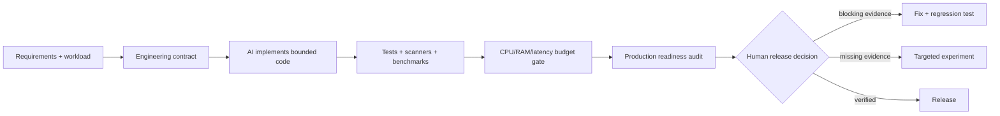

# ShipProof

**Teach coding agents to build secure, fast, resource-bounded software—and prove it before release.**

[](https://github.com/kingggg5/shipproof/actions/workflows/ci.yml)
[](https://github.com/kingggg5/shipproof/actions/workflows/security.yml)
[](https://learn.chatgpt.com/docs/build-skills)
[](https://code.claude.com/docs/en/skills)
[](LICENSE)

ShipProof is a portable pair of AI Agent Skills plus zero-dependency Python gates. It guides Codex or Claude Code while code is being designed and written, then audits the result with reproducible evidence.

It does **not** promise “perfect,” “unhackable,” “maximum performance,” or “one million users” from a static scan. It turns those goals into explicit invariants, resource budgets, target-specific tests, and release gates.

## Two modes, one workflow

| Skill | Use it for | Outcome |
| --- | --- | --- |
| `engineer-production-systems` | Design, implementation, refactoring, hardening, CPU/RAM/latency work, kernels, browser engines, parsers, and protocols | Small, bounded, testable production code with explicit assumptions |
| `audit-production-readiness` | Deep review, vulnerability triage, pre-production checks, incident prevention, and 10k-to-1M-user planning | Independent Security, Correctness, Scale, Operability, and Supply Chain gates |



## What it tells the AI to do

- Read the real architecture and trace the affected path before changing code.
- Define authorization, tenancy, correctness, workload, latency, CPU, memory, and recovery constraints.
- Bound input, output, recursion, concurrency, fan-out, queues, caches, retries, timeouts, logs, and retained state.
- Prefer simple composition and narrow interfaces over speculative abstractions or premature microservices.
- Measure before and after with the same workload; report variance and tail behavior, not one fast run.
- Treat static and AI findings as leads until a path, reproducer, sanitizer failure, or focused test confirms them.
- Keep dangerous actions human-approved and never upload private code or run active tests without authorization.

## Systems coverage

ShipProof routes high-risk code to a stricter evidence ladder:

| Target | Review focus | Recommended evidence when authorized |
| --- | --- | --- |
| Kernel and drivers | User/kernel boundaries, lifetime/refcounts, copy-to/from-user, ioctl/netlink, locks/RCU, teardown races | KASAN, KMSAN, KCSAN, UBSAN, syzkaller, minimized reproducers |
| Browser engines | GC/refcount boundaries, parsers/codecs, JIT, IPC, sandbox/origin identity, re-entrancy | ASan, UBSan, MSan, coverage-guided fuzzing, regression corpora |
| Network protocols | Framing, integer/length checks, explicit state machines, negotiation, replay, fragmentation, amplification | Structure-aware fuzzing, protocol corpora/dictionaries, fault and sequence tests |
| Services and apps | Authn/authz, tenancy, transactions, retries, idempotency, timeouts, queues, dependency budgets | Unit/integration tests, SAST/SCA, load/soak tests, traces and resource profiles |

The bundled scanner stays deliberately conservative. Deep memory-safety and protocol findings need compiler instrumentation, sanitizers, fuzzers, and target-specific reasoning—not misleading regex matches.

## Codex and Claude compatibility

Both hosts use the open `SKILL.md` structure, so ShipProof keeps one source of truth.

| Host | Skill metadata | Plugin manifest | Personal skill path |
| --- | --- | --- | --- |
| Codex | `skills/*/SKILL.md` + optional `agents/openai.yaml` | `.codex-plugin/plugin.json` | `$CODEX_HOME/skills` or `~/.codex/skills` |
| Claude Code | `skills/*/SKILL.md` | `.claude-plugin/plugin.json` | `~/.claude/skills` |

## Install

Python 3.10+ is the only runtime requirement.

```bash
git clone https://github.com/kingggg5/shipproof.git
cd shipproof
python install.py
```

The default installs both skills for Codex and Claude Code. Limit the target when needed:

```bash
python install.py --target codex
python install.py --target claude
```

Then invoke the skill while building:

```text
Use $engineer-production-systems to implement this feature with explicit security,
CPU, RAM, latency, and failure budgets.
```

Before release:

```text
Use $audit-production-readiness to audit this repository for production.
```

Claude Code can also load the repository directly as a plugin during development:

```bash
claude --plugin-dir .
```

Plugin-installed Claude skills use the namespaced commands `/shipproof:engineer-production-systems` and `/shipproof:audit-production-readiness`.

## Reproducible resource budgets

Benchmarks remain owned by your project. ShipProof only evaluates their numeric outputs, which keeps CI local, fast, and provider-independent.

`perf-baseline.json`:

```json
{"metrics":{"p95_latency_ms":120,"cpu_ms":8.5,"rss_mb":180,"throughput_rps":850}}
```

`perf-current.json` has the same keys. Define reviewed limits in `perf-budget.json`:

```json
{
  "metrics": {
    "p95_latency_ms": {"direction":"lower","max_regression_percent":10,"max":160},
    "cpu_ms": {"direction":"lower","max_regression_percent":8},
    "rss_mb": {"direction":"lower","max_regression_percent":5,"max":220},
    "throughput_rps": {"direction":"higher","max_regression_percent":5,"min":750}
  }
}
```

Run the gate:

```bash
python skills/engineer-production-systems/scripts/check_budget.py \
  --baseline perf-baseline.json --current perf-current.json \
  --budget perf-budget.json --format markdown
```

Runnable sample files live in [`examples/performance`](examples/performance).

Exit codes are `0` for pass, `1` for a measured budget failure, and `2` for missing or invalid evidence.

## Audit and capacity tools

Fast local scan with Markdown, JSON, or SARIF 2.1.0 output:

```bash
python skills/audit-production-readiness/scripts/scan_repo.py . \
  --format sarif --output shipproof.sarif --fail-on high
```

Create a reviewed fingerprint baseline for accepted debt:

```bash
python skills/audit-production-readiness/scripts/scan_repo.py . \
  --format json --baseline-out .shipproof-baseline.json --fail-on none
```

Turn one million registered users into a transparent workload hypothesis, including CPU and memory assumptions:

```bash
python skills/audit-production-readiness/scripts/capacity_model.py \
  --users 1000000 --dau-ratio 0.25 --peak-hour-ratio 0.20 \
  --actions-per-session 12 --requests-per-action 2 --instance-rps 250 \
  --cpu-ms-per-request 5 --memory-mb-per-instance 512 --format markdown
```

Replace every sample value with analytics and a production-shaped benchmark. Registered users are not concurrent users, and capacity arithmetic is not a load test.

## Layer with mature tools

ShipProof routes the agent to tools already present in the environment and never silently installs them:

- [CodeQL](https://docs.github.com/en/code-security/concepts/code-scanning/codeql/codeql-cli) or [Semgrep](https://semgrep.dev/docs/) for source and data-flow analysis.
- [OSV-Scanner](https://google.github.io/osv-scanner/) or [Trivy](https://trivy.dev/docs/latest/) for dependencies, containers, IaC, secrets, licenses, and SBOM evidence.
- [Gitleaks](https://github.com/gitleaks/gitleaks) for current and historical secrets.
- [SkillSpector](https://github.com/NVIDIA/SkillSpector) for trust checks before installing third-party agent skills.
- [OpenSSF Scorecard](https://scorecard.dev/) for repository and supply-chain posture.
- [LLVM libFuzzer](https://llvm.org/docs/LibFuzzer.html), [OSS-Fuzz](https://github.com/google/oss-fuzz), or [syzkaller](https://github.com/google/syzkaller) for authorized target-specific fuzzing.
- [Grafana k6](https://grafana.com/docs/k6/latest/) or the project's existing harness for SLO-driven load testing.

## What came from CodeVibes—and what did not

[CodeVibes](https://github.com/danish296/codevibes) is MIT-licensed and demonstrates useful product ideas: prioritize high-risk files, show progress, combine deterministic candidates with contextual AI, and return actionable findings. ShipProof independently implements those ideas as portable agent instructions and local CI gates.

ShipProof does not copy CodeVibes' React/Express application, DeepSeek service, SQLite history, Vibe Score, or source code. It deliberately avoids a single score because one critical defect must not be averaged away by many clean files.

The design also learns from [NVIDIA SkillSpector](https://github.com/NVIDIA/SkillSpector) (bounded input, static-first analysis, baselines, SARIF), [Vercel deepsec](https://github.com/vercel-labs/deepsec) (resumable stages, explicit cost/time caps, revalidation), [OSV-Scanner](https://github.com/google/osv-scanner) (authoritative dependency matching and call analysis), and mature fuzzing projects. See [docs/research.md](docs/research.md) for the source-by-source synthesis and limitations.

## About large vulnerability claims

The cited counts—107 Critical, 990 High, 1,286 Medium, and 53 Low—sum to 2,436. We could not locate a primary public report that ties this exact distribution to the Linux kernel, WebKit, FreeBSD, or a 40-year-old bug, so ShipProof does not repeat it as a verified benchmark.

Verified primary material does show the broader lesson: modern AI-assisted research has found serious flaws in mature operating systems and browsers, while projects such as OSS-Fuzz report thousands of vulnerabilities over years of continuous fuzzing. The engineering response is layered verification and retained regression evidence, not trusting a headline or one model pass.

## Development

```bash
python -m unittest discover -s tests -v
python -m compileall -q skills tests install.py
python skills/audit-production-readiness/scripts/scan_repo.py . --fail-on high
```

The runtime uses only the Python standard library. Read [CONTRIBUTING.md](CONTRIBUTING.md) before adding a detector: each rule needs positive and negative tests, a mapping, remediation, and false-positive analysis.

## License and security

[MIT](LICENSE). Report vulnerabilities privately according to [SECURITY.md](SECURITY.md).
