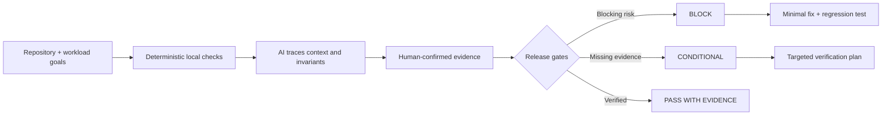

# ShipProof

**Evidence-first production readiness audits for bugs, security, and scale.**

[](https://github.com/kingggg5/shipproof/actions/workflows/ci.yml)
[](https://github.com/kingggg5/shipproof/actions/workflows/security.yml)
[](LICENSE)

ShipProof is an open-source Codex plugin and skill for deep repository review. It combines a zero-dependency local scanner, an explicit 10k-to-1M-user capacity model, and an AI-guided workflow that separates confirmed evidence from hypotheses and unknowns.

It is inspired by [CodeVibes](https://github.com/danish296/codevibes), but takes a different scope: local-first auditing, release gates, SARIF, stable baselines, threat modeling, supply-chain review, and measurable workload planning instead of a single quality score.

> ShipProof does not certify software as secure or prove capacity from static code. It finds evidence, makes assumptions visible, and defines the tests needed for a defensible release decision.

## Why ShipProof

| Capability | ShipProof approach |
| --- | --- |
| Privacy | Repository analysis starts locally; no API key or code upload is required |
| Bugs | Review business invariants, concurrency, retries, transactions, timeouts, and failure paths |
| Security | Threat model plus layered SAST, secret, dependency, IaC, and authorization evidence |
| Scale | Convert users into peak RPS, concurrency, DB work, and a staged load-test plan |
| Triage | Severity and confidence stay separate; findings have stable fingerprints |
| CI | Exit codes, JSON, Markdown, SARIF 2.1.0, pinned actions, tests, and CodeQL |
| Decisions | Independent Security, Correctness, Scale, Operability, and Supply Chain gates |

## How AI is used



AI helps trace cross-file behavior, build a threat model, deduplicate root causes, challenge architecture assumptions, and propose the smallest verifiable remediation. Deterministic scripts own reproducible detection and capacity arithmetic. A human retains release authority.

## Install

Clone the repository, then run the cross-platform installer (Python 3.10+):

```bash
git clone https://github.com/kingggg5/shipproof.git
cd shipproof
python install.py
```

This copies `audit-production-readiness` into `$CODEX_HOME/skills`, or `~/.codex/skills` when `CODEX_HOME` is unset. Restart Codex, then ask:

```text
Use $audit-production-readiness to audit this repository for production.
```

The repository also contains `.codex-plugin/plugin.json` for plugin-capable Codex clients.

## Use the tools directly

Run a fast local scan and fail on high or critical findings:

```bash
python skills/audit-production-readiness/scripts/scan_repo.py . \
  --format markdown --output shipproof-report.md --fail-on high
```

Generate SARIF 2.1.0 for GitHub code scanning:

```bash
python skills/audit-production-readiness/scripts/scan_repo.py . \
  --format sarif --output shipproof.sarif --fail-on high
```

Create a reviewed baseline for existing debt:

```bash
python skills/audit-production-readiness/scripts/scan_repo.py . \
  --format json --baseline-out .shipproof-baseline.json --fail-on none
```

Model a one-million-user target. Replace every example ratio with product analytics and measured throughput:

```bash
python skills/audit-production-readiness/scripts/capacity_model.py \
  --users 1000000 --dau-ratio 0.25 --peak-hour-ratio 0.20 \
  --actions-per-session 12 --requests-per-action 2 \
  --instance-rps 250 --format markdown
```

Exit codes are `0` for pass, `1` when the severity gate fails, and `2` for invalid input or configuration.

## Layer with mature scanners

ShipProof's bundled scanner is intentionally fast and explainable, not a replacement for deeper tools. For production evidence, add the tools relevant to the target:

- [CodeQL](https://docs.github.com/en/code-security/concepts/code-scanning/codeql/codeql-cli) or [Semgrep](https://semgrep.dev/docs/) for data-flow/static analysis.
- [Gitleaks](https://github.com/gitleaks/gitleaks) for current and historical secrets.
- [Trivy](https://trivy.dev/docs/latest/target/filesystem/) for dependencies, filesystems, images, IaC, secrets, licenses, and SBOMs.
- [OpenSSF Scorecard](https://scorecard.dev/) for open-source repository and supply-chain signals.
- [Grafana k6](https://grafana.com/docs/k6/latest/) for SLO-driven smoke, load, stress, spike, and soak tests.

The skill can use tools already available in the environment, but never installs them, sends code away, or attacks a target without explicit authorization.

## Design principles

1. **Evidence over confidence.** Every confirmed finding needs a reachable path, broken invariant, impact, fix, and verification.
2. **Unknown is not green.** Missing production metrics or load tests produce a conditional gate.
3. **Users are not requests.** Registered-user targets must become a workload model before architecture advice.
4. **Simple until measured otherwise.** Do not prescribe microservices, Kubernetes, caching, or sharding without a named constraint.
5. **Independent gates.** A good aggregate score must never hide a critical security or correctness failure.
6. **Safe by default.** Audit read-only; redact secrets; require authorization for load, fuzz, DAST, or exploit testing.

## Research basis

The workflow combines primary standards and operational guidance with community failure reports:

- [OWASP ASVS 5.0](https://github.com/OWASP/ASVS/tree/master/5.0) and [NIST SSDF SP 800-218](https://csrc.nist.gov/pubs/sp/800/218/final) shape verification and secure-development coverage.
- [GitHub SARIF documentation](https://docs.github.com/en/code-security/concepts/code-scanning/sarif-files) defines interoperable static-analysis output.
- [Google SRE: Addressing Cascading Failures](https://sre.google/sre-book/addressing-cascading-failures/) ties capacity planning to realistic overload tests and graceful degradation.
- [Grafana k6 thresholds](https://grafana.com/docs/k6/latest/using-k6/thresholds/) turn latency and error SLOs into automated pass/fail criteria.
- A [2026 Medium production account](https://medium.com/real-world-net/we-hit-1m-users-heres-what-broke-first-in-our-net-system-68617da49a33) describes failures emerging in layers: queries, jobs, caches, logging, authentication, and deployment.
- Stack Overflow discussions reinforce that [ten million stored users do not mean ten million concurrent users](https://stackoverflow.com/questions/5645393/how-to-do-load-testing-using-jmeter-and-visualvm) and that [connection-pool exhaustion often exposes leaks or long transactions](https://stackoverflow.com/questions/57974810/how-dbcontext-and-connections-to-db-should-be-implemented-to-handle-load-testing).
- Experienced engineers on Reddit similarly emphasize [measuring real bottlenecks and traffic shape](https://www.reddit.com/r/ExperiencedDevs/comments/y39rgz/building_highly_scalable_distributed_systems/) instead of declaring an architecture infinitely scalable.

See [docs/research.md](docs/research.md) for the design synthesis and limitations.

## Development

```bash
python -m unittest discover -s tests -v
python -m compileall -q skills tests install.py
python skills/audit-production-readiness/scripts/scan_repo.py . --fail-on high
```

ShipProof uses only the Python standard library at runtime. Read [CONTRIBUTING.md](CONTRIBUTING.md) before adding a rule; every rule must include a positive test, a negative test, mappings, remediation, and a false-positive analysis.

## License

[MIT](LICENSE). Security reports should follow [SECURITY.md](SECURITY.md).
