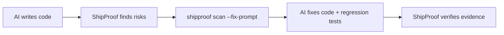
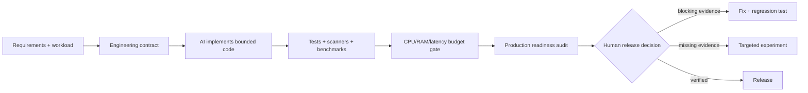

# ShipProof

**Make AI-written code prove it is ready to ship.**

Security · Correctness · Scale · Performance · Production readiness

Works with **Codex**, **Claude Code**, **Cursor**, **Gemini**, **Grok**, local terminals, pre-commit, and GitHub Actions.

[](https://github.com/kingggg5/shipproof/actions/workflows/ci.yml)
[](https://github.com/kingggg5/shipproof/actions/workflows/security.yml)
[](CHANGELOG.md)
[](.github/workflows/ci.yml)
[](https://learn.chatgpt.com/docs/build-skills)
[](https://code.claude.com/docs/en/skills)
[](LICENSE)

ShipProof is a production gate for AI-assisted repositories. It scans code without executing it, checks measured CPU/RAM/latency budgets, models reviewed capacity assumptions, and gives coding agents focused engineering instructions. Results are available as terminal output, JSON, SARIF, pre-commit, GitHub Actions, or an optional read-only MCP adapter.

It does **not** promise "perfect," "unhackable," "maximum performance," or "one million users" from a static scan. It makes assumptions visible, verifies what can be verified, and preserves human authority for consequential actions and releases.


## Understand it in 30 seconds

The checked-in [demo API](examples/demo-api/README.md) contains five real, intentionally vulnerable code paths: missing admin authorization, interpolated SQL, unbounded pagination, a missing outbound timeout, and production debug mode.

```bash
shipproof scan examples/demo-api/fixtures/before --fail-on high
# BLOCK · 5 findings

python -m unittest discover -s examples/demo-api/fixtures/after/tests -v
shipproof scan examples/demo-api/fixtures/after --fail-on high
# PASS_WITH_EVIDENCE · 0 findings
```

The test suite verifies the exact before/after contract. Additional [Node.js, Python, secure, and performance fixtures](fixtures/README.md) guard against missed findings and obvious false positives.

## Quickstart (Zero-Config)

Run directly in any repository without creating a configuration file first:

```bash
npx @kingggg5/shipproof check
```

Or install globally:

```bash
npm install --global github:kingggg5/shipproof
shipproof doctor .
shipproof init . --target both
shipproof check .
```

`init` adds repository-scoped skills to `.agents/skills` for Codex and `.claude/skills` for Claude Code. It skips existing skill directories unless you explicitly pass `--force`.

Node.js 20+ runs the front-door CLI. Python 3.10+ is needed for `scan`, `check`, `budget`, `capacity`, and the MCP tools. The core has no runtime npm or Python package dependencies.

## Code-Review Terminal Output

ShipProof formats findings as actionable review cards with source context, confidence levels, why the risk matters, and recommended fixes:

```text
  [BLOCK] ShipProof: BLOCK
  Scanned 24 files | 1 blocking issue | 0 suppressed
  HIGH: 1

  [HIGH] Sensitive route lacks visible authorization (SP108)
     src/routes/admin.py:42  |  confidence: LIKELY

     Evidence:
       40   
       41   @app.post("/admin/users/{user_id}/ban")
       42 > def ban_user(user_id: str):
       43       return db.ban(user_id)

     Why: An admin or internal route has no visible authorization dependency.
     Fix: Require an explicit authorization dependency or verify application-wide control.
     Ref: CWE-862 | OWASP ASVS V4

  ----------------------------------------------------------------------

  -> Run `shipproof scan --fix-prompt` to generate AI-ready fix instructions
  -> Run `shipproof explain SP108` for attack scenarios and testing guidance
```

## The Closed-Loop AI Workflow

ShipProof turns development into a verified feedback loop: AI writes code, ShipProof finds risks, AI fixes with explicit constraints, and ShipProof re-verifies.



### Generate Prompts for AI Handoff

```bash
shipproof scan --fix-prompt
```

Outputs structured instructions with code context, constraints, and test requirements ready for **Codex**, **Claude Code**, **Cursor**, **Gemini**, **Grok**, or **Copilot**:

```text
Fix SP108 in src/routes/admin.py (line 42).
Problem: An admin route has no visible authorization dependency.
Required fix: Add Depends(require_admin) to route dependencies.
Constraints:
- Do not change the public API contract
- Add a regression test verifying non-admin returns 403
- Reference: CWE-862, OWASP ASVS V4
```

### Interactive Rule Explanations

Inspect why a rule exists, the threat scenario, common false positives, and how to write a regression test:

```bash
shipproof explain SP108
```

## Framework-Aware Detection

ShipProof automatically detects project frameworks and applies domain-specific rules:

| Framework | Detection Source | Reviewed Checks |
| :--- | :--- | :--- |
| **Next.js** | `package.json` (`next`) | Secrets in `NEXT_PUBLIC_` env vars (`SP403`), missing CSP headers |
| **Express / Fastify** | `package.json` (`express`, `fastify`) | Missing `helmet` security middleware (`SP401`), raw error leaks to client (`SP406`), unthrottled endpoints |
| **FastAPI** | `requirements.txt`, `pyproject.toml` | Unprotected admin routes (`SP108`), unpaginated queries (`SP305`), blocking async sleep (`SP303`), unbounded HTTP timeouts (`SP304`) |
| **Django** | `requirements.txt`, `pyproject.toml` | Hardcoded `SECRET_KEY` (`SP404`), wildcard `ALLOWED_HOSTS` (`SP405`), interpolated SQL queries (`SP103`) |
| **Containers & CI** | `Dockerfile`, `.github/workflows` | Floating container base images (`SP202`), unpinned GitHub Actions (`SP203`) |

## False Positive Control

ShipProof prioritizes high precision over noisy alerts:

- **Inline suppression:** Add `# shipproof-ignore SP101` or `// shipproof-ignore SP101` directly on the line or on the line immediately preceding it.
- **Confidence filtering:** Run with `--min-confidence high` to surface only confirmed, high-confidence issues.
- **Reviewed baselines:** Record existing technical debt into `.shipproof-baseline.json` using `shipproof scan --baseline-out .shipproof-baseline.json`.

## Add the GitHub Action

Add a deterministic gate to pull requests:

```yaml
name: ShipProof
on: [pull_request]
permissions:
  contents: read
jobs:
  production-gate:
    runs-on: ubuntu-latest
    steps:
      - uses: actions/checkout@v4
      - uses: kingggg5/shipproof@v0.4.0
        with:
          fail-on: high
```

The action automatically writes a structured Markdown status card to the GitHub Step Summary. `v0.4.0` is the public-beta contract. Pin ShipProof to the release commit SHA when immutable supply-chain references are required.

## One Policy, One Command

Commit a bounded [`.shipproof.yml`](.shipproof.yml), then run every declared repository gate:

```yaml
version: 1
scan:
  path: .
  exclude:
    - vendor/**
security:
  fail_on: high
performance:
  baseline: perf/baseline.json
  current: perf/current.json
  budget: perf/budget.json
capacity:
  config: capacity.json
```

```bash
shipproof check .
```

The dependency-free YAML subset rejects executable tags, anchors, duplicate keys, unknown fields, path traversal, and arbitrary commands. The full shape is documented by the [policy schema](schemas/shipproof-policy.schema.json).

## Two Modes, One Workflow

| Skill | Use it for | Outcome |
| :--- | :--- | :--- |
| `engineer-production-systems` | Design, implementation, refactoring, hardening, performance, data, AI/MCP, and authorized defensive systems work | Small, bounded, testable production code with explicit assumptions |
| `audit-production-readiness` | Deep review, vulnerability triage, incidents, release gates, and 10k-to-1M-user planning | Independent Security, Correctness, Data & Privacy, Scale, Operability, and Supply Chain gates |



## What It Tells the AI to Do

- Read the real architecture and trace the affected path before changing code.
- Define authorization, tenancy, correctness, workload, latency, CPU, memory, and recovery constraints.
- Bound input, output, recursion, concurrency, fan-out, queues, caches, retries, timeouts, logs, and retained state.
- Prefer simple composition and narrow interfaces over speculative abstractions or premature microservices.
- Measure before and after with the same workload; report variance and tail behavior, not one fast run.
- Treat static and AI findings as leads until a path, reproducer, sanitizer failure, or focused test confirms them.
- Keep dangerous actions human-approved and never upload private code or run active tests without authorization.

Progressive references cover production architecture, full-stack boundaries, database invariants and migrations, AI/RAG/MCP security, software supply chains, operability and incident response, performance, low-level systems, and authorized defensive reverse engineering.

The [ShipProof production engineering playbook](docs/production-playbook.md) is the owner-authored map across those disciplines: eight control planes, one decision doctrine, and a compact release record.

## Systems Coverage

ShipProof routes high-risk code to a stricter evidence ladder:

| Target | Review focus | Recommended evidence when authorized |
| :--- | :--- | :--- |
| Kernel and drivers | User/kernel boundaries, lifetime/refcounts, copy-to/from-user, ioctl/netlink, locks/RCU, teardown races | KASAN, KMSAN, KCSAN, UBSAN, syzkaller, minimized reproducers |
| Browser engines | GC/refcount boundaries, parsers/codecs, JIT, IPC, sandbox/origin identity, re-entrancy | ASan, UBSan, MSan, coverage-guided fuzzing, regression corpora |
| Network protocols | Framing, integer/length checks, explicit state machines, negotiation, replay, fragmentation, amplification | Structure-aware fuzzing, protocol corpora/dictionaries, fault and sequence tests |
| Services and apps | Authn/authz, tenancy, transactions, retries, idempotency, timeouts, queues, dependency budgets | Unit/integration tests, SAST/SCA, load/soak tests, traces and resource profiles |

The bundled scanner stays deliberately conservative. Deep memory-safety and protocol findings need compiler instrumentation, sanitizers, fuzzers, and target-specific reasoning rather than misleading regex matches.

## Codex and Claude Compatibility

Both hosts use the open `SKILL.md` structure, so ShipProof keeps one source of truth.

| Host | Skill metadata | Plugin manifest | Personal skill path |
| --- | --- | --- | --- |
| Codex | `skills/*/SKILL.md` + optional `agents/openai.yaml` | `.codex-plugin/plugin.json` | `~/.agents/skills` or `<repo>/.agents/skills` |
| Claude Code | `skills/*/SKILL.md` | `.claude-plugin/plugin.json` | `~/.claude/skills` |

## Command Reference

```text
shipproof check [path] [--config <file>]     Run every gate (works without config)
shipproof scan [path] [options]              Scan repository (--format terminal|json|sarif)
shipproof explain <rule-id>                  Explain a rule in detail (e.g. explain SP108)
shipproof doctor [path] [--json]             Inspect local runtime and integration health
shipproof init [path] [--target <host>]      Add project skills (.agents/.claude)
shipproof install [--target <host>]          Add personal skills for Codex/Claude
shipproof prompt <name|list>                 Print a focused production engineering prompt
shipproof budget [budget options]            Enforce CPU/RAM/latency regression budgets
shipproof capacity [capacity options]        Model capacity and export to k6 load tests
shipproof evidence [path] [options]          Run allowlisted TypeScript, Go, or Rust analyzers
shipproof mcp                                Start the read-only stdio MCP server
shipproof help                               Show command help
shipproof version                            Print current version
```

See [docs/commands.md](docs/commands.md) for full argument options and exit codes.

## Install from a Clone

```bash
git clone https://github.com/kingggg5/shipproof.git
cd shipproof
npm install --global .
```

Then invoke the skill while building:

```text
Use $engineer-production-systems to implement this feature with explicit security,
CPU, RAM, latency, and failure budgets.
```

Before release:

```text
Use $audit-production-readiness to audit this repository for production.
```

Claude Code can also load the repository directly as a plugin during development:

```bash
claude --plugin-dir .
```

Plugin-installed Claude skills use the namespaced commands `/shipproof:engineer-production-systems` and `/shipproof:audit-production-readiness`.

## Reproducible Resource Budgets

Benchmarks remain owned by your project. ShipProof evaluates numeric outputs to keep CI local, fast, and provider-independent.

`perf-baseline.json`:

```json
{"metrics":{"p95_latency_ms":120,"cpu_ms":8.5,"rss_mb":180,"throughput_rps":850}}
```

`perf-current.json` has the same keys. Define reviewed limits in `perf-budget.json`:

```json
{
  "metrics": {
    "p95_latency_ms": {"direction":"lower","max_regression_percent":10,"max":160},
    "cpu_ms": {"direction":"lower","max_regression_percent":8},
    "rss_mb": {"direction":"lower","max_regression_percent":5,"max":220},
    "throughput_rps": {"direction":"higher","max_regression_percent":5,"min":750}
  }
}
```

Run the gate:

```bash
shipproof budget \
  --baseline perf-baseline.json --current perf-current.json \
  --budget perf-budget.json --format markdown
```

Runnable sample files live in [`examples/performance`](examples/performance).

Exit codes are `0` for pass, `1` for a measured budget failure, and `2` for missing or invalid evidence.

## Audit and Capacity Tools

Fast local scan with Terminal, Markdown, JSON, or SARIF 2.1.0 output:

```bash
shipproof scan . --format sarif --output shipproof.sarif --fail-on high
```

Create a reviewed fingerprint baseline for accepted debt:

```bash
shipproof scan . --format json --baseline-out .shipproof-baseline.json --fail-on none
```

Turn one million registered users into a transparent workload hypothesis, including CPU and memory assumptions:

```bash
shipproof capacity \
  --users 1000000 --dau-ratio 0.25 --peak-hour-ratio 0.20 \
  --actions-per-session 12 --requests-per-action 2 --instance-rps 250 \
  --cpu-ms-per-request 5 --memory-mb-per-instance 512 --format markdown
```

Replace sample values with analytics and production-shaped benchmarks. Registered users are not concurrent users, and capacity arithmetic is not a load test.

Generate a deterministic k6 starting point from reviewed config:

```bash
shipproof capacity --config examples/capacity/shipproof.config.json \
  --export-k6 load-test.js --format json
BASE_URL=https://staging.example.test LOAD_TEST_TOKEN=replace-me k6 run load-test.js
```

The generated file contains no hostname or credential. Running it is a separate, authorized action; review the rate, routes, target environment, and thresholds first.

## Local MCP and Language Evidence

Install optional MCP peers beside ShipProof, then point an MCP client at `shipproof mcp`:

```bash
npm install --save-dev github:kingggg5/shipproof @modelcontextprotocol/sdk@1.29.0 zod@3.25.76
npx shipproof mcp
```

Set `SHIPPROOF_MCP_ROOT` to the repository root when the client does not launch the server there. Paths are canonicalized, symlink escapes are denied, execution is bounded to 30 seconds and 2 MB, and no raw shell or file-reading tool is exposed.

Inspect available language-native evidence adapters before running one:

```bash
shipproof evidence . --list --format json
shipproof evidence . --adapter typescript --format json
shipproof evidence . --adapter go --format json
shipproof evidence . --adapter rust --allow-project-code --format json
```

Dependency downloads are disabled for Go and Rust adapters. TypeScript must exist in the repository. The Rust opt-in is deliberate because `cargo clippy` can execute project-controlled `build.rs` code.

## Layer with Mature Tools

ShipProof routes the agent to tools already present in the environment and never silently installs them:

- CodeQL or Semgrep for source and data-flow analysis.
- OSV-Scanner or Trivy for dependencies, containers, IaC, secrets, licenses, and SBOM evidence.
- Gitleaks for current and historical secrets.
- SkillSpector for trust checks before installing third-party agent skills.
- OpenSSF Scorecard for repository and supply-chain posture.
- LLVM libFuzzer, OSS-Fuzz, or syzkaller for authorized target-specific fuzzing.
- Grafana k6 or the project's existing harness for SLO-driven load testing.

## ShipProof Design and Research Trail

ShipProof is independently implemented. Its guidance is written as ShipProof decisions—each tied to an invariant, evidence, and a limitation—not as a collage of external checklists.

- Read the [production playbook](docs/production-playbook.md) for the first-party operating model.
- Read the [research notebook](docs/research.md) only when you need to trace which primary pages were opened, what question they answered, what ShipProof retained, and what it deliberately did not claim.

External links are concentrated in the notebook so the README and skill instructions remain ShipProof's own concise guidance. Community posts and repositories may suggest questions, but they are not accepted as proof and their code or prompts are not imported.

ShipProof deliberately avoids a single readiness score because one critical defect must not be averaged away by many clean files.

## AWE TraceGate Engineering Loop and Roadmap

AWE TraceGate orchestrates the loop; ShipProof remains the reusable evidence engine. This keeps loop state, budgets, approvals, and user experience in AWE TraceGate while one ShipProof contract serves local CLI, pre-commit, GitHub Actions, generated k6 tests, and MCP clients.

```text
Observe -> Contract -> Change -> Verify -> Audit -> Decide -> Learn
   ^                                                        |
   +--------------------- bounded next iteration -----------+
```

Run `shipproof prompt loop` to load the bounded workflow. See the [delivery roadmap](docs/roadmap.md) for what shipped in 0.4.0 and which acceptance evidence belongs before a stable 1.0 release.

## Development

```bash
npm ci --ignore-scripts
python -m pip install -r requirements-dev.txt
npm run lint
npm run test
python -m compileall -q skills tests
python skills/audit-production-readiness/scripts/scan_repo.py . --fail-on high
npm pack --dry-run
```

The core runtime uses only Node and the Python standard library; Ruff is development-only. The optional MCP adapter uses the official MCP SDK and Zod as explicitly installed peers. CI tests Node 20/24 and Python 3.10/3.12, verifies package contents, and runs CodeQL for Python and JavaScript/TypeScript. Read [CONTRIBUTING.md](CONTRIBUTING.md) before adding a detector: each rule needs positive and negative tests, a mapping, remediation, and false-positive analysis.

The scoped npm manifest is ready for a future registry release. Until the owner configures npm trusted publishing, use the GitHub npm install shown above; this project does not claim an unpublished registry release. See [docs/releasing.md](docs/releasing.md).

## License and Security

[MIT](LICENSE). Report vulnerabilities privately according to [SECURITY.md](SECURITY.md).
