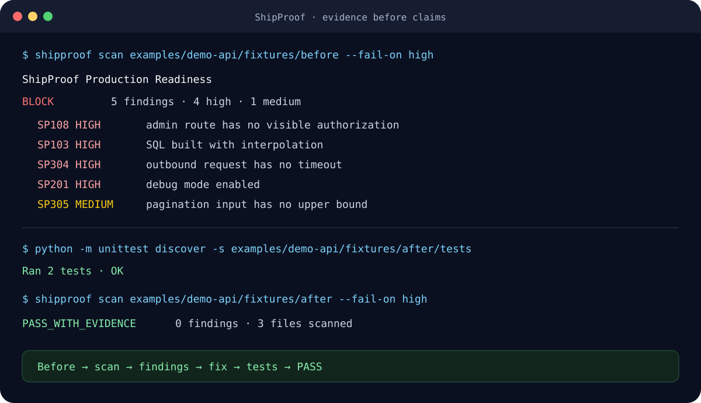
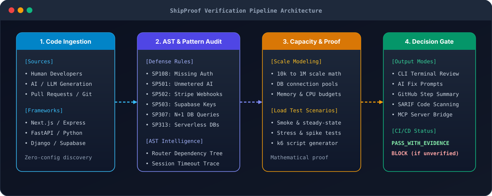
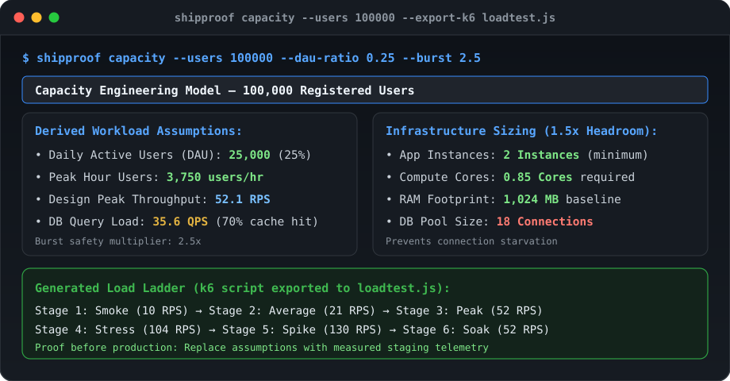

# ShipProof

**ระบบตรวจสอบและพิสูจน์ความพร้อมของโค้ดก่อนปล่อยขึ้น Production**

[English](README.md) · [ภาษาไทย](README.th.md)

ความปลอดภัย · ความถูกต้องของโค้ด · การรองรับการสเกล · ประสิทธิภาพ · ความพร้อมสำหรับ Production

รองรับการทำงานร่วมกับ **Codex**, **Claude Code**, **Cursor**, **Gemini**, **Grok**, Terminal ทั่วไป, Pre-commit และ GitHub Actions

[](https://github.com/kingggg5/shipproof/actions/workflows/ci.yml)
[](https://github.com/kingggg5/shipproof/actions/workflows/security.yml)
[](CHANGELOG.md)
[](.github/workflows/ci.yml)
[](https://learn.chatgpt.com/docs/build-skills)
[](https://code.claude.com/docs/en/skills)
[](LICENSE)

ShipProof คือเกตตรวจสอบความพร้อม (Production Gate) สำหรับโปรเจกต์ที่เขียนโค้ดด้วยตนเองหรือใช้ AI ช่วยเขียน (Vibe Coding) เครื่องมือจะตรวจสอบโค้ดแบบ Static Analysis โดยไม่ต้องรันโค้ดจริง, วัดและเปรียบเทียบการใช้ CPU/RAM/Latency ตามงบประมาณที่กำหนด, จำลองการรองรับโหลดและคอขวดเมื่อมีผู้ใช้เพิ่มขึ้น และสร้าง Prompt คำแนะนำให้ AI นำไปแก้ไขโค้ดได้อย่างตรงจุด

ShipProof ไม่ได้สัญญาคำว่า "สมบูรณ์แบบ 100%" หรือ "ไม่มีวันถูกแฮก" จากการสแกนโค้ดเพียงอย่างเดียว แต่ช่วยให้เรามองเห็นสมมติฐานและจุดบกพร่องที่ซ่อนอยู่ นำหลักฐานจริงมาพิสูจน์ และคงอำนาจการตัดสินใจขั้นสุดท้ายไว้ที่นักพัฒนาและทีมงาน

<p align="center">
  
</p>

## ทำความเข้าใจใน 30 วินาที

ในไดเรกทอรีตัวอย่าง [demo API](examples/demo-api/README.md) มีการจำลองโค้ดที่มีช่องโหว่จริง 5 ประการ: ไม่มีระบบยืนยันสิทธิ์ใน Route แอดมิน, ต่อ String ในคำสั่ง SQL โดยตรง, การแบ่งหน้าข้อมูล (Pagination) ที่ไม่จำกัดจำนวนสูงสุด, การยิง HTTP Request ภายนอกโดยไม่มี Timeout และการเปิด Debug Mode ค้างไว้ใน Production

```bash
shipproof scan examples/demo-api/fixtures/before --fail-on high
# ผลลัพธ์: BLOCK · พบ 5 ปัญหาความเสี่ยงสูง

python -m unittest discover -s examples/demo-api/fixtures/after/tests -v
shipproof scan examples/demo-api/fixtures/after --fail-on high
# ผลลัพธ์: PASS_WITH_EVIDENCE · ไม่พบปัญหา (0 findings)
```

ชุดทดสอบจะยืนยันความถูกต้องระหว่างก่อนและหลังการแก้โค้ด พร้อมทั้งมี [Node.js, Python และ Performance Fixtures](fixtures/README.md) เพื่อป้องกันการแจ้งเตือนที่ผิดพลาด (False Positives)

## เริ่มต้นใช้งานทันที (ไม่ต้องตั้งค่าไฟล์ล่วงหน้า)

สามารถรันคำสั่งตรวจสอบในโปรเจกต์ใดก็ได้ทันที:

```bash
npx @kingggg5/shipproof check
```

หรือติดตั้งแบบ Global ลงในเครื่อง:

```bash
npm install --global github:kingggg5/shipproof
shipproof doctor .
shipproof init . --target both
shipproof check .
```

คำสั่ง `init` จะเพิ่มชุดคำสั่ง (Skills) ให้กับ Codex ในโฟลเดอร์ `.agents/skills` และ Claude Code ในโฟลเดอร์ `.claude/skills` โดยจะไม่เขียนทับโฟลเดอร์เดิมที่มีอยู่แล้ว เว้นแต่จะระบุตัวเลือก `--force`

ความต้องการของระบบ: Node.js 20+ สำหรับการเรียกใช้งาน CLI และ Python 3.10+ สำหรับคำสั่ง `scan`, `check`, `budget`, `capacity` และระบบ MCP ตัวระบบหลักไม่มี Runtime Dependency ภายนอก ทำให้ติดตั้งและทำงานได้อย่างรวดเร็ว

## รูปแบบการรายงานผลใน Terminal

ShipProof ออกแบบการรายงานผลให้เข้าใจง่ายเหมือนได้รับการตรวจโค้ด (Code Review) จาก Senior Engineer โดยระบุบรรทัดที่พบปัญหา, ระดับความมั่นใจ, เหตุผลว่าทำไมจุดนี้จึงอันตราย และแนวทางการแก้ไขที่ถูกต้อง:

```text
  [BLOCK] ShipProof: BLOCK
  Scanned 24 files | 1 blocking issue | 0 suppressed
  HIGH: 1

  [HIGH] Sensitive route lacks visible authorization (SP108)
     src/routes/admin.py:42  |  confidence: LIKELY

     Evidence:
       40   
       41   @app.post("/admin/users/{user_id}/ban")
       42 > def ban_user(user_id: str):
       43       return db.ban(user_id)

     Why: เส้นทาง API สำหรับผู้ดูแลระบบไม่มีการตรวจสอบสิทธิ์ ทำให้ผู้ใช้ทั่วไปสามารถเรียกคำสั่งได้
     Fix: เพิ่ม Dependency ในการตรวจสอบสิทธิ์ เช่น Depends(require_admin)
     Ref: CWE-862 | OWASP ASVS V4

  ----------------------------------------------------------------------

  -> รัน `shipproof scan --fix-prompt` เพื่อสร้าง Prompt สำหรับสั่งให้ AI แก้โค้ด
  -> รัน `shipproof explain SP108` เพื่อดูรายละเอียดและตัวอย่างการเขียน Test
```

## กระบวนการพัฒนาแบบวงปิดร่วมกับ AI (Closed-Loop Workflow)

ShipProof เปลี่ยนการเขียนโค้ดร่วมกับ AI ให้เป็นวงรอบที่มีการตรวจสอบหลักฐานอย่างรัดกุม: AI เขียนโค้ด -> ShipProof ตรวจพบความเสี่ยง -> สร้างคำสั่งแก้ไขพร้อมเงื่อนไข -> AI แก้โค้ดและเพิ่ม Regression Test -> ShipProof ตรวจสอบซ้ำจนกว่าจะผ่านเกณฑ์

<p align="center">
  
</p>


### การสร้าง Prompt สำหรับส่งต่อให้ AI

```bash
shipproof scan --fix-prompt
```

คำสั่งนี้จะสร้างข้อความคำสั่งที่มีบริบทของโค้ด, ข้อจำกัด และเงื่อนไขการเขียน Test เพื่อนำไปวางใน **Codex**, **Claude Code**, **Cursor**, **Gemini**, **Grok** หรือ **Copilot**:

```text
Fix SP108 in src/routes/admin.py (line 42).
Problem: An admin route has no visible authorization dependency.
Required fix: Add Depends(require_admin) to route dependencies.
Constraints:
- Do not change the public API contract
- Add a regression test verifying non-admin returns 403
- Reference: CWE-862, OWASP ASVS V4
```

### การดูคำอธิบาย Rule อย่างละเอียด

สามารถตรวจสอบเหตุผลเบื้องหลัง, รูปแบบการโจมตี, ข้อควรระวังเรื่อง False Positive และวิธีเขียน Test ยืนยันผล:

```bash
shipproof explain SP108
```

## การตรวจจับที่ปรับตาม Framework อัตโนมัติ

ShipProof จะตรวจสอบไฟล์โครงสร้างของโปรเจกต์และเปิดใช้งานกฎการตรวจสอบที่เหมาะสมกับ Framework และ Runtime นั้นๆ โดยอัตโนมัติ:

| กลุ่มเทคโนโลยี / Framework | การตรวจจับ | รายการที่ตรวจสอบเจาะจง |
| :--- | :--- | :--- |
| **Next.js, Nuxt, SvelteKit, Remix, Astro** | `package.json` (`next`, `nuxt`, `@sveltejs/kit`, `@remix-run/*`, `astro`) | ป้องกัน Secret หลุดใน `NEXT_PUBLIC_` (`SP403`), ตรวจสอบนโยบาย CSP (`SP408`), ป้องกัน Connection รั่วใน Serverless DB (`SP313`) |
| **React, Vue, Angular, SolidJS** | `package.json` (`react`, `vue`, `@angular/core`, `solid-js`) | ป้องกัน Supabase `service_role` key หลุดฝั่ง Client (`SP503`), ป้องกันการ Log Credential ใน Client Bundle (`SP204`), ป้องกัน SVG XSS (`SP112`) |
| **Express, Fastify, NestJS, Koa, Hono, Elysia** | `package.json` (`express`, `fastify`, `@nestjs/core`, `koa`, `hono`, `elysia`) | ตรวจสอบ Security Headers (`SP401`), ป้องกัน Raw Error Object หลุด (`SP406`), ป้องกัน Stripe Webhook ปลอม (`SP502`), ตรวจสอบ Rate Limit ใน AI Route (`SP501`) |
| **Prisma, Drizzle, TypeORM, Mongoose, Supabase** | `package.json` (`@prisma/client`, `drizzle-orm`, `typeorm`, `mongoose`, `@supabase/*`) | ป้องกันการสร้าง DB Client ซ้ำซ้อนใน Serverless (`SP313`), ป้องกัน Supabase RLS Bypass (`SP503`), ป้องกัน Unbounded Query (`SP302`) |
| **FastAPI, Starlette, Litestar, Sanic** | `pyproject.toml`, `requirements.txt` | ตรวจสอบสิทธิ์ Route แอดมิน (`SP108`), ตรวจสอบ N+1 Query ใน Loop (`SP307`), ตรวจสอบ Limit ของ Pagination (`SP305`), ตรวจสอบ Timeout (`SP304`) |
| **Django & Flask** | `pyproject.toml`, `requirements.txt` | ป้องกัน Hardcoded `SECRET_KEY` (`SP404`), ตรวจสอบ Wildcard `ALLOWED_HOSTS` (`SP405`), ป้องกัน SQL Interpolation (`SP103`) |
| **Go (Gin, Echo, Fiber, Chi)** | `go.mod` | ป้องกัน Insecure Secret Fallback (`SP004`), ตรวจสอบ Outbound Request Timeout (`SP304`), ป้องกัน Unbounded Concurrency (`SP306`) |
| **Rust (Actix-web, Axum, Rocket)** | `Cargo.toml` | ป้องกันการปิด TLS Verification (`SP104`), ป้องกัน SSRF สู่ Cloud Metadata (`SP109`), ป้องกันการ Log ข้อมูลลับ (`SP204`) |
| **PHP (Laravel, Symfony)** | `composer.json` | ป้องกัน Dynamic Code Execution (`SP101`), ป้องกัน SQL Injection (`SP103`), ป้องกัน Path Traversal (`SP110`) |
| **Ruby (Rails, Sinatra)** | `Gemfile` | ป้องกัน Secret Key รั่วไหล (`SP003`), ป้องกัน Unsafe Deserialization (`SP106`), ป้องกันการเปิด Debug Mode (`SP201`) |
| **Java / Kotlin (Spring Boot, Quarkus, Micronaut)** | `pom.xml`, `build.gradle`, `build.gradle.kts` | ป้องกัน Hardcoded Token (`SP003`), ป้องกัน Wildcard CORS พร้อม Credentials (`SP107`), ป้องกัน Path Traversal (`SP110`) |
| **Containers, Serverless & CI/CD** | `Dockerfile`, `compose.yaml`, `serverless.yml`, `.github/workflows` | ตรวจสอบการ Pin SHA ใน GitHub Actions (`SP203`), ตรวจสอบ Container Base Image Digest (`SP202`), ป้องกัน Debug Mode ใน Prod (`SP201`) |

## การควบคุม False Positive (ความแม่นยำสูง)

ShipProof เน้นความแม่นยำสูงเพื่อไม่ให้เกิดการแจ้งเตือนรบกวน:

- **Inline suppression:** ใส่คอมเมนต์ `# shipproof-ignore SP101` หรือ `// shipproof-ignore SP101` ไว้ที่บรรทัดนั้นหรือบรรทัดก่อนหน้าโดยตรง
- **Confidence filtering:** รันด้วยตัวเลือก `--min-confidence high` เพื่อดูเฉพาะรายการที่มีความมั่นใจสูง
- **Reviewed baselines:** บันทึกรายการหนี้ทางเทคนิคที่มีอยู่เดิมไว้ใน `.shipproof-baseline.json` ด้วยคำสั่ง `shipproof scan --baseline-out .shipproof-baseline.json`

## การใช้งานบน GitHub Actions

เพิ่มเกตตรวจสอบอัตโนมัติในทุก Pull Request:

```yaml
name: ShipProof
on: [pull_request]
permissions:
  contents: read
jobs:
  production-gate:
    runs-on: ubuntu-latest
    steps:
      - uses: actions/checkout@v4
      - uses: kingggg5/shipproof@v0.5.1
        with:
          fail-on: high
```

Action จะสร้างการ์ดสรุปสถานะแบบ Markdown สวยงามลงใน GitHub Step Summary อัตโนมัติ

## นโยบายเดียว คำสั่งเดียว

สร้างไฟล์คอนฟิก [`.shipproof.yml`](.shipproof.yml) ไว้ที่ Root ของโปรเจกต์ จากนั้นสั่งรันตรวจสอบทุกเกตได้ด้วยคำสั่งเดียว:

```yaml
version: 1
scan:
  path: .
  exclude:
    - vendor/**
security:
  fail_on: high
performance:
  baseline: perf/baseline.json
  current: perf/current.json
  budget: perf/budget.json
capacity:
  config: capacity.json
```

สั่งตรวจสอบทั้งหมด:

```bash
shipproof check
```

## สรุปคำสั่งทั้งหมดของ CLI

```text
shipproof check [path] [--config <file>]     รันทุกเกตตามที่ตั้งค่าไว้ (หรือรันได้ทันทีแม้ไม่มีไฟล์คอนฟิก)
shipproof scan [path] [options]              สแกนโค้ดในโปรเจกต์ (--format terminal|json|sarif|markdown)
shipproof explain <rule-id>                  แสดงคำอธิบายกฎอย่างละเอียด (เช่น explain SP108)
shipproof doctor [path] [--json]             ตรวจสอบความพร้อมของ Environment และ Runtime ในเครื่อง
shipproof init [path] [--target <host>]      ติดตั้ง Skills สำหรับ Codex (.agents) และ Claude (.claude)
shipproof install [--target <host>]          ติดตั้ง Skills สำหรับใช้งานส่วนตัวใน Codex/Claude
shipproof prompt <name|list>                 แสดงข้อความ Prompt มาตรฐานสำหรับงาน Production Engineering
shipproof budget [budget options]            ตรวจสอบการถดถอยของ CPU, RAM, Latency เทียบกับ Baseline
shipproof capacity [capacity options]        วิเคราะห์การรองรับโหลดและส่งออกเป็นสคริปต์ทดสอบ k6
shipproof evidence [path] [options]          รันตัววิเคราะห์ภาษาเฉพาะทาง (TypeScript, Go, Rust)
shipproof hook <install|remove>              ติดตั้งหรือถอด Git Pre-commit Hook อัตโนมัติ
shipproof mcp                                เริ่มต้นการทำงานของ MCP Server แบบ Read-Only
shipproof help                               แสดงคำแนะนำการใช้งาน
shipproof version                            แสดงเวอร์ชันปัจจุบัน
```

รายละเอียดเพิ่มเติมเกี่ยวกับ Parameter และ Exit Code สามารถอ่านได้ที่ [docs/commands.md](docs/commands.md)

## การติดตั้งจากการ Clone โค้ด

```bash
git clone https://github.com/kingggg5/shipproof.git
cd shipproof
npm install --global .
```

จากนั้นเรียกใช้งาน Skill ในระหว่างพัฒนา:

```text
Use $engineer-production-systems to implement this feature with explicit security,
CPU, RAM, latency, and failure budgets.
```

ก่อนปล่อยโค้ดขึ้น Production:

```text
Use $audit-production-readiness to audit this repository for production.
```

สำหรับ Claude Code สามารถโหลดโปรเจกต์เป็น Plugin ได้โดยตรง:

```bash
claude --plugin-dir .
```

## การควบคุมงบประมาณทรัพยากร (Resource Budgets)

ผลการทดสอบ Benchmark จะยังคงอยู่ในโปรเจกต์ของคุณ โดย ShipProof จะทำหน้าที่ประเมินตัวเลขเพื่อความรวดเร็วและไม่ขึ้นกับ Cloud Provider ใดๆ

ตัวอย่าง `perf-baseline.json`:

```json
{"metrics":{"p95_latency_ms":120,"cpu_ms":8.5,"rss_mb":180,"throughput_rps":850}}
```

กำหนดเพดานที่ยอมรับได้ใน `perf-budget.json`:

```json
{
  "metrics": {
    "p95_latency_ms": {"direction":"lower","max_regression_percent":10,"max":160},
    "cpu_ms": {"direction":"lower","max_regression_percent":8},
    "rss_mb": {"direction":"lower","max_regression_percent":5,"max":220},
    "throughput_rps": {"direction":"higher","max_regression_percent":5,"min":750}
  }
}
```

สั่งตรวจสอบเกต:

```bash
shipproof budget \
  --baseline perf-baseline.json --current perf-current.json \
  --budget perf-budget.json --format markdown
```

ตัวอย่างไฟล์ที่พร้อมทดลองรันอยู่ที่ [`examples/performance`](examples/performance)

## เครื่องมือวิเคราะห์โหลดและการสเกล (Capacity Modeling)

สแกนโค้ดและส่งออกผลลัพธ์เป็น SARIF 2.1.0 สำหรับ GitHub Code Scanning:

```bash
shipproof scan . --format sarif --output shipproof.sarif --fail-on high
```

<p align="center">
  
</p>

จำลองความต้องการของระบบเมื่อมีผู้ใช้ลงทะเบียน 100,000 ถึง 1,000,000 คน พร้อมคำนวณการใช้ CPU, Memory และ Database Connection Pool:

```bash
shipproof capacity \
  --users 100000 --dau-ratio 0.25 --peak-hour-ratio 0.15 \
  --actions-per-session 10 --requests-per-action 2 --burst 2.5 --format markdown
```

ส่งออกเป็นสคริปต์ k6 สำหรับนำไปรัน Load Test จริง:

```bash
shipproof capacity --config examples/capacity/shipproof.config.json \
  --export-k6 load-test.js --format json
BASE_URL=https://staging.example.test LOAD_TEST_TOKEN=replace-me k6 run load-test.js
```

## การเชื่อมต่อผ่าน MCP และการตรวจภาษาเฉพาะทาง

ติดตั้ง Dependency เพิ่มเติมสำหรับ MCP แล้วเริ่มการทำงานของ Server:

```bash
npm install --save-dev github:kingggg5/shipproof @modelcontextprotocol/sdk@1.29.0 zod@3.25.76
npx shipproof mcp
```

ตรวจสอบเครื่องมือเฉพาะภาษาที่พร้อมใช้งาน:

```bash
shipproof evidence . --list --format json
shipproof evidence . --adapter typescript --format json
shipproof evidence . --adapter go --format json
shipproof evidence . --adapter rust --allow-project-code --format json
```

## ตารางกฎการตรวจสอบ (Detection Rules Reference)

| รหัส Rule | คำอธิบายปัญหา | ระดับความรุนแรง | การตรวจจับ |
| :--- | :--- | :--- | :--- |
| **SP001** | ตรวจพบ Private Key ฝังในโค้ด | CRITICAL | Regex |
| **SP002** | ตรวจพบ AWS Access Key ฝังในโค้ด | CRITICAL | Regex |
| **SP003** | ตรวจพบ Hardcoded API Token / Password | HIGH | Regex |
| **SP004** | ตรวจพบ Secret Fallback Default ที่ไม่ปลอดภัย | HIGH | Regex |
| **SP101** | การใช้คำสั่ง Dynamic Code Execution (`eval`, `exec`) | HIGH | AST / Regex |
| **SP102** | การเปิดใช้งานคำสั่ง Shell (`shell=True`) | HIGH | AST / Regex |
| **SP103** | การต่อ String ใน SQL Query โดยตรง | HIGH | Python AST |
| **SP104** | การปิดระบบตรวจสอบ TLS Certificate (`verify=False`) | HIGH | AST / Regex |
| **SP105** | การใช้งาน JWT โดยปิดการตรวจ Signature | HIGH | Regex |
| **SP106** | การ Deserialization ข้อมูลที่ไม่ปลอดภัย (`pickle`, `yaml.load`) | HIGH | AST / Regex |
| **SP107** | การเปิด Wildcard CORS พร้อมกับ Credential | HIGH | Regex |
| **SP108** | Route สำคัญ/แอดมินไม่มีการตรวจสิทธิ์ | HIGH | Python AST |
| **SP109** | เสี่ยงต่อ SSRF ไปยัง Cloud Metadata (169.254.169.254) | HIGH | AST / Regex |
| **SP110** | เสี่ยงต่อ Path Traversal ในการเปิดหรือบันทึกไฟล์ | HIGH | AST / Regex |
| **SP112** | การรับอัปโหลดไฟล์ SVG โดยไม่ Sanitize เสี่ยงต่อ Stored XSS | MEDIUM | Regex |
| **SP113** | ช่องโหว่ PHP Object Injection ผ่านการใช้ `unserialize()` | CRITICAL | Regex |
| **SP114** | ปัญหา Catastrophic ReDoS จาก Nested Quantifiers ใน Regex | MEDIUM | Regex |
| **SP201** | การเปิด Debug Mode ค้างไว้ใน Production | HIGH | Regex |
| **SP202** | การใช้ Container Base Image แบบไม่ระบุ Version/Digest | MEDIUM | Regex |
| **SP203** | การใช้ GitHub Actions Tag แบบ Mutable (ไม่ Pin SHA) | MEDIUM | Regex |
| **SP204** | การบันทึก Log รหัสผ่าน, Token หรือข้อมูลสำคัญ | MEDIUM | Regex |
| **SP301** | การใช้คำสั่ง Redis `KEYS *` แทน `SCAN` | MEDIUM | Regex |
| **SP302** | คำสั่ง SQL `SELECT` ที่ไม่มี `LIMIT` | LOW | Regex |
| **SP303** | การเรียก `time.sleep()` ใน Async Function | MEDIUM | Python AST |
| **SP304** | การยิง Outbound HTTP Request โดยไม่มี Timeout | HIGH | Python AST |
| **SP305** | Parameter การแบ่งหน้า (Pagination) ไม่จำกัดค่าสูงสุด | MEDIUM | Python AST |
| **SP306** | การรัน Concurrency จำนวนมากโดยไม่จำกัด Pool (`Promise.all`) | MEDIUM | Regex |
| **SP307** | ปัญหา N+1 Database Query ภายใน Loop | MEDIUM | Python AST |
| **SP313** | การสร้าง DB Client ซ้ำซ้อนใน Serverless Route | MEDIUM | Regex |
| **SP314** | มีการ Commit ไฟล์ฐานข้อมูล SQLite (`.sqlite`, `.db`) ลงใน Git | HIGH | File Header |
| **SP315** | ลืมปิด `defer resp.Body.Close()` ในการยิง HTTP Request ของ Go | HIGH | Regex |
| **SP316** | การยิง HTTP Request ภายนอกค้างไว้ใน Database Transaction | HIGH | Python AST |
| **SP317** | การเรียกคำสั่ง Synchronous/Blocking ใน Python `async def` | HIGH | Python AST |
| **SP401** | Express App ที่ไม่ได้เปิดใช้งาน Helmet | MEDIUM | Regex |
| **SP403** | มี Secret หลุดในตัวแปร `NEXT_PUBLIC_` | HIGH | Regex |
| **SP404** | Django `SECRET_KEY` ถูก Hardcode ในการตั้งค่า | CRITICAL | Regex |
| **SP405** | Django `ALLOWED_HOSTS` เปิดรับทุก Host (`*`) | HIGH | Regex |
| **SP406** | การส่ง Raw Error Object ออกไปที่ Response | MEDIUM | Regex |
| **SP501** | เส้นทางเรียกใช้ AI/LLM API โดยไม่มี Auth / Rate Limit | HIGH | Regex |
| **SP502** | Stripe Webhook ที่ใช้ JSON Body แทน Raw Buffer | HIGH | Regex |
| **SP503** | Supabase `service_role` Key หลุดไปฝั่ง Frontend | CRITICAL | Regex |

## การทำงานร่วมกับเครื่องมือมาตรฐาน

ShipProof ถูกออกแบบมาเพื่อทำงานเสริมร่วมกับเครื่องมือระดับ Enterprise:

```text
  L1: ShipProof Heuristic Gate (ตรวจสอบรวดเร็วในเครื่อง < 1 วินาที)
  L2: Deep SAST / Secret Scanning (CodeQL, Semgrep, Trufflehog)
  L3: Software Supply Chain (Dependency Audit, OSV-Scanner)
  L4: Dynamic Testing & Load Proof (k6, Playwright, Staging Validation)
```

## เอกสารเพิ่มเติม

- [คำสั่งทั้งหมดและ Exit Codes](docs/commands.md)
- [คู่มือสถาปัตยกรรม Production Playbook](docs/production-playbook.md)
- [คู่มือการวิเคราะห์และที่มาของกฎ](docs/research.md)
- [แผนการพัฒนา (Roadmap)](docs/roadmap.md)
- [แนวทางการปล่อยเวอร์ชัน (Releasing)](docs/releasing.md)

## ใบอนุญาต (License)

โปรเจกต์นี้เผยแพร่ภายใต้ใบอนุญาต [MIT License](LICENSE)
