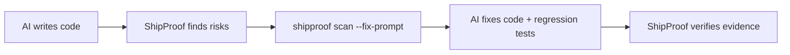

<p align="center">
  
</p>

<h1 align="center">ShipProof</h1>

<p align="center"><strong>ประตู evidence สำหรับ production แบบ local-first สำหรับซอฟต์แวร์ที่ AI ช่วยเขียน</strong></p>

<p align="center"><a href="README.md">English</a> · <a href="README.th.md">ภาษาไทย</a></p>

ความปลอดภัย · ความถูกต้อง · สเกล · ประสิทธิภาพ · หลักฐานก่อน release

[](https://github.com/kingggg5/shipproof/actions/workflows/ci.yml)
[](https://github.com/kingggg5/shipproof/actions/workflows/security.yml)
[](CHANGELOG.md)
[](package.json)
[](pyproject.toml)
[](LICENSE)

ShipProof คือ production gate ที่พัฒนาขึ้นต้นแบบ independent สำหรับ repository ที่เขียนโดยคน coding agent หรือทั้งสอง มันสแกนซอร์สโดยไม่ execute โค้ดใน repository, ประเมิน budget CPU/RAM/latency ที่วัดจริง, สร้าง model จาก assumption capacity ที่ผ่านการ review และรายงานหลักฐานผ่าน terminal, JSON, SARIF, pre-commit, GitHub Actions หรือ MCP adapter แบบ read-only

ShipProof ไม่ใช่ certification, penetration test, formal proof หรือสิ่งทดแทน threat modeling เฉพาะผลิตภัณฑ์และ runtime test มันทำให้ assumption มองเห็นได้ รายงานความแข็งแรงของหลักฐานที่มี และคงอำนาจการตัดสินใจไว้ที่มนุษย์สำหรับ action ที่มีผลตามมา

**แหล่งข้อมูลโครงการ:** [เว็บไซต์](https://shipproof-site.sjet2744.chatgpt.site/shipproof/) · [Commands](docs/commands.md) · [Contributing](CONTRIBUTING.md) · [Support](SUPPORT.md) · [Governance](GOVERNANCE.md) · [Security](SECURITY.md) · [Community validation](docs/community-validation.md) · [Research methodology](docs/research.md) · [Roadmap](docs/roadmap.md) · [Citation](CITATION.cff)

<p align="center">
  
</p>

## เข้าใจได้ภายใน 30 วินาที

[demo API](examples/demo-api/README.md) ใน repository มีช่องโหว่จริง 5 จุดที่ตั้งใจฝังไว้: admin route ไร้ authorization, SQL แบบ interpolate, pagination ไม่จำกัด, outbound timeout ที่หายไป และ debug mode ใน production

```bash
shipproof scan examples/demo-api/fixtures/before --fail-on high
# BLOCK · 5 findings

python -m unittest discover -s examples/demo-api/fixtures/after/tests -v
shipproof scan examples/demo-api/fixtures/after --fail-on high
# PASS_WITH_EVIDENCE · 0 findings
```

Test suite ตรวจ contract before/after นี้แบบเป๊ะ ๆ และยังมี [fixture Node.js, Python, secure และ performance](fixtures/README.md) คอยกัน finding หลุดและ false positive ระดับโจ่งแจ้ง

## เริ่มต้นอย่างรวดเร็ว

รันใน repository ใดก็ได้โดยไม่ต้องสร้างไฟล์ config ก่อน:

```bash
npx github:kingggg5/shipproof check
```

หรือติดตั้งแบบ global:

```bash
npm install --global github:kingggg5/shipproof
shipproof doctor .
shipproof init . --target both
shipproof check .
```

`init` ติดตั้ง skill ระดับ repository ลง `.agents/skills` สำหรับ Codex และ `.claude/skills` สำหรับ Claude Code

Node.js 20+ ทำหน้าที่ CLI ส่วน Python 3.10+ จำเป็นสำหรับ `scan`, `check`, คำสั่ง `gate`/`labs` ทั้งหมด และเครื่องมือ MCP core ไม่มี dependency npm หรือ Python package เพิ่มเติม

## ขอบเขตและสถานะโครงการ

ShipProof บังคับ review contract เดียวกันไม่ว่าใครเขียนโค้ด executable scanner ปัจจุบันมี **635 deterministic rules** สำหรับ security, correctness, scale, performance, configuration และ supply-chain risk ที่สังเกตได้ locally path เริ่มต้นเป็น read-only, offline และไม่มี dependency เกิน Node.js กับ Python standard library

| หัวข้อ | Contract ปัจจุบัน |
| :--- | :--- |
| Release ล่าสุด | `v0.10.0` reviewed release |
| Runtime | Node.js 20+; Python 3.10+ สำหรับคำสั่ง scanner-backed |
| Executable rules | 635 (`SP001`–`SP665`, มีช่องว่างสงวนไว้ตั้งใจ) |
| Evidence levels | `L0` pattern, `L1` structural/artifact, `L2` interprocedural taint (`--cross-file`; Python + JavaScript/TypeScript) |
| Research inventory | 7,800 catalogued candidates และ reserved promotion slots 1,000 รายการ; ไม่มีอะไรเป็น finding จนกว่าจะ promote |
| Exit codes | `0` ผ่าน, `1` gate fail, `2` evidence ไม่ถูกต้อง/ไม่พร้อม |
| Data flow เริ่มต้น | Local filesystem และ subprocesses เท่านั้น; ไม่มี telemetry หรือ upload ซอร์ส |

การออกแบบกฎอ้างอิง primary references เช่น [MITRE CWE](https://cwe.mitre.org/), [OWASP ASVS](https://owasp.org/www-project-application-security-verification-standard/), [OWASP API Security](https://owasp.org/API-Security/), [NIST SSDF](https://csrc.nist.gov/pubs/sp/800/218/final), เอกสาร framework ที่เป็นเจ้าของ และ vulnerability records จริง

## Trust model

| ShipProof การันตี | ShipProof ไม่อ้างสิทธิ์ |
| :--- | :--- |
| Output deterministic สำหรับ input/version เดียวกัน | การไม่มี vulnerability หรือ incident ใน production |
| Rule IDs, schemas, fingerprints และ exit semantics `0/1/2` ที่ stable | Cross-file reachability หรือ exploitability ระดับ runtime จาก regex ล้วน |
| Evidence แบบ redact และไม่ execute โค้ด repository ใน scanner default | Certification ตาม CWE, OWASP, NIST หรือมาตรฐานอื่น |
| Unknown/unavailable evidence อย่างชัดเจน ไม่ fabricate ผ่าน | Target/SLO/architecture capacity สากล |
| Severity แบบ review-first สำหรับ heuristic ที่ต้องมี context | สิ่งทดแทน CodeQL, dependency/SBOM tools, fuzzing หรือ human review |

## ตัวอย่างผลลัพธ์ Terminal

ShipProof จัด format findings เป็น review card ที่ actionable พร้อม context, confidence, เหตุผลความเสี่ยง และวิธีแก้:

```text
  [BLOCK] ShipProof: BLOCK
  Scanned 24 files | 1 blocking issue | 0 suppressed
  HIGH: 1

  [HIGH] Sensitive route lacks visible authorization (SP108)
     src/routes/admin.py:42  |  confidence: LIKELY

     Why: An admin or internal route has no visible authorization dependency.
     Fix: Require an explicit authorization dependency or verify application-wide control.
     Ref: CWE-862 | OWASP ASVS V4
```

## Verification workflow

ShipProof เปลี่ยนการพัฒนาให้เป็น verified feedback loop: AI เขียนโค้ด, ShipProof หาความเสี่ยง, AI แก้ตาม constraint ที่ชัดเจน แล้ว ShipProof ตรวจซ้ำ

<p align="center">
  
</p>

ถ้าผลตรวจเป็น `BLOCK` หลักฐานจะย้อนกลับไปที่ขั้นแก้โค้ดและเพิ่มเทส ส่วน `PASS` หมายถึง gate ที่ตั้งไว้มีหลักฐานเพียงพอสำหรับขอบเขตที่ตรวจ ไม่ได้หมายความว่าซอฟต์แวร์ปราศจากช่องโหว่ทุกกรณี

<details>
<summary>ดู workflow ในรูปแบบข้อความ</summary>



</details>

```bash
shipproof scan --fix-prompt        # handoff แบบ structured สำหรับ Codex/Claude Code/Cursor/Copilot
shipproof explain SP108            # rationale, attack scenario, false positives, แผนทดสอบ
shipproof labs impact src/app.py   # blast radius แบบ experimental ก่อนแก้โค้ด
```

ตัวอย่าง prompt เต็ม, invariant analysis, token cost budgeting, worktree isolation, status badges และ output `--trace` อยู่ใน [docs/features.md](docs/features.md)

## กฎการตรวจจับ

**635 deterministic executable rules** (`SP001`–`SP665`, มีช่องสงวนไว้ตั้งใจ) ครอบคลุม security, correctness, scale, performance, configuration และ supply-chain risks ทุก finding มี evidence `proof_level`: `L0` pattern match, `L1` structural/AST/artifact และ `L2` interprocedural taint flows (`--cross-file`; Python plus JavaScript/TypeScript route-to-sink chains ตั้งแต่ v0.8)

catalog ฉบับเต็ม, severity, category และวิธี detection ต่อกฎ พร้อม mapping ecosystem/framework ที่กำหนดว่า structural check แต่ละตัวรันที่ไหน: อยู่ที่ **[docs/rules.md](docs/rules.md)**

## ควบคุม False Positive

ShipProof ให้ความสำคัญกับ precision สูงกว่า alert รก:

- **Inline suppression:** เติม `# shipproof-ignore SP101` หรือ `// shipproof-ignore SP101` บนบรรทัดนั้นหรือบรรทัดก่อนหน้า marker มีผลเฉพาะใน comment เท่านั้น และระบุหลาย rule พร้อมกันได้ เช่น `# shipproof-ignore SP101 SP102`
- **Confidence filtering:** รันด้วย `--min-confidence high` เพื่อเห็นเฉพาะปัญหา confidence สูง
- **Reviewed baselines:** บันทึก technical debt เดิมลง `.shipproof-baseline.json` ด้วย `shipproof scan --baseline-out .shipproof-baseline.json`

## เพิ่ม GitHub Action

ใส่ deterministic gate ให้ pull request:

```yaml
name: ShipProof
on: [pull_request]
permissions:
  contents: read
jobs:
  production-gate:
    runs-on: ubuntu-latest
    steps:
      - uses: actions/checkout@v4
      - uses: kingggg5/shipproof@v0.10.0
        with:
          fail-on: high
```

Action เขียน status card Markdown ลง GitHub Step Summary สำหรับ PR ที่แตะ repository ใหญ่ ให้ scan เฉพาะสิ่งที่เปลี่ยน:

```yaml
      - uses: actions/checkout@v4
        with:
          fetch-depth: 0
      - uses: kingggg5/shipproof@v0.10.0
        with:
          fail-on: high
          changed-since: origin/main
```

Format รายงาน default คือ `sarif` จะอัปโหลดเป็น Code Scanning alerts ให้ใช้ official action ของ GitHub ต่อจาก gate step และต้องการ `permissions: security-events: write` (คง `contents: read`) ที่ job หรือ workflow

## นโยบายเดียว หนึ่งคำสั่ง

Commit [.shipproof.yml](.shipproof.yml) ที่ bound ไว้ แล้วรัน gate ทุกตัวที่ประกาศ:

```bash
shipproof check .
```

YAML subset แบบ dependency-free จะ reject executable tags, anchors, duplicate keys, unknown fields, path traversal และ arbitrary commands รูปแบบเต็มดูได้ที่ [policy schema](schemas/shipproof-policy.schema.json)

## สอง skill หนึ่ง workflow

| Skill | ใช้เมื่อ |
| :--- | :--- |
| `$engineer-production-systems` | implement แบบ bounded พร้อม budget security, CPU/RAM/latency และ failure ที่ชัดเจน |
| `$audit-production-readiness` | release gate อิสระ: Security, Correctness, Data & Privacy, Scale, Operability, Supply Chain |

Workflow diagram ฉบับเต็ม, systems coverage ladder, ตาราง compatibility ของ host และ production playbook อยู่ใน [docs/features.md](docs/features.md) และ [docs/production-playbook.md](docs/production-playbook.md)

## Command Reference

```text
shipproof check [path] [--config <file>]     Run every gate (works without config)
shipproof scan [path] [options]              Scan repository (--format terminal|markdown|json|sarif|github)
shipproof explain <rule-id>                  Explain a rule in detail (e.g. explain SP108)
shipproof doctor [path] [--json]             Inspect local runtime and integration health
shipproof init [path] [--scope <scope>]      Add project/global skills and a project policy
shipproof config validate [path]             Validate policy without running gates
shipproof gate budget [options]              Enforce CPU/RAM/latency regression budgets
shipproof gate evidence [path] [options]     Run allowlisted TypeScript, Go, or Rust analyzers
shipproof labs impact <file>[:line]          Experimental blast-radius analysis
shipproof labs invariants [path]             Experimental invariant analysis
shipproof labs cost [path] [options]         Experimental token/cost estimate
shipproof labs capacity [options]            Experimental capacity model and k6 export
shipproof mcp                                Start the read-only stdio MCP server
shipproof help                               Show command help
shipproof version                            Print current version
```

ดู [docs/commands.md](docs/commands.md) สำหรับ options และ exit codes ฉบับเต็ม

## ติดตั้งจาก Clone

```bash
git clone https://github.com/kingggg5/shipproof.git
cd shipproof
npm install --global .
```

จากนั้นเรียกใช้ skill ขณะ build:

```text
Use $engineer-production-systems to implement this feature with explicit security,
CPU, RAM, latency, and failure budgets.
```

ก่อน release:

```text
Use $audit-production-readiness to audit this repository for production.
```

Claude Code โหลด repository เป็น plugin ระหว่าง development ได้ด้วย `claude --plugin-dir .`

## Budgets, capacity, MCP และ layering

- **Resource budgets:** gate regression ของ p95 latency/CPU/RAM/throughput ที่วัดจริงด้วย `shipproof gate budget`; ตัวอย่างรันได้ใน [examples/performance](examples/performance)
- **Capacity planning:** เปลี่ยน workload assumption ที่ผ่าน review เป็น model โปร่งใสหรือ k6 scaffold แบบ deterministic ด้วย `shipproof labs capacity`
- **MCP mode:** `shipproof mcp` เปิด five read-only tools ให้ MCP client ใดก็ได้ พร้อม canonical paths, bounded runtime และ evidence แบบ redact
- **Language-native evidence:** `shipproof gate evidence . --adapter typescript|go|rust` รัน approved analyzers ในเครื่องโดยไม่ดาวน์โหลด dependency
- **Layering:** ใช้คู่กับเครื่องมือ SAST/SCA/secret-history/supply-chain ที่มีอยู่แล้วในสภาพแวดล้อมของคุณ; ShipProof route ไปยังเครื่องมือที่มีอยู่แล้วและไม่ install แอบ ๆ

รายละเอียดทุก walkthrough อยู่ใน [docs/features.md](docs/features.md)

## วิธีวิจัยและ provenance

ShipProof implement ขึ้นต้นแบบ independent references ถูกใช้เพื่อกำหนดคำถาม ศัพท์ และขอบเขตความปลอดภัยที่คาดหวัง; detector code ภายนอกและ ruleset ที่มี license จำกัดไม่ถูกคัดลอก [research notebook](docs/research.md) บันทึกหน้าที่ consult, คำถามที่ถาม, การตัดสินใจที่ retain และ claim ที่ไม่ infer ตั้งแต่ต้น

candidate จาก research จะกลายเป็น executable `SPxxx` rule ได้หลัง deduplication, local invariant ที่สังเกตได้, bounded implementation, CWE/control mapping, remediation, false-positive analysis และ positive/negative/adversarial tests เท่านั้น severity สื่อ potential impact ของเงื่อนไขที่ match; proof level สื่อความแข็งแรงของหลักฐาน local: ไม่มีตัวไหนคือ probability of exploitation

| Research artifact | ขอบเขต | ผลต่อ runtime |
| :--- | :--- | :--- |
| [Expert candidate catalog](docs/rule-expansion-1000.md) | 1,000 hypotheses จาก model-assisted mapped กับ source | ไม่มี |
| [2021–2026 annual catalog](docs/rule-expansion-2021-2026.md) | 1,800 CVE/CWE/community signals | ไม่มี |
| [Language catalog](docs/rule-expansion-languages-5000.md) | 5,000 research slots แยก ecosystem/CWE | ไม่มี |
| [Executable rule table](docs/rules.md#detection-rules-reference) | 635 detectors ผ่าน review | Emit versioned findings |

ดู [production playbook](docs/production-playbook.md), [development plan](docs/next-development-plan.md) และ [delivery roadmap](docs/roadmap.md) สำหรับขอบเขต operational และ acceptance gates อ้างอิง release ด้วย [CITATION.cff](CITATION.cff)

## การกำกับดูแลโครงการ

ShipProof ใช้ decision model แบบ maintainer-led เน้น evidence เรื่อง backward compatibility, rule promotion, releases, security response และการเปลี่ยน trust boundary default เป็นไปตาม [GOVERNANCE.md](GOVERNANCE.md) การ contribute ต้อง follow [CONTRIBUTING.md](CONTRIBUTING.md) และ [Code of Conduct](CODE_OF_CONDUCT.md) vulnerability ที่ exploit ได้รายงานผ่านช่องทาง private ตาม [SECURITY.md](SECURITY.md)

## Development

```bash
npm ci --ignore-scripts
python -m pip install -r requirements-dev.txt
npm run check
python skills/audit-production-readiness/scripts/scan_repo.py . --fail-on high
```

Core runtime ใช้แค่ Node กับ Python standard library; Ruff เป็น dev-only CI ทดสอบ Node 20/22/24 และ Python 3.10/3.11/3.12/3.13/3.14, ตรวจ package allowlist แบบเป๊ะ, smoke-test packed artifact และรัน CodeQL สำหรับ Python กับ JavaScript/TypeScript

scoped npm manifest และ manual OIDC workflow พร้อมสำหรับ public npm release ในอนาคต แต่จนกว่าเจ้าของจะสร้าง package, protected environment และ trusted-publisher relationship ให้ใช้วิธีติดตั้งจาก GitHub ด้านบนก่อน โครงการไม่อ้างว่าเผยแพร่ package ที่ยังไม่มีใน registry ดู [docs/releasing.md](docs/releasing.md) สำหรับ release discipline

## License, citation และ security

ShipProof เผยแพร่ภายใต้ [MIT License](LICENSE) ผู้ใช้งานเชิงวิชาการอ้างอิงโครงการได้ผ่าน [CITATION.cff](CITATION.cff) รายงาน vulnerability แบบ private ตาม [SECURITY.md](SECURITY.md)
