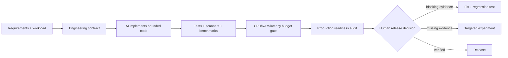

# Agent workflows and companion tools

Detailed usage for the ShipProof feedback loop, experimental labs commands, resource budgets, capacity planning, MCP mode, and language-native evidence adapters. The README keeps only the quickstart; this page owns the depth.

## Verification loop with AI agents

ShipProof turns development into a verified feedback loop: AI writes code, ShipProof finds risks, AI fixes with explicit constraints, and ShipProof re-verifies.

<p align="center">
  
</p>


### Generate Prompts for AI Handoff

```bash
shipproof scan --fix-prompt
shipproof scan --fix-prompt --context-level overview
```

Outputs structured instructions with code context, constraints, and test requirements ready for **Codex**, **Claude Code**, **Cursor**, **Gemini**, **Grok**, or **Copilot**:

```text
Fix SP108 in src/routes/admin.py (line 42).

Problem:
An admin route has no visible authorization dependency.

Required fix:
Add Depends(require_admin) to route dependencies.

Engineering Dimensions:
- [x] Object-Level Authorization & IDOR Protection
- [x] Tenant Boundary Isolation
- [x] Least Privilege & Default-Deny Policy
- [x] Token Lifecycle & Invalidation

Implicit Requirements:
- Enforce authorization before executing any business logic or state modification.
- Return 403 Forbidden for authenticated non-authorized users, 401 for unauthenticated.
- Preserve legitimate user access paths while closing escalation routes.

Failure Scenarios to Guard Against:
- Regular authenticated user submits payload to target endpoint and modifies elevated resource.
- Missing tenant scoping allows user in Organization A to access records belonging to Organization B.

Constraints:
- Do not change the public API contract
- Add a regression test that verifies the fix
- Reference: CWE-862, OWASP ASVS V4
```

### Experimental Change Impact Analysis

Inspect caller dependencies, state tables touched, and impact-selected test suites before editing code:

```bash
shipproof labs impact src/routes/admin.py
```

### Experimental System Invariant Analysis

Verify system-level architectural and security invariants (such as auth boundaries, tenant isolation, and transaction safety):

```bash
shipproof labs invariants .
```

### AI Agent Cost & Token Budgeting

Model AI token consumption, prompt caching savings, and dollar costs across Claude 3.5/3.7, GPT-4o, Gemini 2.0, and DeepSeek R1:

```bash
shipproof labs cost . --model claude-3-5-sonnet --iterations 3
shipproof labs cost . --model deepseek-r1 --cadence per-pr --budget-usd 0.50
```

### Git Worktree Isolation

Use Git's standard worktree commands, then run the ShipProof gate inside the isolated tree:

```bash
git worktree add .work/fix-auth -b fix-auth
shipproof check .work/fix-auth
git worktree remove .work/fix-auth
```

### Production Gate Status Badge

Use the status badge from the CI workflow that actually runs the gate. The retired `shipproof badge` command cannot produce a verifiable attestation from static Markdown.

```markdown
[](https://github.com/OWNER/REPOSITORY/actions/workflows/security.yml)
```

### Interactive Rule Explanations

Inspect why a rule exists, the threat scenario, common false positives, and how to write a regression test:

```bash
shipproof explain SP108
shipproof explain SP108 --context-level summary
```

Use `summary` for compact triage, `overview` for rationale and false-positive review, and `full` for attack scenarios and the complete engineering contract. `full` is the default, so existing integrations keep their current output.

For a locally inspectable gate decision, add `--trace` to JSON, Markdown, or terminal scans:

```bash
shipproof scan . --format json --trace --fail-on high
```

The opt-in trace contains deterministic counts for selected files, filters, baseline suppression, and gate evaluation. It contains no source or evidence text, paths, secrets, timestamps, timings, user identifiers, telemetry, or network calls.

## Two skills, one workflow

| Skill | Use it for | Outcome |
| :--- | :--- | :--- |
| `engineer-production-systems` | Design, implementation, refactoring, hardening, performance, data, AI/MCP, and authorized defensive systems work | Small, bounded, testable production code with explicit assumptions |
| `audit-production-readiness` | Deep review, vulnerability triage, incidents, release gates, and 10k-to-1M-user planning | Independent Security, Correctness, Data & Privacy, Scale, Operability, and Supply Chain gates |



## What It Tells the AI to Do

- Read the real architecture and trace the affected path before changing code.
- Define authorization, tenancy, correctness, workload, latency, CPU, memory, and recovery constraints.
- Bound input, output, recursion, concurrency, fan-out, queues, caches, retries, timeouts, logs, and retained state.
- Prefer simple composition and narrow interfaces over speculative abstractions or premature microservices.
- Measure before and after with the same workload; report variance and tail behavior, not one fast run.
- Treat static and AI findings as leads until a path, reproducer, sanitizer failure, or focused test confirms them.
- Keep dangerous actions human-approved and never upload private code or run active tests without authorization.

Progressive references cover production architecture, full-stack boundaries, database invariants and migrations, AI/RAG/MCP security, software supply chains, operability and incident response, performance, low-level systems, and authorized defensive reverse engineering.

The [ShipProof production engineering playbook](../docs/production-playbook.md) is the owner-authored map across those disciplines: eight control planes, one decision doctrine, and a compact release record.

## Systems Coverage

ShipProof routes high-risk code to a stricter evidence ladder:

| Target | Review focus | Recommended evidence when authorized |
| :--- | :--- | :--- |
| Kernel and drivers | User/kernel boundaries, lifetime/refcounts, copy-to/from-user, ioctl/netlink, locks/RCU, teardown races | KASAN, KMSAN, KCSAN, UBSAN, syzkaller, minimized reproducers |
| Browser engines | GC/refcount boundaries, parsers/codecs, JIT, IPC, sandbox/origin identity, re-entrancy | ASan, UBSan, MSan, coverage-guided fuzzing, regression corpora |
| Network protocols | Framing, integer/length checks, explicit state machines, negotiation, replay, fragmentation, amplification | Structure-aware fuzzing, protocol corpora/dictionaries, fault and sequence tests |
| Services and apps | Authn/authz, tenancy, transactions, retries, idempotency, timeouts, queues, dependency budgets | Unit/integration tests, SAST/SCA, load/soak tests, traces and resource profiles |

The bundled scanner stays conservative. Deep memory-safety and protocol findings need compiler instrumentation, sanitizers, fuzzers, and target-specific reasoning rather than misleading regex matches.

## Codex and Claude Compatibility

Both hosts use the open `SKILL.md` structure, so ShipProof keeps one source of truth.

| Host | Skill metadata | Plugin manifest | Personal skill path |
| --- | --- | --- | --- |
| Codex | `skills/*/SKILL.md` + optional `agents/openai.yaml` | `.codex-plugin/plugin.json` | `~/.agents/skills` or `<repo>/.agents/skills` |
| Claude Code | `skills/*/SKILL.md` | `.claude-plugin/plugin.json` | `~/.claude/skills` |

## Reproducible resource budgets

Benchmarks remain owned by your project. ShipProof evaluates numeric outputs to keep CI local, fast, and provider-independent.

`perf-baseline.json`:

```json
{"metrics":{"p95_latency_ms":120,"cpu_ms":8.5,"rss_mb":180,"throughput_rps":850}}
```

`perf-current.json` has the same keys. Define reviewed limits in `perf-budget.json`:

```json
{
  "metrics": {
    "p95_latency_ms": {"direction":"lower","max_regression_percent":10,"max":160},
    "cpu_ms": {"direction":"lower","max_regression_percent":8},
    "rss_mb": {"direction":"lower","max_regression_percent":5,"max":220},
    "throughput_rps": {"direction":"higher","max_regression_percent":5,"min":750}
  }
}
```

Run the gate:

```bash
shipproof gate budget \
  --baseline perf-baseline.json --current perf-current.json \
  --budget perf-budget.json --format markdown
```

Runnable sample files live in [`examples/performance`](../examples/performance).

Exit codes are `0` for pass, `1` for a measured budget failure, and `2` for missing or invalid evidence.

## Audit and capacity tools

Fast local scan with Terminal, Markdown, JSON, or SARIF 2.1.0 output:

```bash
shipproof scan . --format sarif --output shipproof.sarif --fail-on high
```

Create a reviewed fingerprint baseline for accepted debt:

```bash
shipproof scan . --format json --baseline-out .shipproof-baseline.json --fail-on none
```

<p align="center">
  
</p>

Turn one million registered users into a transparent workload hypothesis, including CPU and memory assumptions:

```bash
shipproof labs capacity \
  --users 1000000 --dau-ratio 0.25 --peak-hour-ratio 0.20 \
  --actions-per-session 12 --requests-per-action 2 --instance-rps 250 \
  --cpu-ms-per-request 5 --memory-mb-per-instance 512 --format markdown
```

Replace sample values with analytics and production-shaped benchmarks. Registered users are not concurrent users, and capacity arithmetic is not a load test.

Generate a deterministic k6 starting point from reviewed config:

```bash
shipproof labs capacity --config examples/capacity/shipproof.config.json \
  --export-k6 load-test.js --format json
BASE_URL=https://staging.example.test LOAD_TEST_TOKEN=replace-me k6 run load-test.js
```

The generator never embeds the base URL or authorization token. Reviewed request bodies are copied into the script, so sensitive fields such as `password`, `token`, `api_key`, and `client_secret` must use an environment placeholder such as `{"$env":"LOAD_TEST_PASSWORD"}`; ShipProof rejects literal values for these keys. Running the script is a separate, authorized action; review every request body, rate, route, target environment, and threshold first.

## Local MCP and language evidence

Install optional MCP peers beside ShipProof, then point an MCP client at `shipproof mcp`:

```bash
npm install --save-dev github:kingggg5/shipproof @modelcontextprotocol/sdk@1.29.0 zod@3.25.76
npx shipproof mcp
```

Set `SHIPPROOF_MCP_ROOT` to the repository root when the client does not launch the server there. Paths are canonicalized, symlink escapes are denied, execution is bounded to 30 seconds (raise it for large repositories with `SHIPPROOF_MCP_TIMEOUT_MS`, an integer from 1000 through 600000) and 2 MB, and no raw shell or file-reading tool is exposed. `shipproof_scan` accepts the same core controls as the CLI: `exclude` glob patterns, `min_confidence`, and `cross_file` to augment findings with interprocedural taint flows.

Inspect available language-native evidence adapters before running one:

```bash
shipproof gate evidence . --list --format json
shipproof gate evidence . --adapter typescript --allow-project-code --format json
shipproof gate evidence . --adapter go --format json
shipproof gate evidence . --adapter rust --allow-project-code --format json
```

Dependency downloads are disabled for Go and Rust adapters. TypeScript must exist in the repository. The Rust opt-in is deliberate because `cargo clippy` can execute project-controlled `build.rs` code.

## Layer with mature tools

ShipProof routes the agent to tools already present in the environment and never silently installs them:

- CodeQL or Semgrep for source and data-flow analysis.
- OSV-Scanner or Trivy for dependencies, containers, IaC, secrets, licenses, and SBOM evidence.
- Gitleaks for current and historical secrets.
- SkillSpector for trust checks before installing third-party agent skills.
- OpenSSF Scorecard for repository and supply-chain posture.
- LLVM libFuzzer, OSS-Fuzz, or syzkaller for authorized target-specific fuzzing.
- Grafana k6 or the project's existing harness for SLO-driven load testing.