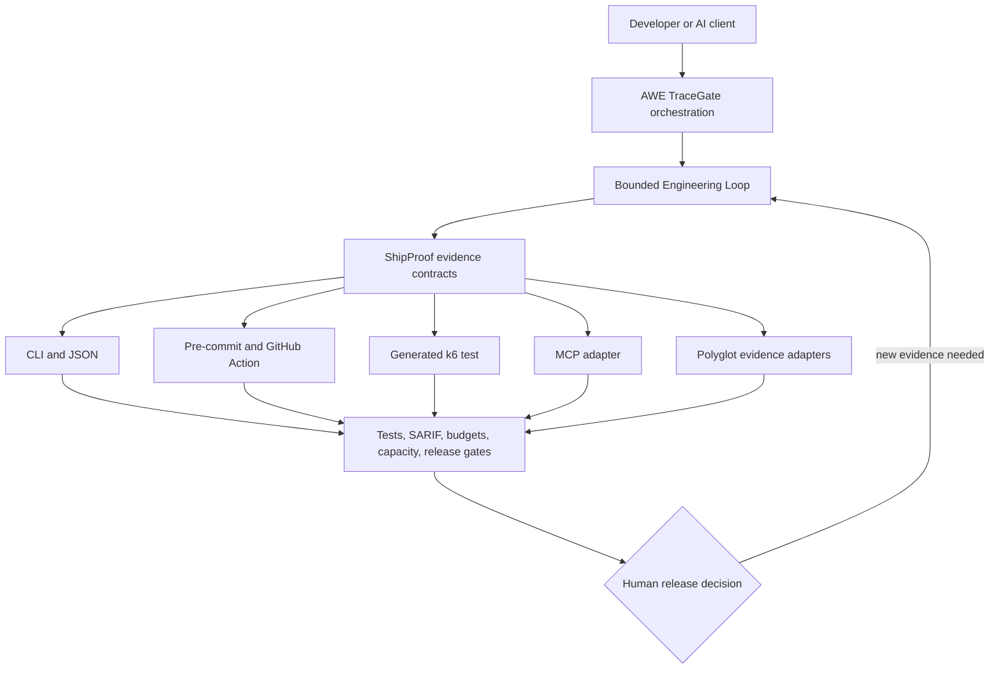

# AWE TraceGate and ShipProof roadmap

The risk-based expansion program reserves 8,800 research slots without bulk-shipping noisy regexes. The original [1,000-candidate program](rule-expansion-1000.md) defines promotion thresholds and the `SP651–SP661` pilot. The [2021–2026 and expert expansion](rule-expansion-2021-2026.md) adds 1,800 annual CVE signals and 1,000 CWE-grounded expert candidates. The [5,000-candidate language expansion](rule-expansion-languages-5000.md) adds deduplicated C#, TypeScript, PHP, React, Go, C++, Angular, JavaScript, SQL, Python, Java, Rust, Kotlin, and Swift variants. Every unpromoted record remains research-only. The ordered implementation work, acceptance gates, promotion lifecycle, and CLI 1.0 cleanup are maintained in the [next development plan](next-development-plan.md).

The post-v0.10 priority is [community validation](community-validation.md): representative field evidence, integration reliability, and measured false-positive review. Rule-count growth is not a milestone by itself.

This roadmap turns ShipProof from a local evidence toolkit into a reusable execution layer for AWE TraceGate and global developer workflows. Version 0.4.0 ships the important end-to-end slices; unchecked acceptance work remains a release gate rather than an implied claim.

## Version 0.4.0 implementation status

| Area | Shipped | Still required before stable 1.0 |
| --- | --- | --- |
| Contracts | Published config/evidence JSON Schemas; scan, budget, and capacity share version/tool/verdict/limitations fields; golden scan fixture proving identical findings and fingerprints across direct Python, the Node CLI, and SARIF | Golden compatibility fixtures for the budget and capacity envelopes, source revision/timing policy, and broader config coverage |
| Distribution | Root composite action and pre-commit hook with closed inputs, workspace path checks, maintained moving major tag (`v0`), and a packed-artifact smoke test that installs the tarball and runs the CLI end to end | Cross-platform consumer fixtures and the stable `v1` moving-tag compatibility contract |
| Load testing | Deterministic `--export-k6`, environment-only target/token, checks, thresholds, weighted routes, overwrite protection, and a determinism/parse gate over the generated script | k6 binary parse fixture in CI and additional reviewed scenario templates |
| MCP | Optional official-SDK stdio adapter; five read-only tools (`shipproof_scan`, `shipproof_budget`, `shipproof_capacity`, `shipproof_explain`, `shipproof_lint_snippet`); canonical paths, cancellation, timeout, and output cap | Live client handshake matrix, concurrency soak, and structured error-code schema |
| Polyglot evidence | Allowlisted TypeScript, Go, and Rust adapters; offline dependency policy; Rust project-code consent | Parsed analyzer fingerprints/SARIF, version capture, and language fixture corpus |

“Shipped” means the code and local contract tests exist. It does not mean every acceptance gate below has passed on every supported client or operating system.

## Product boundary



- **AWE TraceGate** owns orchestration, approvals, run budgets, loop state, policy, and the user experience.
- **Engineering Loop** owns controlled iteration: Observe, Contract, Change, Verify, Audit, Decide, Learn.
- **ShipProof** owns deterministic evidence contracts and focused agent guidance.
- **Adapters** remain thin. They invoke the same contracts instead of reimplementing scanners, gates, or capacity math.

Do not rename ShipProof after an external project or import another project's workflow. `Engineering Loop` is a generic first-party workflow inside AWE TraceGate, with explicit stop conditions and evidence integrity.

## Delivery principles

1. Stabilize contracts before multiplying integrations.
2. Keep the local CLI dependency-light and offline by default.
3. Make every generated artifact deterministic and reviewable.
4. Default integrations to read-only or report-only behavior.
5. Require explicit targets and authorization for load, fuzz, DAST, write, or production operations.
6. Version schemas independently from CLI presentation.
7. Measure time-to-first-value, false positives, runtime, and support cost for every phase.

## Phase 0 — Contract foundation

**Why first:** GitHub Actions, k6, MCP, and AWE TraceGate must not each parse human-formatted output or invent different policy.

### Deliverables

- Define one versioned JSON envelope for every command: schema version, tool version, run ID, source revision, inputs, assumptions, artifacts, findings/gates, verdict, limitations, and timing.
- Add `shipproof.config.json` plus a published JSON Schema. Keep CLI arguments as explicit overrides.
- Stabilize exit codes: pass, evidence/gate failure, and invalid or unavailable evidence.
- Extract CLI-independent domain functions so adapters call code rather than shell text where practical.
- Add compatibility fixtures for the previous schema and deterministic golden outputs.
- Define path, timeout, concurrency, output-size, and redaction policies shared by every adapter.

### Acceptance gate

- The same fixture produces semantically identical JSON through direct Python, the Node CLI, and adapter tests.
- Unknown configuration fails closed; secrets do not appear in artifacts; schema changes require an explicit version change.

## Phase 1 — Pre-commit and GitHub Action

**Outcome:** a developer can add a local fast gate or a pull-request gate without copying scripts.

### Deliverables

- Add `.pre-commit-hooks.yaml` with a repository scan hook that receives no arbitrary filenames and runs against the repository root.
- Add a root `action.yml` composite action with explicit inputs for path, format, fail threshold, baseline, and output. Keep SARIF upload in the caller so the action never needs write permission.
- Keep the action in this repository initially and use the current public-beta tag, `kingggg5/shipproof@v0.4.0`, or its full commit SHA. Publish a moving `@v1` tag only with the stable v1 compatibility contract. A separate `shipproof-action` repository would create release drift without adding user value; reconsider it only for a distinct Marketplace/release lifecycle.
- Publish immutable release tags and maintain a reviewed moving major tag. Security-sensitive consumers should be able to pin a full commit SHA.
- Default workflow permissions to `contents: read`. Request `security-events: write` only in the caller workflow that uploads SARIF.
- Add minimal examples for pull requests, scheduled scans, baselines, and pre-commit installation.

### Acceptance gate

- `pre-commit try-repo` and Linux/Windows CI fixtures produce the same finding fingerprints as the direct CLI.
- The action works in paths containing spaces, handles missing Python clearly, performs no install-time network script, and uploads no source.
- A new user can copy one documented workflow and obtain a useful report without hidden repository secrets or write permissions.

## Phase 2 — Capacity-to-k6 generator

**Outcome:** turn reviewed workload math into a runnable, inspectable load-test starting point.

### Command contract

```text
shipproof labs capacity --config workload.json --export-k6 generated/load-test.js
```

### Deliverables

- Extend the workload schema with routes, methods, weights, JSON payloads, expected statuses, scenario duration, and reviewed SLO thresholds. Fixture paths, think time, and additional scenario shapes remain follow-up work.
- Generate deterministic JavaScript using k6 scenarios, checks, and thresholds.
- Read the base URL and credentials from named environment variables. Never embed tokens, passwords, or a production hostname.
- Emit a deterministic provenance header containing the ShipProof version and input digest, plus a warning that generation is not authorization to run the test. Timestamps stay out of reproducible output.
- Generate protocol-level traffic first. Keep browser scenarios optional and small because they measure a different, more expensive workload.
- Add overwrite protection, JSON diagnostics, stable formatting, snapshot tests, and a syntax/inspection gate when k6 is available. A dedicated script-to-stdout mode remains optional because the capacity report already owns stdout.

### Acceptance gate

- The generated script parses with k6, its target throughput matches the reviewed model within a documented tolerance, and thresholds come from the workload file rather than hidden defaults.
- Fixtures cover smoke, average, peak, spike, soak, and impaired-dependency templates without automatically targeting a live service.
- Identical inputs and ShipProof version produce identical generated content except an explicitly optional timestamp.

## Phase 3 — MCP server mode

**Outcome:** Cursor, Windsurf, Claude Code, Codex, and other MCP clients can request ShipProof evidence through narrow native tools.

### Architecture

- Implement an optional ESM adapter using the official TypeScript SDK as peer dependencies, keeping the core CLI dependency-free and avoiding a transpiler/runtime build step.
- Start with stdio transport: the client spawns the server locally and no network listener is opened.
- Use the official MCP TypeScript SDK with closed input/output schemas and structured content.
- Keep the shipped surface limited to five read-only tools: `shipproof_scan`, `shipproof_budget`, `shipproof_capacity`, `shipproof_explain`, and `shipproof_lint_snippet`. Add another tool only when its contract and operational value justify the larger surface.
- Keep tools read-only by default. Do not expose raw shell, arbitrary Python, arbitrary file reads, GitHub writes, or automatic production tests.
- Restrict repository roots, canonicalize paths, block traversal/symlink escape, bound runtime/output, redact evidence, propagate cancellation, and return stable error codes.
- If HTTP transport is added later, design authentication, audience binding, scopes, tenancy, rate limits, and audit logging before enabling it.

### Acceptance gate

- Contract tests prove that CLI and MCP results share the same schema and finding fingerprints.
- Negative tests cover path escape, oversized input/output, cancellation, prompt-injected arguments, secret redaction, concurrent requests, and unavailable Python.
- Client examples require no production credential and never grant broader filesystem access than the selected repository.

## Phase 4 — Polyglot evidence and interactive documentation

**Outcome:** broaden coverage without turning ShipProof into a fragile collection of home-grown parsers.

### Deliverables

- Define an adapter protocol for tool name/version, command, scope, normalized finding, confidence, evidence, remediation, and SARIF mapping.
- Prefer language-native evidence first: TypeScript compiler/ESLint, Go vet and approved analyzers, Rust clippy and approved analyzers, plus existing CodeQL/Semgrep/SCA outputs.
- Add AST rules only where a deterministic rule needs syntax awareness and positive/negative corpus tests demonstrate useful precision.
- Treat cross-file data flow, ownership, and exploitability as separate evidence levels; do not present a syntax match as a confirmed vulnerability.
- Generate interactive documentation from CLI schemas, example configs, prompt catalog, and machine-readable fixtures so documentation cannot drift into a second source of truth.
- Publish a support matrix with language, evidence source, coverage boundary, limitations, and last verified version.

### Acceptance gate

- Every adapter has golden inputs, deduplication/fingerprint tests, timeout/output bounds, tool-version capture, and false-positive analysis.
- Documentation examples are executed in CI and broken local links fail the build.
- New language support improves verified coverage without materially regressing package size, startup time, or baseline scan noise.

## Proposed sequence and success measures

| Milestone | Product promise |
| --- | --- |
| v0.4.0 | Public beta: demo, policy, deterministic gates, fixtures, and initial Action |
| v0.5.0 | Hardened Action consumer matrix, release/tag automation, and integration coverage |
| v0.8.0 | Richer native analyzers, integrations, and measured precision/performance corpus |
| v1.0.0 | Stable CLI, policy, evidence-schema, and documented compatibility guarantees |

| Stage | Ship when | Measure |
| --- | --- | --- |
| Phase 0 | JSON/config contracts are stable and compatible | Contract-test pass rate; schema-breaking changes |
| Phase 1 | Local and PR integrations match CLI evidence | Time to first report; action failures; installation issues |
| Phase 2 | Generated scripts are deterministic and runnable | Generation success; k6 validation; model-to-test drift |
| Phase 3 | Read-only MCP tools are isolated and contract-equivalent | Tool success/latency; denied unsafe calls; client compatibility |
| Phase 4 | Adapters add proven signal at controlled cost | Precision/recall sample; runtime/RSS; supported repositories |

Do not start the next phase only because the previous code exists. Advance when its acceptance gate passes, maintenance ownership is clear, and real users demonstrate the next bottleneck.
